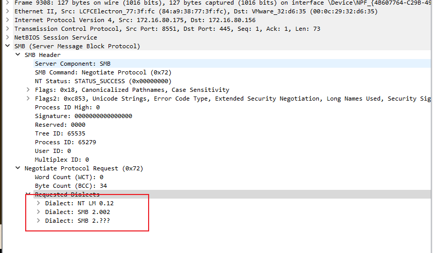

SSPI和SSP

<font style="color:rgb(55, 65, 81);">SSPI（Security Support Provider Interface）是一种安全支持提供程序接口，用于在Windows平台上实现安全相关功能。</font>**<font style="color:rgb(55, 65, 81);">SSPI只定义了一套接口函数而没有实现具体内容，SSPI只是一个框架，SSP调用基础SSPI来实现具体的安全认证。</font>**

<font style="color:rgb(55, 65, 81);">常见接口：</font>

1. **InitializeSecurityContext：**<font style="color:rgb(55, 65, 81);"> 用于客户端发起安全上下文的初始化，以便与服务器协商安全参数。</font>
2. **AcceptSecurityContext：**<font style="color:rgb(55, 65, 81);"> 用于服务器接受并处理客户端提供的初始化安全上下文的请求，完成安全参数的协商。</font>
3. **EncryptMessage：**<font style="color:rgb(55, 65, 81);"> 用于加密消息，确保消息的机密性。</font>
4. **DecryptMessage：**<font style="color:rgb(55, 65, 81);"> 用于解密已加密的消息。</font>
5. **MakeSignature：**<font style="color:rgb(55, 65, 81);"> 用于生成消息签名，确保消息的完整性。</font>
6. **VerifySignature：**<font style="color:rgb(55, 65, 81);"> 用于验证消息签名，以确保消息的完整性。</font>

<font style="color:rgb(55, 65, 81);">SSP（Single Sign-On Protocol）是一种单一登录协议，用于在多个应用之间实现用户的单一身份验证；</font>

<font style="color:rgb(55, 65, 81);">如：NTLM SSP、Kerberos SSP、Cred SSP</font>

# LM
1、LM Hash的本质是DES加密，较容易被破解

2、为了保证兼容性。从Windows Server2008开始，禁用LM Hash

3、如果LM Hash为aad3b435b51404eeaad3b435b51404ee说明LM Hash被禁用

# NTLM
1、NTLM Hash是基于MD4加密算法组成的

2、NTLM分为v1和v2版本，显著区别是Challenge值和加密算法不同

3、用户在本地登录过程中（winlogon.exe），密码输入后传递到lsass.exe进程，该进程会把明文密码存储到内存，并加密成NTLM Hash，对本地SAM数据库进行比对认证

4、从Windows Server2012开始，明文密码不会存储入内存，所以minikatz默认不能提取密码

5、NTLM是底层认证协议，必须嵌入上层协议使用。

## Hash格式
用户名：用户SID值：LM Hash：NTLM Hash:::

注1：SID（Security Identifier）是Windows操作系统中用于**唯一标识用户**

## NTLM协议认证
NTLM协议是基于Challenge/Response的验证机制，由三种类型的消息组成：

1、Type1 协商Negotiate

2、Type2 质询Challenge

3、Type3 认证Authentication

## 案例1：工作组SMB3.1.1 握手流程


1、用户输入明文账号密码，客户端计算hash到内存，客户端发送Type1协商信息（**不包含NTLM hash**）到服务端

2、服务端选择能接受的服务内容、加密登记等，返回并缓存包含16位随机Challenge值的Type2质询消息

3、客户端从Type2取出Challenge值，用缓存中的hash对Challenge值计算，封装到Type3认证消息

4、服务端收到Net-NTLM hash后，用自己的密码Hash对Challenge进行计算后比对，如果相等证明认证成功

实操：

Windows Server 2016、Windows 11


1、客户端发起SMB1协商协议，表明支持的SMB协议



2、服务端使用SMB2协议返回报文，表示支持SMB2，其中Security mode验证了，虽然Signing enabled True支持签名，但Signing required False说明协商不签名。


3、客户端发送支持的客户端smb协议从2.0.2到3.1.1，还有若干smb2协商报文。


注意此处出现了Pre Auth，在Windows Server 2016 SMB 3.1.1的新改进中，预身份验证（SHA-512）完整性提供了改进的保护，防止中间人攻击者篡改 SMB 的**连接建立和身份验证**消息。（相当于对报文内容做hash运算）

4、服务端响应确定使用SMB 3.1.1，使用了AES-128-GCM（新特性）


5、客户端开始SMB内包含的NTLM协商消息，其中包含了消息类型位NTLMSSP_NEGOTIATE，domain为null，系统version


6、服务端返回一个Challenge值，还有服务端计算机名、系统版本等


7、客户端把用户名，使用Challenge值加密成Net-NTLM Hash，当前主机名等发送到服务端进行认证


8、服务端取出Net-NTLM Hash，用自己的密码计算一遍，如果比对正确就认证成功，反之认证失败。

成功报文：


失败报文：


注1：sessionkey是客户端生成用于签名的协商密钥，服务端需要配合用户密码进行解密流量，攻击者如果没有明文密码就没办法计算出exportedSessionKey，就无法解密流量。

## 案例2：域环境下SMB认证流程


powershell 加入域

```plain
#注意禁用ipv6 桥接模式下的DNS解析默认用v6 dns解析

#域信息
$domain = "sec.com"
$User =  "user1"
$Password = "Az123456@" | ConvertTo-SecureString -asPlainText -Force
$credential = New-Object System.Management.Automation.PSCredential($User,$Password)

#以新pc名加入到域
Add-Computer  -DomainName $domain -Confirm:$false -Credential $credential

#重启电脑
Restart-Computer
```


1、用户输入明文账号密码，客户端计算hash到内存，客户端发送Type1协商信息（**不包含NTLM hash**）到服务端

2、服务端选择能接受的服务内容、加密登记等，返回并缓存包含16位随机Challenge值的Type2质询消息

3、客户端从Type2取出Challenge值，用缓存中的hash对Challenge值计算，封装到Type3认证消息

4、服务端收到Net-NTLM hash后，通过DCERPC协议与DC域控建立安全通道，并使用RPC_NETLOGON发送验证消息给DC。

5、DC收到服务端发来的Net-NTLM Hash后，与数据库中的Hash进行计算对比，相等则认证成功，反之认证失败。

6、服务端根据DC返回的消息，对客户端进行回复

认证成功：


认证失败：


# NTLM v1和NTLM v2
## 区别
NTLM v1/v2的最显著区别是Challenge值和加密算法不同

Challenge值：

NTLM v1：8B

NTLM v2：16B

Net-NTLM Hash加密算法：

Challenge值：

NTLM v1：DES加密

NTLM v2：HMAC-MD5加密算法

NTLM v1 Response消息生成

1、16B的NTLM Hash填充为21B

2、分成三组个7bit，作为3DES的三组密钥

3、利用三组密码对服务端发来的Challenge值进行加密

4、三个密文连起来得到Response

格式

username:hostname:LM response:NTLM response:challenge

LmCompatibilityLevel控制协商等级


## NTLM v1的脆弱性
### 案例1 Pass The Hash（PTH）
因为NTLM v1是用户NTLM Hash加密出来的，由于<u>DES的天然缺陷</u>，只要获取到Net-NTLM v1 Hash就可以破解出NTLM Hash。有了NTLM Hash，在域内就可以横向移动了。

## 案例2：NET-NTLM v1 Relay
在NTLM认证的第三步，Response包同时存在NET-NTLM Hash和Challenge，获得可以进行中间人攻击。

## 任务：与域控进行NTLM v1认证，获得Net-NTLM Hash进行破解
1、域控降级v1认证

本地安全策略或命令行修改注册表


2、Responder抓取目标主机Net-NTLM v1 Hash

修改Responder.conf的Challenge为固定值


使用Responder进行监听，之后使用打印机漏洞或Petitpotman触发域控机器强制向我们机器进行NTLM认证，即可收到域控的Net-NTLM v1 Hash

这里直接使用net use触发


由于crack.sh暂停服务，无法继续破解成NTLM Hash