```plain
categories: 域渗透攻防指南笔记
tags: 内网安全
publish: true
autoExcerpt: true
```

参考链接：

1、[https://144.one/kerberosxie-yi-fen-xi.html](https://144.one/kerberosxie-yi-fen-xi.html)

# 基础
特性：

1、Kerberos使用TCP/UDP 88端口进行认证，使用TCP/UDP 464端口进行密钥重设

2、Kerberos是一种基于Ticket票据的认证方式，认证获得TGT，TGT在兑换ST。TGT和ST都是由KDC发放。

3、Kerberos协议有两个基础认证模块【AS_REQ & AS_REP】和【TGS_REQ & TGS_REP】以及两个拓展认证模块S4U和PAC

## Kerberos三个角色
1、访问服务的客户端：每个客户端需要访问资源前都会请求身份验证

2、提供服务的服务端：域内提供的服务端都有一个唯一的SPN服务主体名称

3、提供认证服务的KDC（密钥分发中心）：它工作在DC上，服务账号名为krbtgt，向域内计算机和用户提供会话票据和临时会话密钥。

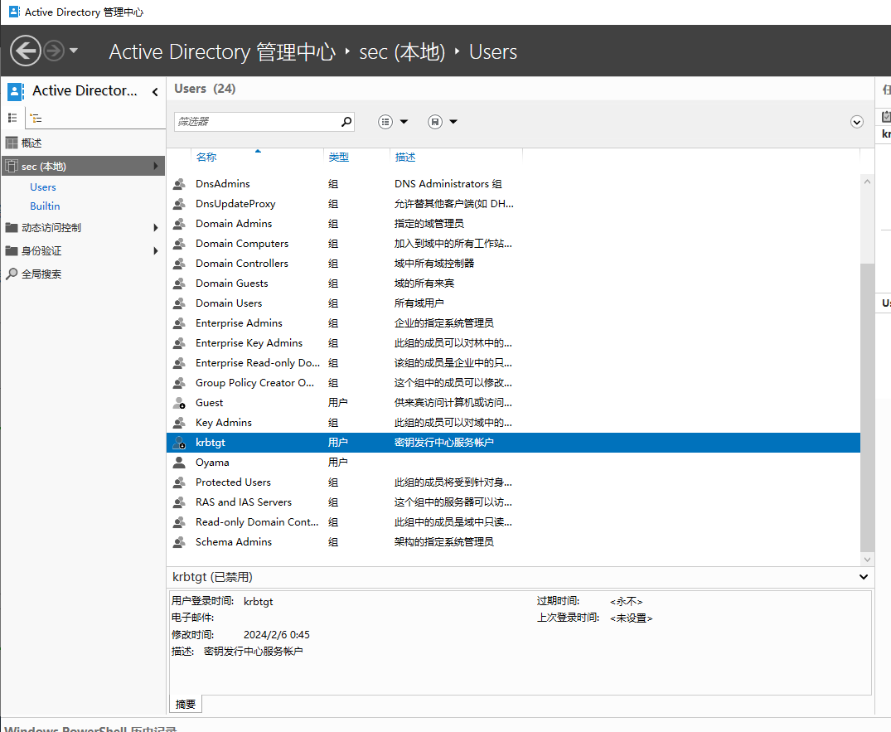

## PAC
微软在自己的产品中加入了PAC的概念，在认证过程中返回的TGT和ST都包含PAC，PAC包含各种授权信息、附加凭据、策略信息、权限信息，PAC可以在本地直接与ACL比对验证权限。

PAC中包含两个数字签名：

1、PAC_SERVER_CHECKSUM：使用服务密钥签名

2、PAC_PRIVSVR_CHECKSUM：使用KDC密钥签名

数字签名的原因：防止不受信任的服务用无效PAC为自己伪造票据；

在默认情况下，由于防止流量过大，PRISVR验证不开启

# 案例1：Impacket请求win11的CIFS服务票据
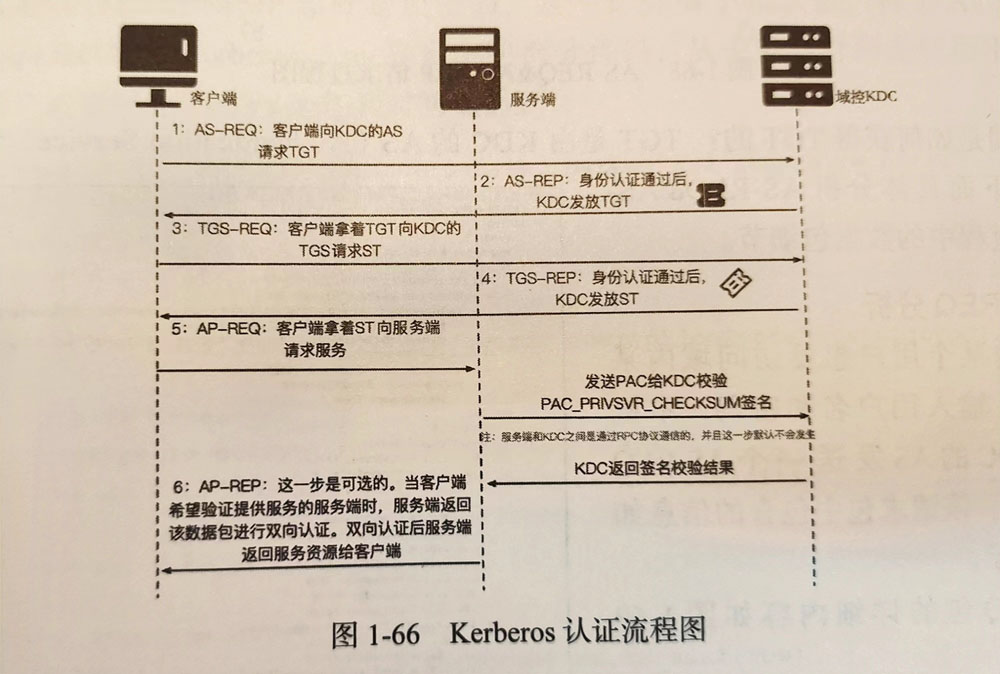

```plain
C:\root> impacket-getST -dc-ip 172.16.80.189 -spn cifs/DESKTOP-GBE538B sec.com/administrator:Az123456@
Impacket v0.11.0 - Copyright 2023 Fortra

[*] Getting TGT for user
[*] Getting ST for user
[*] Saving ticket in administrator.ccache

C:\root> export KRB5CCNAME=administrator.ccache

C:\root> impacket-smbexec -no-pass -k DESKTOP-GBE538B
Impacket v0.11.0 - Copyright 2023 Fortra

[!] Launching semi-interactive shell - Careful what you execute
C:\Windows\System32>

## 这里有可能会报SMB SessionError: STATUS_MORE_PROCESSING_REQUIRED
## 先检查三方时间/时区是否正确，还可以尝试cifs/DESKTOP-GBE538B.sec.com,cifs还可以换成host，
## SPN可以用setspn -l DESKTOP-GBE538B查询一下
```

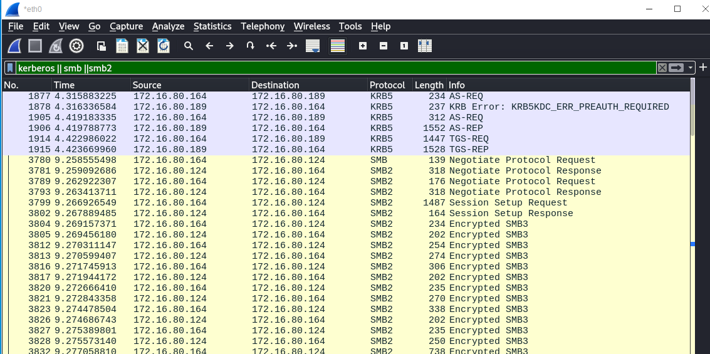

注1：为什么第一次请求了一个空验证，为了兼容旧版本，以前版本支持空认证，所以就返回了个认证失败

注2：为什么这里的ST不可伪造，因为虽然ST默认不需要向KDC验证PRIVSVR签名，但是需要服务端会验证PAC_SERVER_CHECKSUM验证，该验证由服务密钥进行签名。

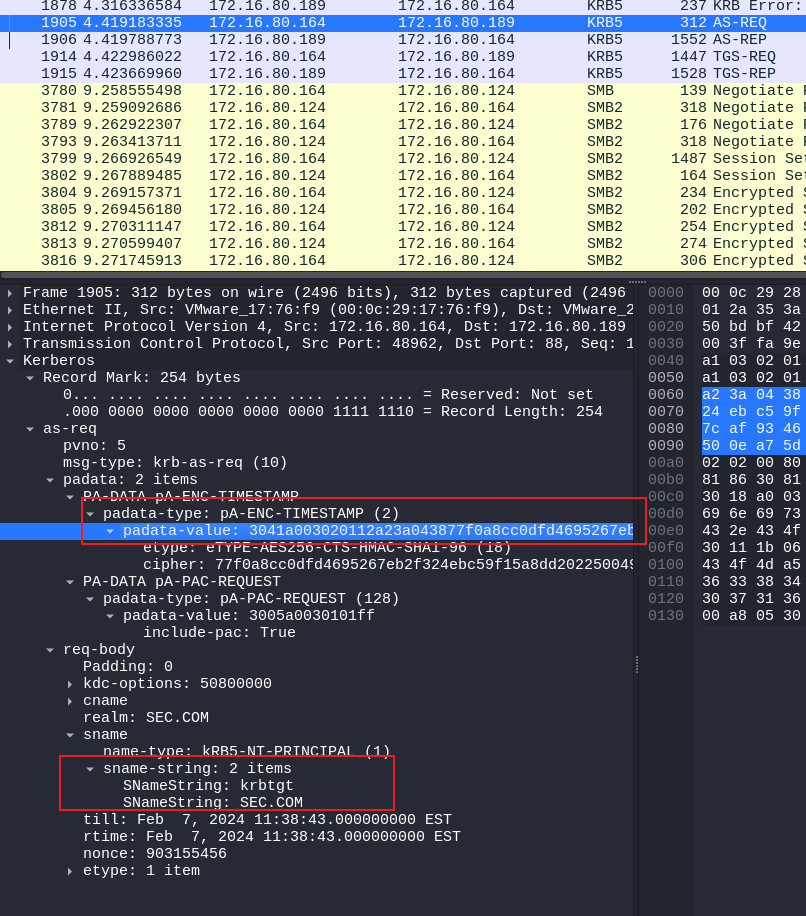

1、AS-REQ

padata pA-ENC-TIMESTAMP就是用户Hash加密时间戳的作为value发送给KDC中的AS，如果KDC从数据库查询出该用户的Hash进行解密，解密成功能获得时间戳，且时间戳在一定范围内则证明认证通过。

由于使用用户密码Hash加密时间戳，因此造成了Hash传递攻击。

2、pA-PAC-REQUEST

启用PAC支持的拓展，根据include-pac Value的布尔值来确定返回票据是否携带PAC

3、cname、realm

CNameString：请求的用户名，该选项可用于暴力枚举用户名

realm：域名

sname：请求的服务

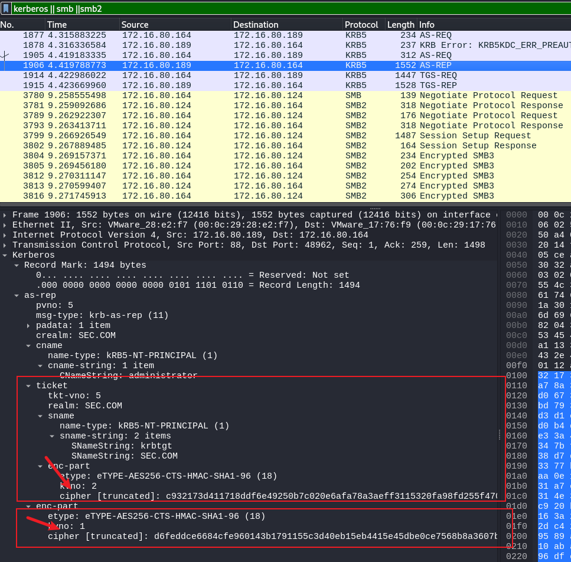

AS-REP

AS-REP中的ticket就是TGT信息，其中加密部分是使用<font style="color:#DF2A3F;">krbtgt账户加密</font>的；enc-part是Logon Session Key，由<font style="color:#DF2A3F;">请求的用户密钥加密的</font>。

## 1、TGT和Logon session key解密
首先使用mimikatz提取Credentials

```plain
./mimikatz.exe "lsadump::dcsync /user:sec\krbtgt" exit
 Credentials
      aes256_hmac       (4096) : 7f6eae6f78ff5ddb17f4bb622ab8c88cafd6c7a7c8f71b109eab5916139fa7c3
      aes128_hmac       (4096) : b8ceaa616360ddce571975f713ff647c
      des_cbc_md5       (4096) : f4e0e30e1504d926

./mimikatz.exe "lsadump::dcsync /user:sec\administrator" exit
 Credentials
      aes256_hmac       (4096) : 8d09ba4a34b167485d668a3266fc6a4aa5dafae9a2ede3bbddfec3ded5f0231f
      aes128_hmac       (4096) : 56934257e792bf6b036052996d70fd6f
      des_cbc_md5       (4096) : 4c85260ed0619249

# SPN账户是机器用户，后面需要加$
./mimikatz.exe "lsadump::dcsync /user:sec\DESKTOP-GBE538B$" exit
 Credentials
      aes256_hmac       (4096) : 9b2dd05778f948de5ea44dedd9c79b03d81a46a6226d02333ca3828e84e1fd2a
      aes128_hmac       (4096) : 56956055bdb126b54c012c1866722c78
      des_cbc_md5       (4096) : 3db06d0b589137a1
```

根据数据包显示eType-AES256-CTS-HMAC-SHAq-96(18)表明只要aes256_hmac，复制上述三条aes256_hmac到forest-trust-tools-master/keytab.py工具，python ketytab.py key.ky，然后导入到wireshark即可解密

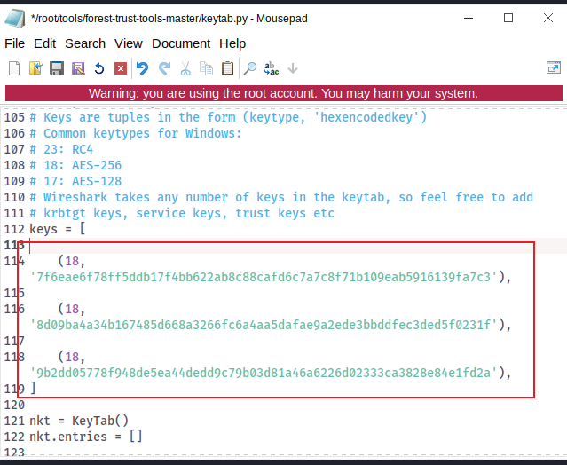

解密成功后的样子

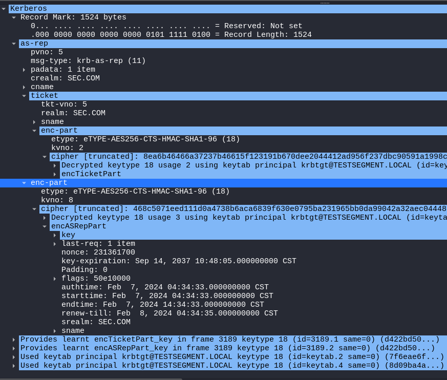

## 2、AS-REP解读
耐心翻阅，可以找到PAC_LOGON_INFO，这里就是用来辨别权限的

KDC生成PAC是当收到客户端发来的AS-REQ后，用该用户生成对应的PAC

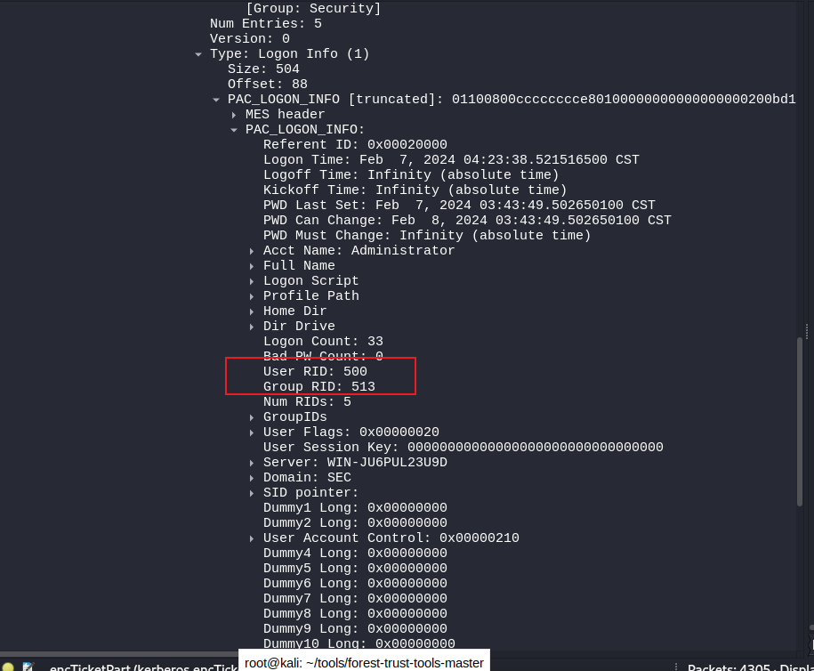

最外层的enc-part就是Logon Session Key，用于确保客户端和KDC下一阶段的通信安全，使用用户的密钥来加密

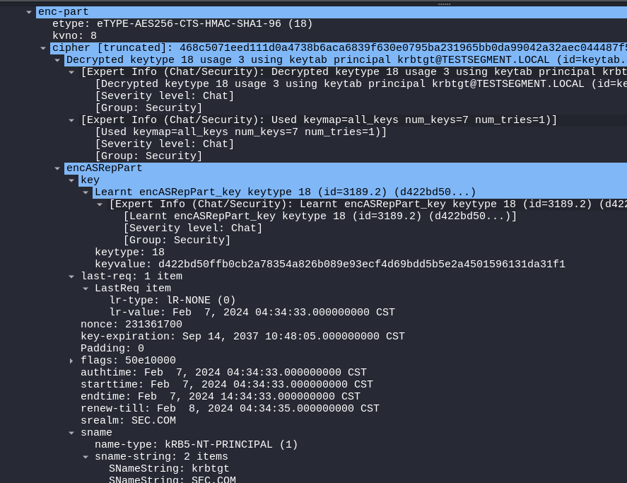

主要包含认证时间authtime、到期时间endtime、域名srealm等

<font style="color:#DF2A3F;">注1：TGT也包含Session Key，所以会看到两次authtime等字段</font>

## <font style="color:rgb(38, 38, 38);">4、TGS-REQ</font>
<font style="color:rgb(38, 38, 38);">客户端收到KDC的AS-REP后，使用用户密钥解密得到enc_Logon Session Key并且也获得了TGT。客户端凭借TGT购买相应的ST。</font>

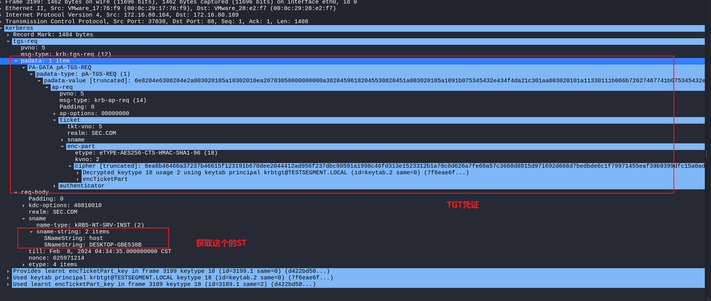

REQ主要包含padata，包含TGT票据还有authenticator部分的Logon Session Key加密过的时间戳

## 5、TGS-REP
1、KDC收到TGS-REQ后，先使用krbtgt密钥解密TGT加密部分，得到Logon Session Key和PAC，解密成功说明TGT是该KDC颁发的

2、验证PAC的PAC_SERVER_CHECKSUM签名，由服务密钥进行验证，验证PAC未经过篡改

3、最后使用Logon Session Key解密authenticator部分的时间戳，解密成功验证有效范围

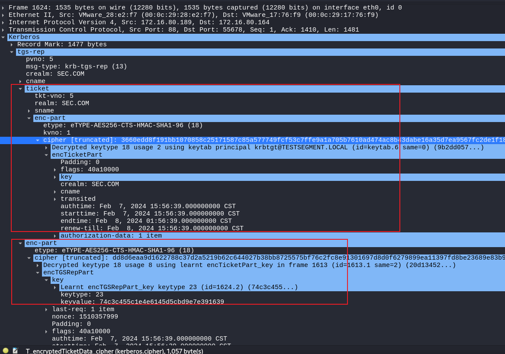

## 6、AP-REQ
AP-REQ由SMB2承载，包含ST票据和加密时间戳


## 7、AP-REP
Impacket默认不需要验证提供服务端身份，所以不会由AP-REP包。

当服务端收到AP-REQ消息后，用SPN密钥解密ST得到Service Session Key和PAC等消息，然后用Service Session Key解出时间戳，如果解密成功且在有效期内，就验证了客户端的身份。从ST取出PAC和服务ACL比对权限，生成访问令牌。

服务端会检查AP-REQ的mutual-required选项的布尔值，True的话，服务端会用Service Session Key加密时间戳作为Authenticator。

## 6、总结
注1：下面说的密钥都是指keytype 18 AES256-HMAC

### AS-REQ
1、使用了用户sec\Administrator的密钥加密的当前时间戳

### AS-REP
1、ticket中的enc-part，加密使用了sec\krbtgt的密钥，得到TGT凭证

2、外层中的enc-part，加密使用了用户sec\Administrator的密钥，得到了下一阶段的认证密钥Logon Session Key

### TGS-REQ
1、pdata中的TGT凭证，由sec\krbtgt的密钥加密的

2、authenticator中的时间戳，由AS-REP第二步得到的Logon Session Key加密

### TGS-REP
1、ticket（ST）中的enc-part，加密由服务账号SPN的sec\DESKTOP-GBE538B$密钥

2、外层的enc-part中的Service Session Key，由由AS-REP第二步得到的Logon Session Key加密

### AP-REQ
1、ticket（ST）使用缓存的Logon Session Key解密enc_Service Session Key得到<u>Service Session Key</u>，也同时拿到了ST

2、authenticator：Service Session Key加密的时间戳

### AP-REP
1、ST，服务账号SPN的sec\DESKTOP-GBE538B$密钥加密

2、authenticator：Service Session Key加密的时间戳

总结：需要<u><font style="color:#DF2A3F;">三个账户</font></u>的AES256-HMAC密钥，分别是：

内建账户：sec\krbtgt

UPN系统用户：sec\Administrator

SPN机器用户：sec\DESKTOP-GBE538B$

# S4u2Self协议
S4u2Self代表可以任意用户请求针对自身的服务票据