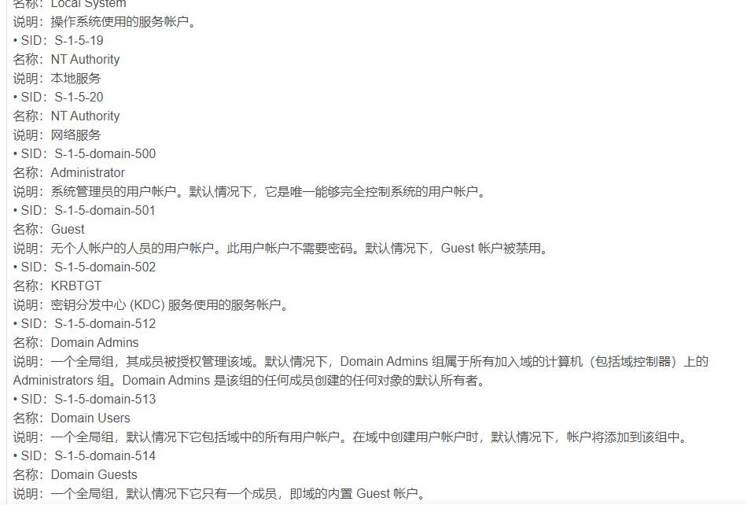
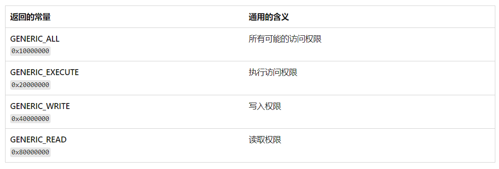
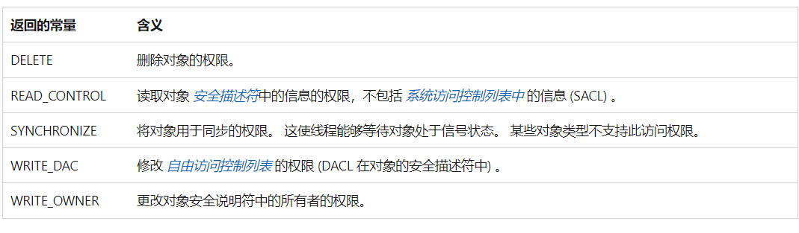
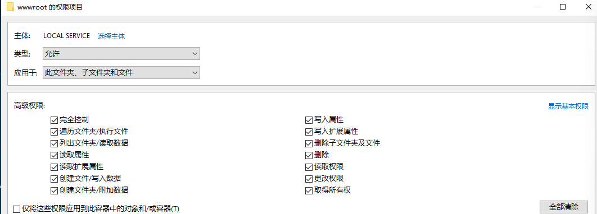
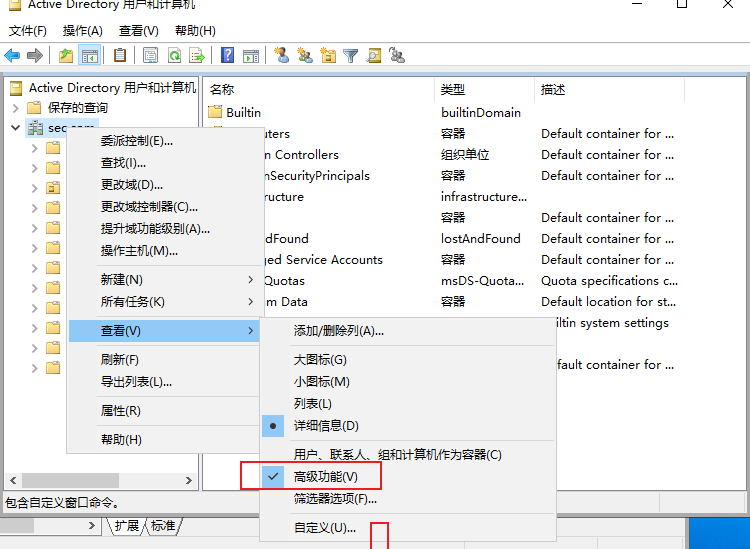
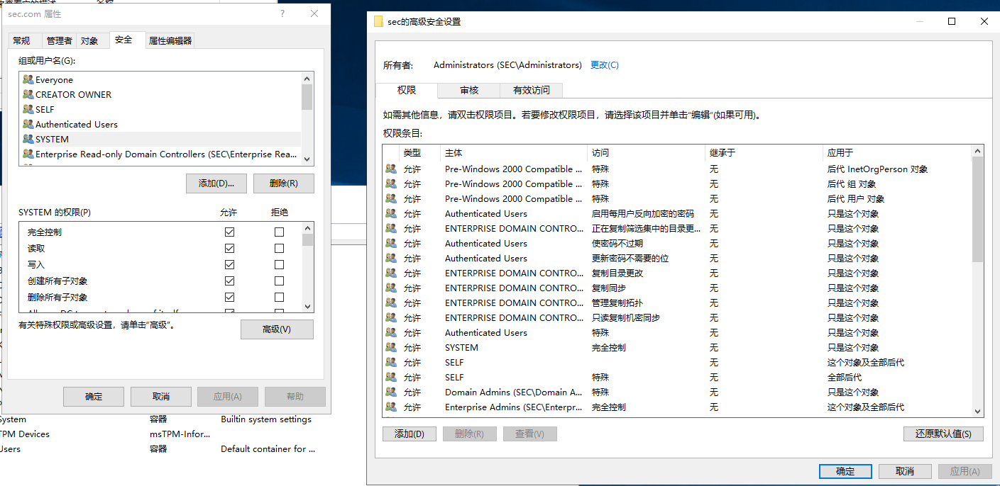

# 基础知识
## 1、安全主体
安全主体是可以通过系统进行身份验证的任何主体，比如用户账户、计算机账户。

每个安全主体在创建时都回自动分配一个安全标识符SID，在活动目录创建的安全主体是活动目录对象。

## 2、SID
SID（Security Identifiers）用于唯一标识安全主体或者安全组。比如常见SID：



# Windows访问控制模型
访问控制（Access Control,AC）是指控制<font style="color:#DF2A3F;">安全主体</font>可以访问的资源（<font style="color:#DF2A3F;">被访问实体</font>）实现增删改查等。

操作系统判断安全主体是否对被访问实体具有权限，是依靠（Access Control Model，ACM），访问令牌和安全描述符（Security Descriptor）两部分组成

## 1、访问令牌（Access Token）
访问令牌是一个数据结构，用于标识和验证用户或进程对资源的访问权限。

当用户登录到Windows系统时，系统会为其分配一个访问令牌，该令牌包含了该用户的安全标识SID以及用户所属的安全组（例如，Administrators组、Users组等）。

这个令牌会随着进程的创建和活动而传递，用于验证访问请求的合法性。

## 2、安全描述符
<font style="color:rgb(13, 13, 13);">安全描述符是与每个资源（如文件、文件夹、注册表项等）相关联的数据结构，用于定义该资源的安全性配置。安全描述符包含了以下信息：</font>

+ <font style="color:rgb(13, 13, 13);">拥有者（Owner）：资源的拥有者，有权修改资源的安全设置。</font>
+ <font style="color:rgb(13, 13, 13);">主要组（Primary Group）：资源的主要安全组。</font>
+ <font style="color:rgb(13, 13, 13);">访问控制列表（Access Control List，ACL）：定义了对资源的访问权限，包括允许或拒绝访问的用户和组列表。</font>

## <font style="color:rgb(13, 13, 13);">3、举例</font>
<font style="color:rgb(13, 13, 13);">假设有一个名为"Document.txt"的文件，其安全描述符如下：</font>

+ <font style="color:rgb(13, 13, 13);">拥有者：Alice</font>
+ <font style="color:rgb(13, 13, 13);">主要组：Users</font>
+ <font style="color:rgb(13, 13, 13);">访问控制列表：</font>
    - <font style="color:rgb(13, 13, 13);">允许 Bob 和 Alice 读取文件。</font>
    - <font style="color:rgb(13, 13, 13);">拒绝 Guest 访问文件。</font>

<font style="color:rgb(13, 13, 13);">当 Bob 尝试打开"Document.txt"文件时，Windows系统会检查他的访问令牌，确定他是否有权限执行所请求的操作。系统会检查文件的安全描述符和Bob的访问令牌，如果Bob的令牌中包含有读取权限，且文件的ACL允许Bob读取，那么他就能够成功打开并读取文件。如果Bob的令牌中没有相应的权限，或者ACL拒绝了他的访问请求，那么系统会拒绝他的操作并返回相应的错误。</font>

<font style="color:rgb(13, 13, 13);"></font>

# <font style="color:rgb(13, 13, 13);">访问控制列表（ACL）</font>
ACL由一系列访问控制条目ACE组成，ACE定义了访问策略。

ACL分为两种：

（1）DACL（控制权限）

+ <font style="color:rgb(13, 13, 13);">DACL用于控制对资源的访问权限，它包含了一系列访问控制项（ACEs），每个ACE指定了一个用户或组对资源的访问权限。</font>
+ <font style="color:rgb(13, 13, 13);">DACL决定了谁可以对资源进行什么样的操作，如读取、写入、执行等。</font>

（2）SACL（审计）

+ <font style="color:rgb(13, 13, 13);">SACL用于安全审计，它包含了一系列安全审计项（ACEs），每个ACE指定了对资源执行的操作应该被记录在安全日志中的条件。</font>
+ <font style="color:rgb(13, 13, 13);">SACL决定了对资源的访问应该被记录下来的条件，如何记录以及记录何种类型的安全事件。</font>

（3）举例

<font style="color:rgb(13, 13, 13);">假设有一个名为"Confidential.docx"的文件，其安全描述符包含了以下内容：</font>

+ <font style="color:rgb(13, 13, 13);">DACL：</font>
    - <font style="color:rgb(13, 13, 13);">允许组"HR Managers"具有完全控制权限（Full Control）。</font>
    - <font style="color:rgb(13, 13, 13);">允许用户"Alice"具有读取和写入权限（Read and Write）。</font>
    - <font style="color:rgb(13, 13, 13);">拒绝组"Contractors"访问权限。</font>
+ <font style="color:rgb(13, 13, 13);">SACL：</font>
    - <font style="color:rgb(13, 13, 13);">对所有的读取和写入操作进行安全审计，记录到安全日志中。</font>

## 1、ACE
<font style="color:rgb(13, 13, 13);">
</font><font style="color:rgb(13, 13, 13);">ACE（Access Control Entry）是访问控制列表（ACL）中的一个单独条目，用于指定对资源的访问权限。每个ACE定义了一个用户或组对资源执行特定操作的权限。ACE通常包括以下要素：</font>

1. **安全主体**<font style="color:rgb(13, 13, 13);">（Security Principal）：需要访问资源的用户或组。</font>
2. **访问掩码**<font style="color:rgb(13, 13, 13);">（Access Mask）：</font>[<font style="color:rgb(13, 13, 13);">访问掩码</font>](https://learn.microsoft.com/zh-cn/windows/desktop/SecGloss/a-gly)<font style="color:rgb(22, 22, 22);">是一个 32 位值，其位对应于对象支持的访问权限。 </font>
3. **访问控制类型**<font style="color:rgb(13, 13, 13);">（Access Control Type）：指定了ACE是允许访问（Allow）还是拒绝访问（Deny）。</font>
4. **继承标志**<font style="color:rgb(13, 13, 13);">（Inheritance Flags）：指定了ACE是否应该应用到子对象。</font>
5. **传播标志**<font style="color:rgb(13, 13, 13);">（Propagation Flags）：指定了ACE是否应该传播到子对象。</font>

<font style="color:rgb(13, 13, 13);">这里着重介绍访问掩码,</font><font style="color:rgb(22, 22, 22);">所有安全对象都使用下图所示 </font>[<font style="color:rgb(13, 13, 13);">的访问掩码</font>](https://learn.microsoft.com/zh-cn/windows/desktop/SecGloss/a-gly)<font style="color:rgb(22, 22, 22);"> 格式来排列其访问权限：</font>


<font style="color:rgb(22, 22, 22);">在此格式中，低阶 16 位用于对象特定的访问权限，接下来的 8 位用于 </font>[标准访问权限](https://learn.microsoft.com/zh-cn/windows/win32/secauthz/standard-access-rights)<font style="color:rgb(22, 22, 22);">，这适用于大多数类型的对象，而 4 位高阶位用于指定每个对象类型可以映射到一组标准和对象特定权限的 </font>[通用访问权限](https://learn.microsoft.com/zh-cn/windows/win32/secauthz/generic-access-rights)<font style="color:rgb(22, 22, 22);"> 。 ACCESS_SYSTEM_SECURITY位对应于 </font>[访问对象的 SACL 的权限](https://learn.microsoft.com/zh-cn/windows/win32/secauthz/sacl-access-right)<font style="color:rgb(22, 22, 22);">。</font>

1、基本权限

1）通用访问权限



2）标准访问权限



3）对属性的权限



4）拓展权限

域内的安全对象比较复杂，基本权限和对属性的权限不够用，可以拓展权限，该配置存放在CN=Extended-Rights,CN=Configuration,DC=xie,DC=com

## 2、ACL的判断流程
1）ACL未匹配上条目的时候默认拒绝访问

2）在有DACL但条目为0的时候，默认就是拒绝访问

3）在无DACL的时候，默认为允许访问

4）ACL的解析流程为：显示拒绝>显示允许>继承的拒绝>继承的允许

## <font style="color:#DF2A3F;">3、安全描述符定义语言（暂时无法理解）</font>
安全描述符定义语言（Security Descriptor Definition Language，简称SDDL）是一种用来描述Windows系统中对象的安全属性的语言。

SDDL格式：

+ Owner（O:）标识对象的所有者的 SID 字符串 。
+ Group（G:）标识对象的主组的 SID 字符串。
+ DACL（D:）应用于 DACL 的安全描述符控件标志。
+ SACL（S:）应用于 SACL 的安全描述符控件标志。

<font style="color:rgb(13, 13, 13);">
</font><font style="color:rgb(13, 13, 13);">ACE 字符串中每个部分的简要含义如下：</font>

+ **ace_type**<font style="color:rgb(13, 13, 13);">：ACE 类型，指定了权限的类型（允许或拒绝）。</font>
+ **ace_flags**<font style="color:rgb(13, 13, 13);">：ACE 标志，指定了 ACE 的特定属性。</font>
+ **rights**<font style="color:rgb(13, 13, 13);">：权限，指定了允许或拒绝的具体操作。</font>
+ **object_guid**<font style="color:rgb(13, 13, 13);">：对象 GUID，用于指定 ACE 适用于的对象。</font>
+ **inherit_object_guid**<font style="color:rgb(13, 13, 13);">：继承对象 GUID，指定了 ACE 是否可以继承到子对象。</font>
+ **account_sid**<font style="color:rgb(13, 13, 13);">：帐户 SID，指定了 ACE 应用于的用户或组。</font>
+ **resource_attribute**<font style="color:rgb(13, 13, 13);">：资源属性，可选项，指定了 ACE 的特定属性（如对象类型等）。</font>

<font style="color:rgb(13, 13, 13);"></font>

## <font style="color:rgb(13, 13, 13);">4、域对象ACL的查看和修改</font>
1）图形化查看和修改ACL





2）Adfind查询

查询指定用户对象的ACL

```powershell
PS C:\Users\Administrator\Desktop\AdFind>
.\AdFind.exe -b "CN=administrator,CN=Users,DC=sec,DC=com" nTSecurityDescriptor -sddl

AdFind V01.62.00cpp Joe Richards (support@joeware.net) October 2023

Using server: win2019-1.sec.com:389
Directory: Windows Server 2019 (10.0.17763.1)

dn:CN=Administrator,CN=Users,DC=sec,DC=com
>nTSecurityDescriptor: [OWNER] DA
>nTSecurityDescriptor: [GROUP] DA
>nTSecurityDescriptor: [DACL]  PAI(OA;;RP;{4C164200-20C0-11D0-A768-00AA006E0529};{4828CC14-1437-45BC-9B07-AD6F015E5F28};RU)(OA;;RP;{4C164200-20C0-11D0-A768-00AA006E0529};{BF967ABA-0DE6-11D0-A285-00AA003049E2};RU)(OA;;RP;{5F202010-79A5-11D0-9020-00C04FC2D4CF};{4828CC14-1437-45BC-9B07-AD6F015E5F28};RU)(OA;;RP;{5F202010-79A5-11D0-9020-00C04FC2D4CF};{BF967ABA-0DE6-11D0-A285-00AA003049E2};RU)(OA;;RP;{BC0AC240-79A9-11D0-9020-00C04FC2D4CF};{4828CC14-1437-45BC-9B07-AD6F015E5F28};RU)(OA;;RP;{BC0AC240-79A9-11D0-9020-00C04FC2D4CF};{BF967ABA-0DE6-11D0-A285-00AA003049E2};RU)(OA;;RP;{59BA2F42-79A2-11D0-9020-00C04FC2D3CF};{4828CC14-1437-45BC-9B07-AD6F015E5F28};RU)(OA;;RP;{59BA2F42-79A2-11D0-9020-00C04FC2D3CF};{BF967ABA-0DE6-11D0-A285-00AA003049E2};RU)(OA;;RP;{037088F8-0AE1-11D2-B422-00A0C968F939};{4828CC14-1437-45BC-9B07-AD6F015E5F28};RU)(OA;;RP;{037088F8-0AE1-11D2-B422-00A0C968F939};{BF967ABA-0DE6-11D0-A285-00AA003049E2};RU)(OA;;RPWP;{BF967A7F-0DE6-11D0-A285-00AA003049E2};;CA)(OA;;RP;{46A9B11D-60AE-405A-B7E8-FF8A58D456D2};;S-1-5-32-560)(OA;;RPWP;{6DB69A1C-9422-11D1-AEBD-0000F80367C1};;S-1-5-32-561)(OA;;RPWP;{5805BC62-BDC9-4428-A5E2-856A0F4C185E};;S-1-5-32-561)(OA;;LCRPLORC;;{4828CC14-1437-45BC-9B07-AD6F015E5F28};RU)(OA;;LCRPLORC;;{BF967ABA-0DE6-11D0-A285-00AA003049E2};RU)(OA;;CR;{AB721A53-1E2F-11D0-9819-00AA0040529B};;WD)(OA;;CR;{AB721A53-1E2F-11D0-9819-00AA0040529B};;PS)(OA;CI;RPWPCR;{91E647DE-D96F-4B70-9557-D63FF4F3CCD8};;PS)(A;;CCDCLCSWRPWPLOCRRCWDWO;;;DA)(A;;CCDCLCSWRPWPLOCRRCWDWO;;;S-1-5-21-1027025209-3423359006-2631361786-519)(A;;CCDCLCSWRPWPLOCRSDRCWDWO;;;BA)(A;;LCRPLORC;;;AU)(A;;CCDCLCSWRPWPDTLOCRSDRCWDWO;;;SY)
>nTSecurityDescriptor: [SACL]  AI(AU;SA;WPWDWO;;;WD)(OU;CIIOIDSA;WP;{F30E3BBE-9FF0-11D1-B603-0000F80367C1};{BF967AA5-0DE6-11D0-A285-00AA003049E2};WD)(OU;CIIOIDSA;WP;{F30E3BBF-9FF0-11D1-B603-0000F80367C1};{BF967AA5-0DE6-11D0-A285-00AA003049E2};WD)

1 Objects returned
```

查询指定权限在域内被哪些对象拥有

```powershell
PS C:\Users\Administrator\Desktop\AdFind>
.\AdFind.exe -s subtree -b "DC=sec,DC=com" nTSecurityDescriptor -recmute -resolvesids -nosacl -sddl+++ -sddlfilter ;;;"Exchange Windows Permissions"
 ## 内容太多 举例一个
 dn:CN=User,CN={16D543E9-19D0-4F18-8E1B-3FA168B6A731},CN=Policies,CN=System,DC=sec,DC=com
>nTSecurityDescriptor: [OWNER] SEC\Domain Admins
>nTSecurityDescriptor: [GROUP] SEC\Domain Admins
>nTSecurityDescriptor: [DACL] (FLAGS:INHERIT)
>nTSecurityDescriptor: [DACL] ALLOW;;[FC];;;SEC\Domain Admins
>nTSecurityDescriptor: [DACL] ALLOW;;[LIST CHILDREN][READ PROP][LIST OBJ][READ PERMS];;;NT AUTHORITY\Authenticated Users
>nTSecurityDescriptor: [DACL] ALLOW;;[FC];;;NT AUTHORITY\SYSTEM
>nTSecurityDescriptor: [DACL] OBJ ALLOW;[CONT INHERIT][INHERITED];[CTL];Apply Group Policy;;NT AUTHORITY\Authenticated Users
>nTSecurityDescriptor: [DACL] ALLOW;[CONT INHERIT][INHERITED];[CR CHILD][DEL CHILD][LIST CHILDREN][SELF WRT][READ PROP][WRT PROP][DEL TREE][LIST OBJ][DEL][READ PERMS][WRT PERMS][WRT OWNER];;;SEC\Domain Admins
>nTSecurityDescriptor: [DACL] ALLOW;[CONT INHERIT][INHERITED];[CR CHILD][DEL CHILD][LIST CHILDREN][SELF WRT][READ PROP][WRT PROP][DEL TREE][LIST OBJ][DEL][READ PERMS][WRT PERMS][WRT OWNER];;;SEC\Enterprise Admins
>nTSecurityDescriptor: [DACL] ALLOW;[CONT INHERIT][INHERITED];[LIST CHILDREN][READ PROP][LIST OBJ][READ PERMS];;;NT AUTHORITY\ENTERPRISE DOMAIN CONTROLLERS
>nTSecurityDescriptor: [DACL] ALLOW;[CONT INHERIT][INHERITED];[LIST CHILDREN][READ PROP][LIST OBJ][READ PERMS];;;NT AUTHORITY\Authenticated Users
>nTSecurityDescriptor: [DACL] ALLOW;[CONT INHERIT][INHERITED];[CR CHILD][DEL CHILD][LIST CHILDREN][SELF WRT][READ PROP][WRT PROP][DEL TREE][LIST OBJ][DEL][READ PERMS][WRT PERMS][WRT OWNER];;;NT AUTHORITY\SYSTEM
>nTSecurityDescriptor: [DACL] ALLOW;[CONT INHERIT][INHERIT ONLY][INHERITED];[CR CHILD][DEL CHILD][LIST CHILDREN][SELF WRT][READ PROP][WRT PROP][DEL TREE][LIST OBJ][DEL][READ PERMS][WRT PERMS][WRT OWNER];;;CREATOR OWNER
```

PowerShell Empire ps1脚本查看和修改

略