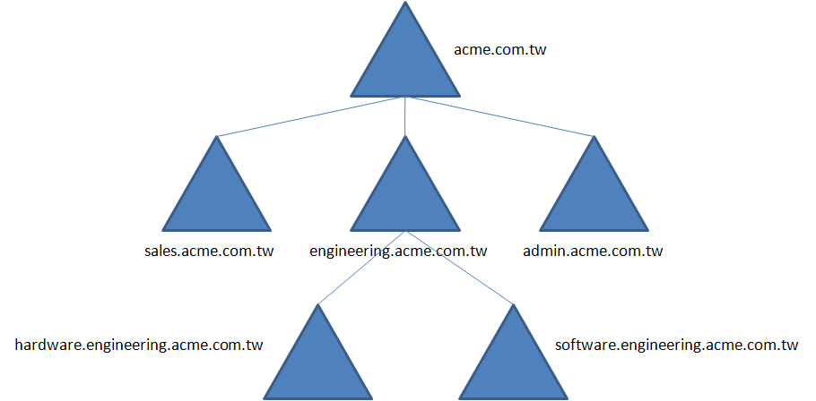
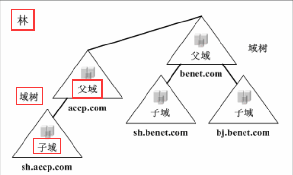

```plain
categories: 域渗透攻防指南笔记
tags: 内网安全
publish: true
autoExcerpt: true
```

# 工作组
1、工作组（Work Group）是局域网中的一个概念，是最常见最简单的资源管理模式。

2、默认情况下，所有计算机都处在名为 Work Group 的工作组中。

3、工作组里的所有计算机都是对等的，也就是没有服务器和客户机之分。

4、工作组可以是同一物理地点且被相同的局域网连接起来的计算机组成的小组，也可以是遍布多个物理地点但被同一网络连接的计算机构成的逻辑小组。

# 域
1、当网络规模大、计算机数量多，需要统一的管理和集中的身份验证，域就是用来解决此问题。

2、在域模式下，至少有一台服务器（域控）来负责每一台连入网络和用户验证工作

3、域控制器中包含由这个域的账户、密码、属于这个域的计算机等信息组成的数据库，当计算机接入网络时，域控先判断这台计算机是否属于这个域，用户使用的登录用户账户密码是否正确。如果以上信息之一不正确，用户就不能防蚊服务器上有权限保护的资源，只能以对等网络的方式访问 Windows 共享的资源。

# 域的分类
## 单域
对于小型企业来说，单域即可满足需求，既所有计算机都加入一个域中。

## 域树


1、域树指若干域通过建立信任关系组成的集合。

2、一个域管理员只能管理本域的内部

3、两个域之间相互访问需要建立信任关系，信任关系是域与域之间的桥梁。

4、父域和子域之间自动建立双向信任关系，信任关系可以传递。在父子域关系下，所有的域都有信任关系，因此只要拥有任何一个域内的权限，就可以访问其他域内的资源。

5、域树内所有域共享一个活动目录域服务，每个域中只存储属于该域的数据。

域树的好处

1、如果把不同地理位置的分公司放在同一个域内，那么它们之间的信息交互所花费的时间过长

2、子公司可以通过自己的域来管理自己的资源，每个域都可以有自己的安全策略

## 域林


域林是指若干个域树通过建立信任关系组成的集合，林中每个域树都有唯一的名称空间，它们之间不连续。可以通过域树之间建立信任关系来管理和使用整个域林中的资源，保持原有域内自身的特效。在林中，只要拥有其中一个域内的权限，就可以防蚊林中其他的资源。

# 域功能级别和林功能级别
1、域控系统版本必须大于或者等于域功能级别的系统版本