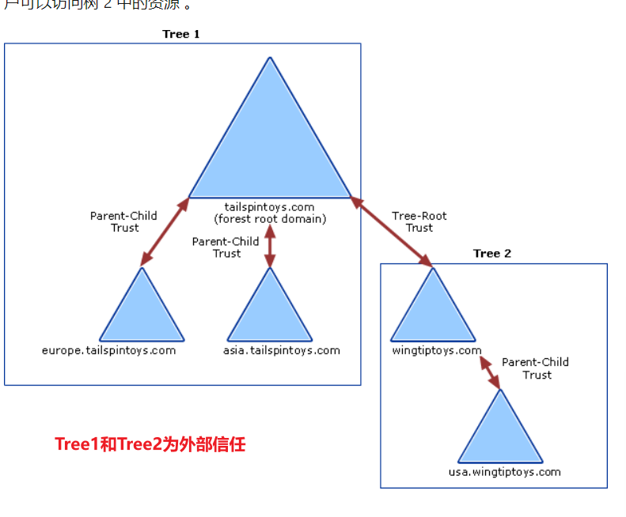

域信任是为了解决多域环境下的跨资源共享问题而诞生的，两个域必须拥有互相信任关系才可以互相访问对方域内资源，由于此信任工作是通过 Kerberos 协议完成的，因此被称为 kerberos trust。

# 单向信任


单向信任是两个域之间创建单向的信任路径，即在一个方向上是信任流，在另一个方向是访问流。

例：dev 域信任 users 域，users 域可以访问 dev 域内资源，dev 域不能访问 users 域资源

# 双向信任


双向信任是指两个单向信任的组合，信任域和受信任域彼此信任，在两个方向都有信任流和访问流。这意味着可以从两个方向在两个域之间传递身份验证请求。活动目录中的所有域信任关系都是双向可传递信任的。<u><font style="color:#DF2A3F;">当任何一个新域加入到域树后，默认自动建立起双向信任关系。</font></u>

<u><font style="color:#DF2A3F;"></font></u>

# 快捷信任


快捷信任实际属于双向信任，作用是减少各种跨域之间建立信任关系要走的认证流程，**<font style="color:rgb(4, 12, 40);">在同一林中的两个子域间建立直接的信任关。</font>**

比如A信任B，B信任C，C可以直接和A建立信任关系

# 内部信任
 

将新域加入到林根域时，将自动创建<font style="color:#DF2A3F;">可传递</font>的内部信任

# 外部信任


外部信任是指两个不同林间的域信任关系，是单向/双向<font style="color:#DF2A3F;">不可传递</font>的。两个林之间需要跨域资源访问，就必须先建立外部信任。

# 林信任
林信任是指不同林之间的域信任关系。假如两个林之间有很多域，要进行跨资源访问就需要设置多次外部信任，林信任就可以直接对两个林之间建立直接<font style="color:#DF2A3F;">林信任关系</font>。

# 实践1：跨域资源访问
搭建子域

**<font style="color:#DF2A3F;">注1：做实验前，关闭IPV6协议版本！！！否则DNS解析将自动优先ipv6，指向去外网</font>**

win2019-1 主域sec.com

win2019-2 子域sz.sec.com


注2：凭据使用sec.com\Administrator完整名称

注3：如果是复制的虚拟机，需要执行sysgrep重置SID，并且主机名不能相同

```plain
cd C:\windows\system32\sysprep
sysprep /generalize /oobe /reboot
```

用Get-ADUser获取信任机器账号，SZ$


用ADExplorer查看


信任账户的Hash有以下的关系：

sec\SZ$ = sz\sec$

使用impacket secretdump验证，可以看到Hash是一致的


**<font style="color:#DF2A3F;"></font>**