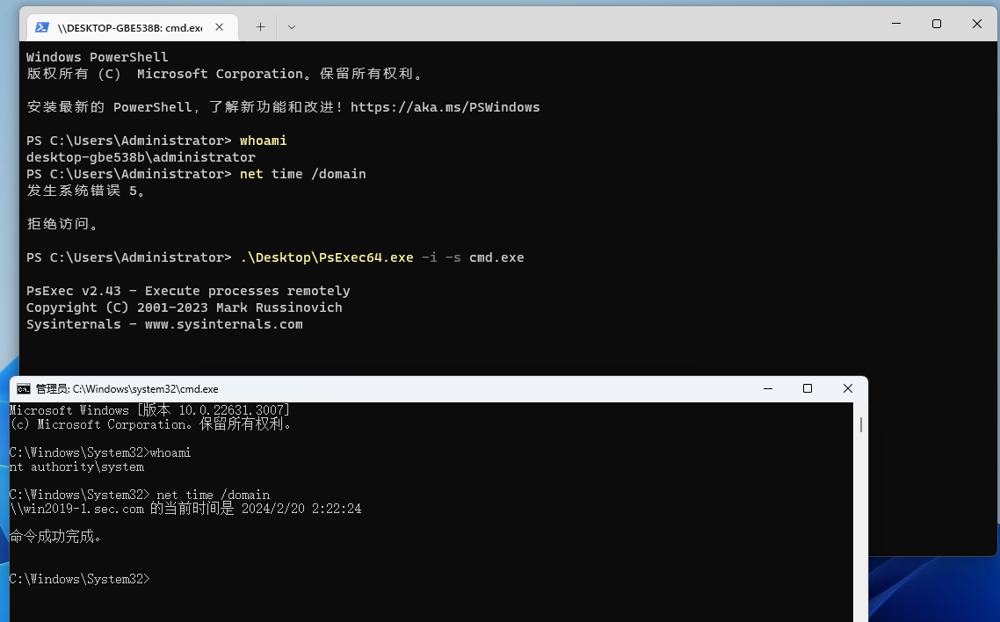

# 本地账号
## 1、Administrator
该账户拥有完全控制服务器的权限

在高版本Windows中，激活禁用的账号

```plain
net user Administrator /active:yes
```

## 2、Guest
来宾账号，默认禁用

## 3、DefaultAccount
在Windows10/2016后引入的内置账号DSMA，用于运行与用户无关的进程

## 4、WDAGUyilityAccount
该账号为Windows Defender的内置用户

# 活动目录账号
所有账号都是用户账号，区分服务账号看是否注册了SPM，区分机器账号看objectcategory是否为computer

## 一、用户账号
1、域内所有用户都在域全局组Domain User内

2、服务器升级域控后，本地用户提升为域用户，管理员用户在Domain Admins里

Administrator：Administrators，Domain Admins、Enterprise Admins、组策略创建者、Schema Admins Groups的默认成员

krbtgt：kerberos密钥发行中心服务账号

## 二、服务账号
1、Service Account是一种特殊的用户账户，比如krbtgt是用户账号也是服务账号

2、默认情况下，域内每个机器都提供服务，所以每个机器都有多个SPN


3、VPN设备，如Citrix、Ivanti配置的ldap用户可能就是服务账号

## 三、机器账号
1、机器账号是一种特殊的用户账号，不能用于登录。

2、机器账号代表一个物理实体，如域机器，在域内的用户名为：机器主机名+$

3、机器账号的密码强度为随机生成的120个字符

4、机器加入域后。存储在CN=Computer容器内


该机器为computer类的实例，computer类是user的子类，因此域用户有的属性，机器账号都有

5、创建机器账号

默认情况下，域内用户最多可以创建10个机器账号

使用impacket-addcomputer可以添加机器用户，<font style="color:#DF2A3F;">通过这种方式创建的机器账号没有SPN</font>

```plain
C:\root> impacket-addcomputer -computer-name 'machine' -computer-pass 'Az123456@' -dc-ip 172.16.80.189 'sec.com/testnoadmin:Az123456@' -method SAMR -debug
Impacket v0.11.0 - Copyright 2023 Fortra

[+] Impacket Library Installation Path: /usr/lib/python3/dist-packages/impacket
[*] Opening domain SEC...
[*] Successfully added machine account machine$ with password Az123456@.

```

该账户的mS-DS-CreatorSID为创建者的SID

6、机器账户和system账号的关联

**本地system账户对应域内的机器账户，当获得了域内主机的system权限，就拥有了域内机器账户的权限。**

假如只拥有Win11<font style="color:#DF2A3F;">本地的administrator账户</font>，机器没有域用户登录的痕迹，将无法执行域查询，但是如果通过psexec获取到system权限后，就可以去执行域查询命令了，验证了上述。



注：内网渗透中，webshell的IUSR_MachineName无法执行域查询命令