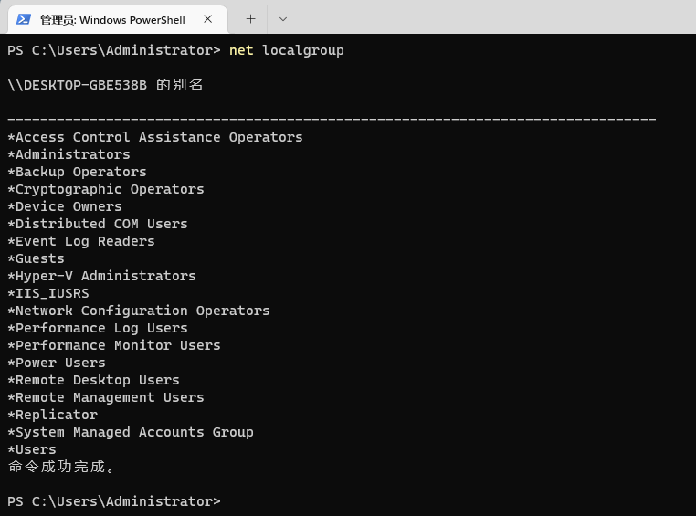
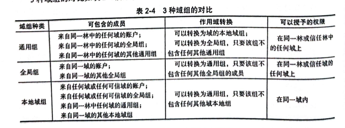
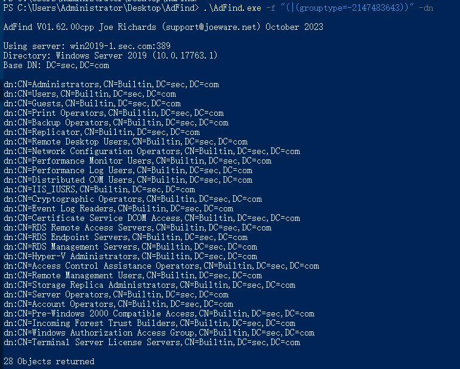
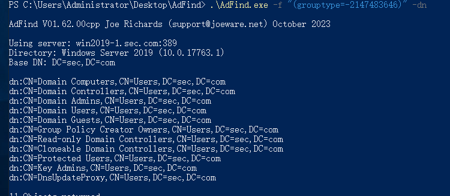
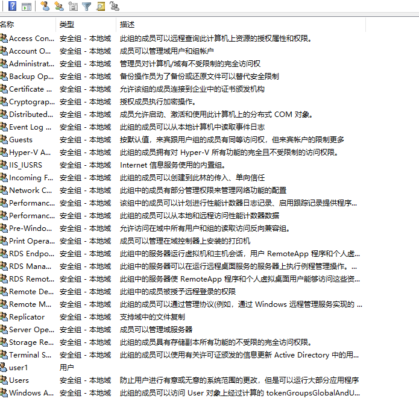
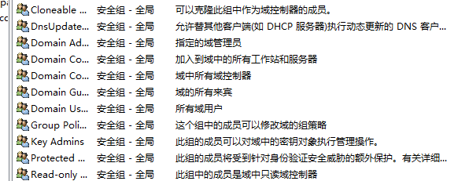
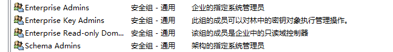

# 本地组


Administrators：管理员组
Users：普通用户组

Guests：来宾组

Backup Operators：该组的成员不考虑保护这些文件的任何权限

Remote desktop Users：成员可远程登录RDP

Power Users：仅次于Administrators组，可以增删普通用户

# 域组
使用Adfind检索所有域内组

```plain
PS C:\Users\Administrator\Desktop\AdFind> .\AdFind.exe -f "(objectcategory=group)" -dn

AdFind V01.62.00cpp Joe Richards (support@joeware.net) October 2023

Using server: win2019-1.sec.com:389
Directory: Windows Server 2019 (10.0.17763.1)
Base DN: DC=sec,DC=com

dn:CN=Administrators,CN=Builtin,DC=sec,DC=com
dn:CN=Users,CN=Builtin,DC=sec,DC=com
dn:CN=Guests,CN=Builtin,DC=sec,DC=com
dn:CN=Print Operators,CN=Builtin,DC=sec,DC=com
dn:CN=Backup Operators,CN=Builtin,DC=sec,DC=com
dn:CN=Replicator,CN=Builtin,DC=sec,DC=com
dn:CN=Remote Desktop Users,CN=Builtin,DC=sec,DC=com
dn:CN=Network Configuration Operators,CN=Builtin,DC=sec,DC=com
dn:CN=Performance Monitor Users,CN=Builtin,DC=sec,DC=com
dn:CN=Performance Log Users,CN=Builtin,DC=sec,DC=com
dn:CN=Distributed COM Users,CN=Builtin,DC=sec,DC=com
dn:CN=IIS_IUSRS,CN=Builtin,DC=sec,DC=com
dn:CN=Cryptographic Operators,CN=Builtin,DC=sec,DC=com
dn:CN=Event Log Readers,CN=Builtin,DC=sec,DC=com
dn:CN=Certificate Service DCOM Access,CN=Builtin,DC=sec,DC=com
dn:CN=RDS Remote Access Servers,CN=Builtin,DC=sec,DC=com
dn:CN=RDS Endpoint Servers,CN=Builtin,DC=sec,DC=com
dn:CN=RDS Management Servers,CN=Builtin,DC=sec,DC=com
dn:CN=Hyper-V Administrators,CN=Builtin,DC=sec,DC=com
dn:CN=Access Control Assistance Operators,CN=Builtin,DC=sec,DC=com
dn:CN=Remote Management Users,CN=Builtin,DC=sec,DC=com
dn:CN=Storage Replica Administrators,CN=Builtin,DC=sec,DC=com
dn:CN=Domain Computers,CN=Users,DC=sec,DC=com
dn:CN=Domain Controllers,CN=Users,DC=sec,DC=com
dn:CN=Schema Admins,CN=Users,DC=sec,DC=com
dn:CN=Enterprise Admins,CN=Users,DC=sec,DC=com
dn:CN=Cert Publishers,CN=Users,DC=sec,DC=com
dn:CN=Domain Admins,CN=Users,DC=sec,DC=com
dn:CN=Domain Users,CN=Users,DC=sec,DC=com
dn:CN=Domain Guests,CN=Users,DC=sec,DC=com
dn:CN=Group Policy Creator Owners,CN=Users,DC=sec,DC=com
dn:CN=RAS and IAS Servers,CN=Users,DC=sec,DC=com
dn:CN=Server Operators,CN=Builtin,DC=sec,DC=com
dn:CN=Account Operators,CN=Builtin,DC=sec,DC=com
dn:CN=Pre-Windows 2000 Compatible Access,CN=Builtin,DC=sec,DC=com
dn:CN=Incoming Forest Trust Builders,CN=Builtin,DC=sec,DC=com
dn:CN=Windows Authorization Access Group,CN=Builtin,DC=sec,DC=com
dn:CN=Terminal Server License Servers,CN=Builtin,DC=sec,DC=com
dn:CN=Allowed RODC Password Replication Group,CN=Users,DC=sec,DC=com
dn:CN=Denied RODC Password Replication Group,CN=Users,DC=sec,DC=com
dn:CN=Read-only Domain Controllers,CN=Users,DC=sec,DC=com
dn:CN=Enterprise Read-only Domain Controllers,CN=Users,DC=sec,DC=com
dn:CN=Cloneable Domain Controllers,CN=Users,DC=sec,DC=com
dn:CN=Protected Users,CN=Users,DC=sec,DC=com
dn:CN=Key Admins,CN=Users,DC=sec,DC=com
dn:CN=Enterprise Key Admins,CN=Users,DC=sec,DC=com
dn:CN=DnsAdmins,CN=Users,DC=sec,DC=com
dn:CN=DnsUpdateProxy,CN=Users,DC=sec,DC=com

48 Objects returned
```

## 域组的类型
1、域组分为安全组和通信组，Domain User、Domain Computer、Domain Admins都是安全组，安全组和通信组可以相互转换

安全组：为活动目录中的安全组/资源分配权限

通信组：只能与exchange一起使用

## 域组的作用域


在应用范围来说，分为三种组：

### 本地域组


1、本地域组只能访问本域内的资源

2、本地域组可以包含<u>本地或其他域</u>的用户、全局组、通用组，还有本地域的域组（不包含他域本地组）

### 全局组


1、全局组可以访问域林除了本域的资源（存疑）

2、组成员只能包含本域的用户和全局组，不可包含其他域林中的资源

### 通用组
1、通用组可以访问全局所有的资源

2、通用组保存在全局编录服务器GC中，任何变化都会导致全林复制

3、通用组可以包含所有域的用户、全局域和通用组，不能包含所有域的本地组。

# 活动目录内置组
## 1、内置本地域组


在创建活动目录的时候会自动创建一些组，这些组默认有指定的权限，把用户或者组添加进去就会继承拥有权限。

## 2、内置的全局组


全局组的权限加入到别的组获得权限。

注：当计算机加入组时，默认会把域内Domain Users加入到本地的Users组内，这就是普通域用户可以登录除了域控以外的所有机器。

## 3、内置的通用组
