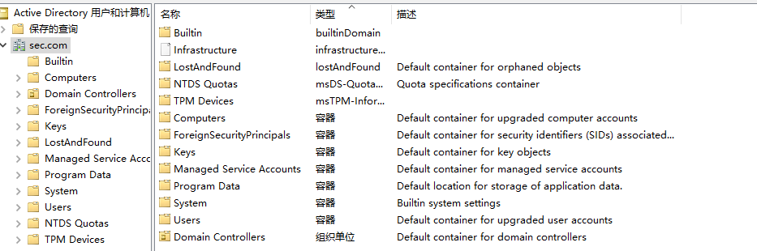
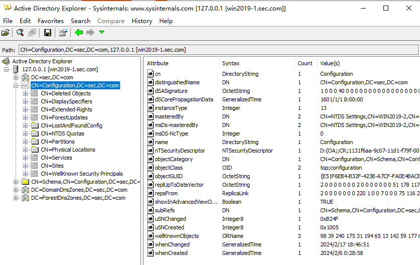
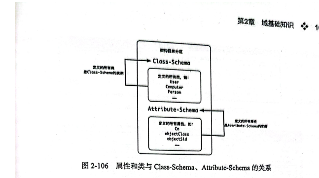
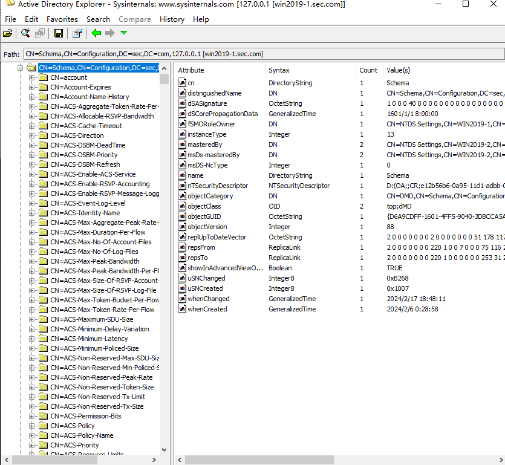
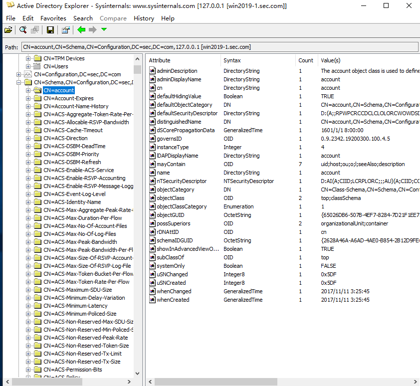
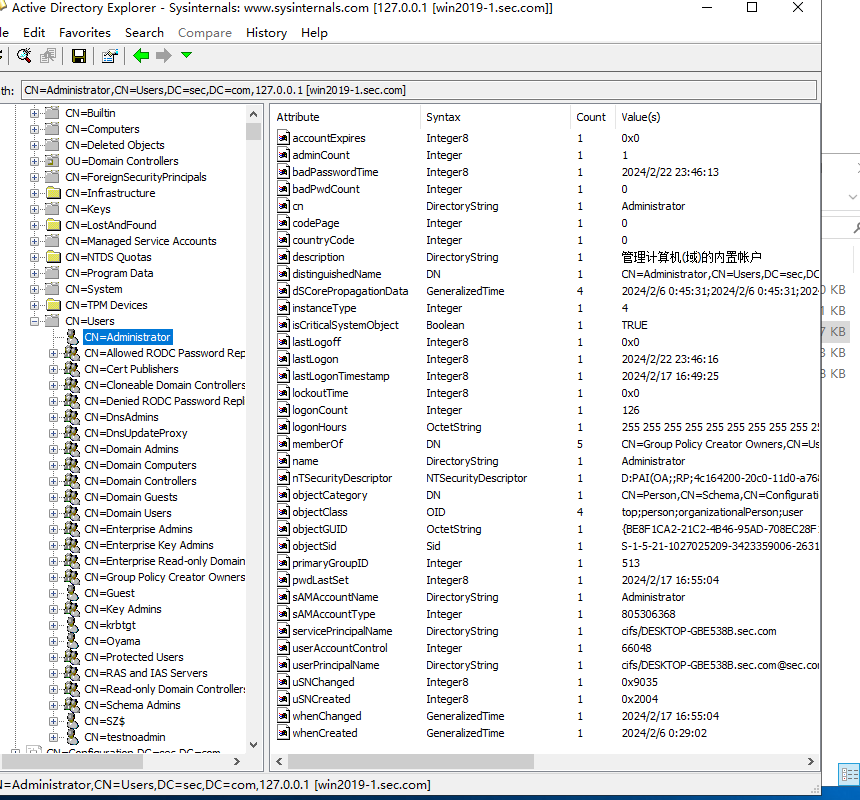
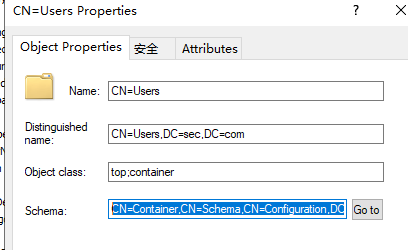
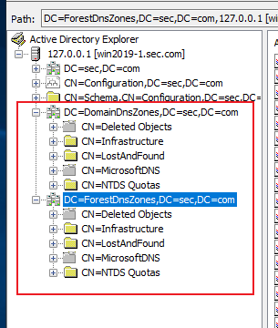
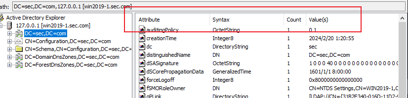

域林中每个域控都包含目录分区（Directory Partition），也被称为命名上下文（Naming Context，NC）

# 一、域目录分区
每个域各有一个域目录分区，关联本地域相关的用户和计算机，如"DC=sec,DC=com"，以下都是本地域的目录分区



# 二、配置目录分区
该分区包含复制拓扑和必须复制的其他配置数据，整个林所有域<font style="color:#DF2A3F;">共享一份相同的</font>配置目录分区



# 三、架构目录分区
### 1、介绍
该分区包含所有类和所有属性的的条目对象，这些对面定义了林中可以使用的类和属性的类型，简而言之就像先预定义参数表一样，每个用户、组、计算机等实例都需要继承Class-Schema/Attribute-Schema。

整个林所有域<font style="color:#DF2A3F;">共享一份相同的</font>配置目录分区





### 2、LDAP中类的继承
比如"CN=account,CN=Schema,CN=Configuration,DC=sec,DC=com"，字段如下面。对比CN=administrator拥有的属性，可以发现确实继承了CN=account的属性





从这里的Properties里可以看出继承关系



### 3、架构目录的分类（没学明白）
所有的类都是“CN=Class-Schema,CN=Schema,CN=Configuration,DC=xie,DC=com”对象的实例

1）结构类(Structural)

2）抽象类（Avstract）

3）辅助类（Auxiliary）

### 4、架构目录分区中的属性
架构目录分区的属性其实就是数据类型，由属性条目的attributeSyntax和oMSyntax属性决定。

## 四、应用程序目录分区
1、从Windows Server 2003开始，允许用户自定义分区来拓展目录分区，该分区存放在特定的域控中，如下图圈中为内置的两个应用程序目录分区。还可以给该分区设置TTL到期自动删除



2、创建应用程序目录分区

注：只装了一个DC，所以报错了，理论上装好就能成功

```plain
PS C:\Users\Administrator\Desktop\AdFind> ntdsutil.exe
C:\Windows\system32\ntdsutil.exe: partition management
partition management: Connections
server connections: connect to server win2019-1.sec.com
绑定到 win2019-1.sec.com ...
用本登录的用户的凭证连接 win2019-1.sec.com。
server connections: q
partition management: create nc "dc=test1,dc=sec,dc=com" win2019-1.sec.com
添加对象 dc=test1,dc=sec,dc=com
ldap_add_ext_sW 错误 0x34(52 (不可用).
Ldap 扩展的错误消息为 000021A2: SvcErr: DSID-03330705, problem 5002 (UNAVAILABLE), data 0

返回的 Win32 错误为 0x21a2(无法验证 FSMO 角色所有权，因为尚未使用至少一个复制伙伴成功地复制其目录分区。)
)
partition management: create nc "dc=test1,dc=sec,dc=com" win2019-1.sec.com
添加对象 dc=test1,dc=sec,dc=com
ldap_add_ext_sW 错误 0x34(52 (不可用).
Ldap 扩展的错误消息为 000021A2: SvcErr: DSID-03330705, problem 5002 (UNAVAILABLE), data 0

返回的 Win32 错误为 0x21a2(无法验证 FSMO 角色所有权，因为尚未使用至少一个复制伙伴成功地复制其目录分区。)
)
```

## 五、条目属性分析


Attribute：条目的属性（名称）

Syntax：数据类型

Count：条目属性值的数量

Value(s)：条目具体的值