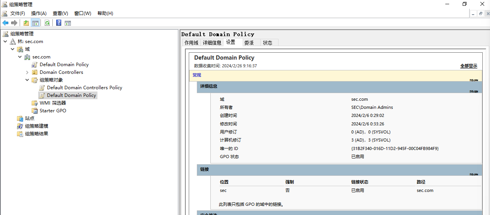

1、组策略分为本地组策略和域环境组策略

2、组策略可以强大的管理整个域环境，配置各种账户策略、脚本、权限等

# 组策略对象
组策略是通过组策略对象GPO来设置的，把GPO链接到指定的域和组织单位，此GPO的设置就会影响到被设置对象。

GPO由组策略容器GPC与组策略模板GPT两部分组成，他们存储在不同的位置

## 1、GPC
GPC（Group Policy Container）是组织 组策略模板的一种容器，它存储了域中所有的组策略对象的配置信息。

GPC记载着组策略的GUID、组策略名称、组策略DN路径，GPT所在的具体路径

## 2、GPT
GPT（Group Policy Template）：GPT是组策略模板的缩写，它是组策略对象的模板文件。GPT定义了组策略对象的设置和配置。

示例：当你创建一个新的组策略对象时，系统会为它生成一个GPT文件。这个文件包含了组策略对象的设置选项和配置信息，例如禁用USB存储设备、设置桌面背景等。

## 3、GPO
GPO（Group Policy Object）：GPO是组策略对象的缩写，它代表一组组策略设置，可以应用于特定的用户或计算机。

示例：假设你想在域中禁用所有计算机的CD/DVD驱动器。你可以创建一个GPO，并将该设置配置为GPO的一部分。然后，将该GPO链接到特定的组织单位（OU）或域中的计算机对象上，以应用该设置。

当AD域部署完毕后，会自动创建两个GPO，默认域策略/默认域控策略，会分别默认应用在所有域计算机/用户和域控计算机/用户。

# 策略设置和首选项
1、策略设置是强制性的，虽然某些选项可以被客户端自行更改，但是下次应用策略会恢复成策略预设值。

2、首选项设置是非强制性的，客户端可以自行更改设置值。

3、策略设置优先级高于首选项设置

# 组策略应用时机
当创建/修改了组策略对象后，设置并不会对其用户/计算机立刻生效，必须等待一段时间推送，或者可以选择强制推送（WIndows Server 2012开始支持，10min强制生效）

# 组策略应用规则
1、组策略不是对组进行设置，而是对最小单元OU设置，不能对指定计算机/用户设定，但是可以把这些计算机设置为同一OU，然后在对该OU设定。

2、OU支持包含子OU，组策略也会被自动继承，除非设置阻止继承

3、如果子容器的策略和父容器策略冲突，则不会应用父容器策略，则可以手动使用“强制继承”。

# 组策略的安全问题
## 1、组策略首选项提权
注：Windows Server2008及以下，未安装2919355补丁

GPT的存储位置位于域控的%systemroot%\sysvol\域名\Policies文件夹内，任何用户都可以访问，如果在组策略中编辑了用户密码，就会存储在xml文件内，然而微软公布了这个密码的AES密钥，则可以解密。

注1：暂时无法复现

## 2、滥用组策略委派属性
如果一个普通域用户test被赋予允许增删改查组策略test，黑客一旦接管了用户test，就可以对受此组策略影响的计算机和用户

## 3、利用组策略创建定时任务
当一个用户拥有修改组策略的权限，可以创建定时任务进行命令执行。

1) 新增组策略，创建一个既时任务，选择administrator权限用户，只要目标主机刷新组策略就会执行。

2）设置计划任务的启动程序命令为calc.exe，弹出计算机

