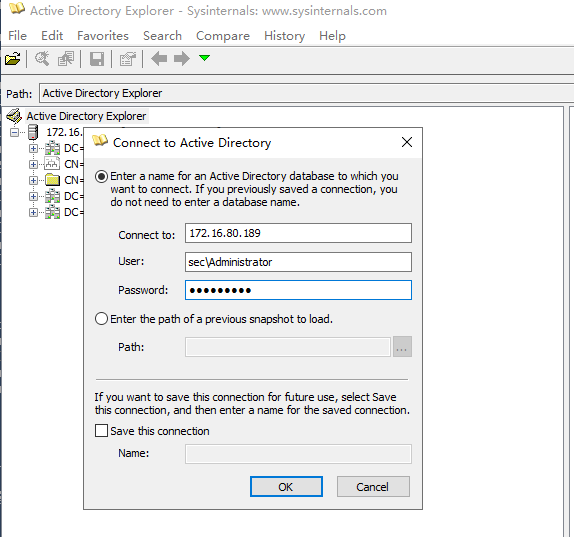
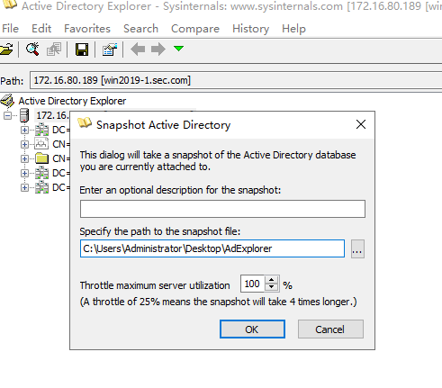
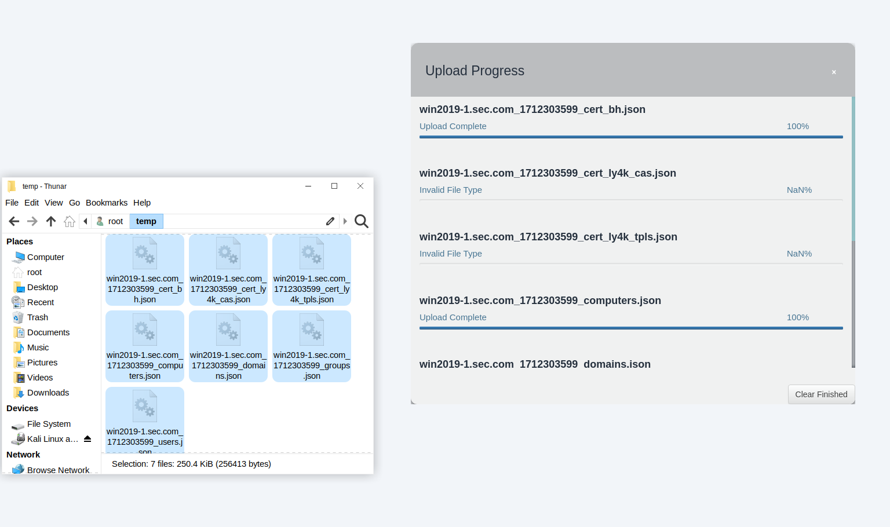
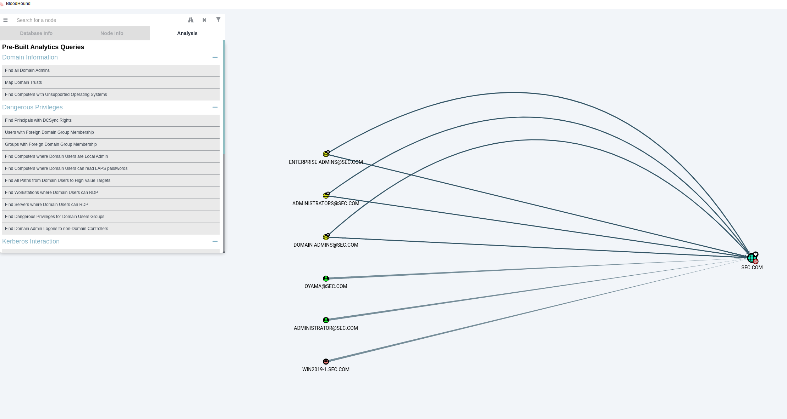

BloodHound有三种方式导入：

+ BloodHound收集器导入，需要一台域内机器，比较麻烦
+ ldapdomaindump导入，需要BloodHound在4.0以下版本
+ AdExploer导出，在用ADExplorerSnapshot转换

# 一、导出ADExploer的DAT数据
adexploer是微软官方工具，没有EDR的一般情况下是正常流量

1、连接域



2、导出dat



3、dat转换成BloodHound支持的json格式

```powershell
(python310) C:\root\temp> python3 /root/tools/ADExplorerSnapshot.py/ADExplorerSnapshot.py AdExplorer.dat
[*] Server: win2019-1.sec.com
[*] Time of snapshot: 2024-04-05T15:53:19
[*] Mapping offset: 0x2900da
[*] Object count: 3711
[+] Parsing properties: 1499
[+] Parsing classes: 269
[+] Parsing object offsets: 3711
[+] Restored pre-processed information from data cache
[+] Collecting data: 6 users, 48 groups, 3 computers, 33 certtemplates, 1 CAs, 1 trusts
[+] Output written to win2019-1.sec.com_1712303599_*.json files

(python310) C:\root\temp>

```

4、拖拽导入



5、分析

示例域太小

